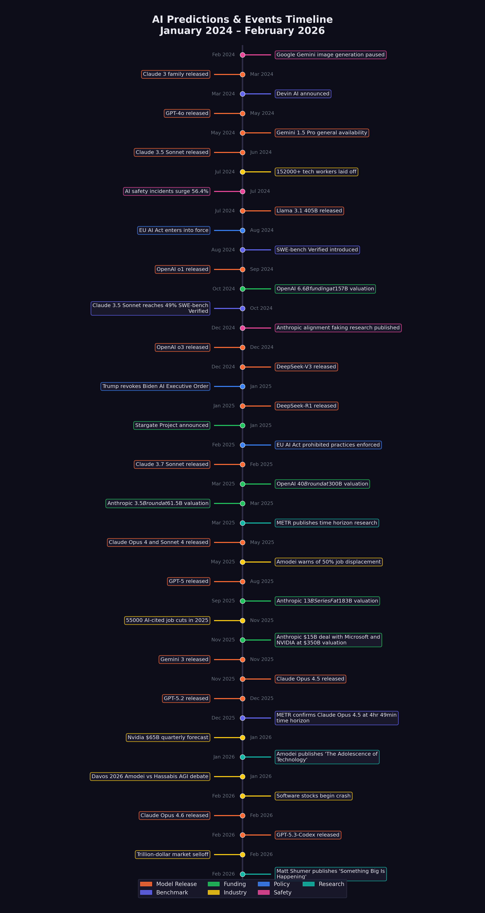

# The Chorus of Warnings {#sec-voices-of-warning}

On January 27, 2026, Dario Amodei walked onto a stage at the World Economic Forum in Davos, Switzerland, and said something that made every software engineer in the audience shift in their seat. AI, the Anthropic CEO predicted, would replace most software engineers' work within six to twelve months. Not in five years. Not in a decade. Months [@amodei2026_davos].

Sitting on the same panel, Demis Hassabis --- the Google DeepMind CEO who'd won a Nobel Prize for protein structure prediction just fifteen months earlier --- pushed back. His estimate was more conservative: a 50% probability of transformative AGI by 2030 [@hassabis2025]. The audience watched two of the most powerful people in AI disagree on timeline but agree on direction. Something enormous was coming. The only question was how fast.
<!-- PROOF: url=https://fortune.com/2026/01/27/at-davos-ceos-said-ai-isnt-coming-for-jobs-as-fast-as-anthropic-ceo-dario-amodei-thinks/ | accessed=2026-02-14 | key=amodei2026_davos -->

The two men agreed on one thing: the transformation was real. They disagreed on how fast it would arrive, how thoroughly it would disrupt existing institutions, and how much time remained to prepare. Their disagreement was not academic. Anthropic was valued at $183 billion and would reach $350 billion by November. Google DeepMind had just won a Nobel Prize. These were not commentators. They were the people building the technology they were debating, and their disagreement about its trajectory was itself evidence of the genuine uncertainty at the frontier. If the people making the thing couldn't agree on what it would do, what chance did the rest of the world have?

Matt Shumer's essay did not emerge from a vacuum. By the time he published "Something Big Is Happening" on February 9, 2026, a growing chorus of the most powerful figures in the AI industry had been issuing increasingly urgent --- and increasingly specific --- warnings about what was coming. What made Shumer's essay resonate so widely was that it synthesized these warnings into a single narrative. But the individual voices deserve examination on their own terms, because each brought different evidence, different stakes, and different credibility to the conversation.

This chapter traces nine key voices, in roughly the order their most consequential predictions were made. For each, we document what they said, when they said it, and how their predictions stood as of February 2026.

## Dario Amodei: "A Country of Geniuses in a Datacenter"

No single figure has been more consistently vocal --- or more consistently alarming --- about AI's near-term trajectory than Dario Amodei, CEO of Anthropic. A former VP of Research at OpenAI who left to found a safety-focused competitor, Amodei occupies an unusual position: he is simultaneously building frontier AI systems and warning the public about their implications.

That dual role --- builder and warner --- made him a uniquely polarizing figure. Supporters saw a responsible leader who understood the power of his creation and was transparent about its risks. Critics saw a salesman using safety rhetoric to inflate the perceived importance of his product. Both readings had evidence behind them. The truth was probably that Amodei was both things simultaneously, and that the tension between them was itself informative.

His predictions have come in three waves.

**May 2025: The job displacement warning.** In an interview with Fortune, Amodei warned that AI could eliminate 50% of entry-level white-collar jobs within one to five years, potentially spiking unemployment to 10--20% [@amodei2025]. At the time, the prediction sounded extreme. By February 2026, the early data was beginning to support it: 55,000 AI-cited layoffs in 2025 alone, with Amazon (14,000 cuts), Salesforce (4,000 support staff cuts), and dozens of other companies citing AI as a direct factor [@cnbc2025_layoffs; @challenger2025_layoffs].

**January 2026: The software engineering timeline.** At the World Economic Forum in Davos, Amodei made his most specific prediction yet: AI would replace "most software engineers' work" within six to twelve months [@amodei2026_davos]. The claim sparked immediate controversy. Other CEOs on the panel pushed back, arguing the timeline was unrealistic. But Amodei had data on his side: Claude Opus 4.5 was already scoring 79.2% on SWE-bench Verified, and Anthropic had disclosed that the majority of code written at the company was now AI-generated [@epoch2025_swebench].

**January 2026: "The Adolescence of Technology."** Just hours before his Davos appearance, Amodei published a 20,000-word essay that may prove to be one of the most important documents of the AI era. In it, he described AI as a technology entering its "adolescence" --- powerful enough to be transformative, but not yet mature enough to be fully controlled. He outlined five categories of existential risk. He predicted "a country of geniuses in a datacenter" within a few years. And he argued that AI's current generation was already "one to two years away" from autonomously building the next generation of AI systems [@amodei2026].

::: {.callout-warning}
## Tracking Amodei's Predictions

| Prediction | Date | Timeline | Status (Feb 2026) | Realization |
|:-----------|:-----|:---------|:-------------------|:------------|
| 50% entry-level job loss | May 2025 | 1--5 years | Early signs | 20% |
| Most SWE work replaced | Jan 2026 | 6--12 months | Too early | 30% |
| AI building next-gen AI | Jan 2026 | 1--2 years | Partially realized | 50% |
| Nobel-level research | Jan 2026 | ~2 years | In progress | 15% |
| 90% of code AI-written | Mar 2025 | End of 2025 | Partially realized | 35% |
| Country of geniuses | Jan 2026 | ~2028--2029 | In progress | 20% |
:::

What lends Amodei's warnings particular weight is that he is not a commentator; he is a builder. Anthropic's Claude models are among the most capable AI systems in the world. When Amodei says AI can replace software engineers, he is describing what his own product already does. When he warns about recursive self-improvement, he is describing a capability his team is actively developing. His incentives are complex --- more alarm can mean more safety funding, but it can also mean more regulatory scrutiny of his own company --- but his technical credibility is difficult to dismiss.

## Sam Altman: "AGI During Trump's Term"

Sam Altman, CEO of OpenAI, has been making predictions about artificial general intelligence longer than almost anyone in the industry. His predictions have been characterized by two qualities: extreme ambition and a tendency to be proven more right than wrong.

**November 2024: AGI during the Trump administration.** In an interview with Time, Altman predicted that AGI --- artificial general intelligence, meaning AI that matches or exceeds human performance across virtually all cognitive tasks --- would "probably" be developed during President Trump's second term, meaning between 2025 and 2029 [@altman2024]. As of February 2026, this prediction remains in progress. GPT-5 and Claude Opus 4.6 demonstrate broad competence across many domains, but whether they constitute "AGI" depends heavily on definitions that remain contested.

**June 2025: Novel AI insights in 2026.** Altman predicted that 2026 would see AI systems generating genuinely novel insights --- not just recombining existing knowledge, but producing ideas that surprised their creators [@altman2025_future]. GPT-5's reasoning capabilities and o3's chain-of-thought advances showed early signs of this, though the bar for "novel insights" is inherently subjective.

**2025: Surpassing humans by 2030.** In a blog post, Altman made his broadest prediction: AI would surpass humans "in all dimensions" by 2030 [@altman2025]. By February 2026, AI systems excelled at coding, mathematical reasoning, and certain forms of analysis, but remained limited in physical-world understanding, common sense reasoning, and embodied tasks. The prediction was scored at 15% realization.

Altman's track record is mixed but directionally correct. He has consistently overestimated near-term timelines while correctly identifying the overall trajectory. His prediction that AI coding would rapidly improve was accurate. His suggestion that AGI was imminent remains unproven, though the gap between current systems and the AGI threshold is narrower than most experts expected it to be by this point.

## Demis Hassabis: "Transformative AGI by 2030"

Demis Hassabis, CEO of Google DeepMind and a Nobel laureate in chemistry for his work on AlphaFold, brings a different flavor of credibility to AI predictions. Where Amodei leads with risk and Altman leads with ambition, Hassabis tends toward measured scientific assessment --- which makes his predictions, when they are bold, particularly noteworthy.

**March 2025: 50% probability of transformative AGI by 2030.** In a CNBC interview, Hassabis assigned a 50% probability to the development of "transformative AGI" by 2030 [@hassabis2025]. He was careful to distinguish this from the more dramatic claims of his peers, noting that key challenges in real-world understanding remained unsolved.

**January 2025: Meaningful evidence of AGI in 2025.** Earlier, Hassabis had predicted that 2025 would yield "meaningful evidence of AGI in play" [@hassabis2025_axios]. By December 2025, GPT-5 and Claude Opus 4.5 demonstrated capabilities that, depending on one's definition, could constitute such evidence. The prediction was scored at 40% realization.

**2025: Superintelligence within a few years.** In a statement that surprised many given his typically cautious demeanor, Hassabis suggested that superintelligence --- AI vastly exceeding human capabilities --- was "at best a few years out" [@hassabis2025_axios]. As of February 2026, this remained the most speculative of his predictions, scored at just 10% realization.

What distinguishes Hassabis from other predictors is his emphasis on scientific rigor. His reference point is not product capabilities or market dynamics but the underlying research trajectory. When he says transformative AGI is plausible by 2030, he is making a statement about the rate of fundamental scientific progress, not about product launches.

## Jensen Huang: "Insatiable Demand"

Jensen Huang, CEO of NVIDIA, occupies a unique position in the AI ecosystem. He does not build AI models, but he builds the hardware on which all frontier models run. His predictions are less about what AI will do and more about the infrastructure required to support it --- and the economic forces driving that infrastructure.

**2025: $500 billion in chip demand.** Huang predicted that AI chip sales would reach $500 billion across 2025--2026, driven by what he called insatiable demand from hyperscalers and AI labs [@huang2025]. By January 2026, NVIDIA was forecasting $65 billion in quarterly revenue, and the company had $500 billion in revenue visibility for its Blackwell and Rubin chip architectures [@nvidia2026_forecast]. The prediction was scored at 50% realization, on track to be fully confirmed.

**2025: Reasoning advances unlocking robotics and self-driving.** Huang also predicted that breakthroughs in AI reasoning would enable "leaps" in robotics and autonomous driving [@huang2025_hpcwire]. This prediction has shown more modest progress. Tesla's Full Self-Driving system continued to improve, and humanoid robotics made advances, but METR's data suggested that self-driving was improving more slowly than other AI domains. The prediction was scored at 15% realization.

Huang's predictions matter because they reflect the supply side of the AI equation. When the CEO of the dominant hardware provider says demand is insatiable, it is a signal about the pace of deployment, not just research. The hundreds of billions being poured into AI infrastructure suggest that the industry's largest players believe the capability gains are real and durable.

## Microsoft Research: "Five Million Jobs"

In early 2025, a widely cited Microsoft Research analysis identified approximately five million white-collar jobs that faced potential "extinction" due to AI automation [@microsoft2025_jobs]. The most vulnerable categories included management analysts, customer service representatives, sales engineers, and various forms of administrative work.

By February 2026, the prediction showed early signs of validity:

- Hundreds of thousands of technology workers had been laid off across 2024--2025 (see @sec-human-cost for detailed analysis) [@challenger2025_layoffs]
- Nearly 55,000 job cuts in 2025 were directly attributed to AI [@cnbc2025_layoffs]
- The U.S. unemployment rate rose to 4.4%
- Worker concern about AI job displacement jumped from 28% to 40% [@hbr2026_aijobs]

The Microsoft Research analysis was notable for its specificity. Rather than making broad claims about AI replacing "jobs," it identified particular occupational categories and estimated their vulnerability based on task analysis. This granularity made it more useful --- and more unsettling --- than generic warnings.

## Daniela Amodei: "The Humanities Will Be More Important Than Ever"

While Dario Amodei warned about the pace of technological change, his sister and Anthropic co-founder Daniela Amodei was articulating a different dimension of the same transformation --- less about what AI would replace than what it would make more valuable.

In a Fortune interview published on February 7, 2026 --- two days before Shumer's essay --- Daniela Amodei described a fundamental shift in how Anthropic thought about hiring. "When we look to hire people at Anthropic today, we look for people who are great communicators, who have excellent EQ and people skills, who are kind and compassionate and curious and want to help other people," she said [@damodei2026_generalists]. The description sounded less like a traditional Silicon Valley AI company than an organization that had internalized the implications of its own technology.

The reasoning ran against intuition. As AI systems became more capable at technical execution --- writing code, analyzing data, generating reports --- the skills that differentiated humans shifted toward precisely the capabilities that machines lacked: empathy, judgment, communication, ethical reasoning, and the ability to understand what other humans actually needed. "I actually think studying the humanities is going to be more important than ever," Daniela Amodei told Fortune. "A lot of these models are actually very good at STEM. But I think this idea that there are things that make us uniquely human --- understanding ourselves, understanding history, understanding what makes us tick --- I think that will always be really, really important" [@damodei2026_generalists].

The statement was striking coming from the president of a company valued at approximately $350 billion, a company that had raised over $13 billion in venture capital precisely because of its technical capabilities [@anthropic2025_seriesf; @cnbc2025_anthropic_msnv]. Daniela Amodei wasn't dismissing technical education. She was insisting it was no longer sufficient on its own --- that the AI systems her company was building had changed the calculus of what skills mattered. "The things that make us human will become much more important instead of much less important," she said [@damodei2026_generalists].

This framing offered something that most AI discourse lacked: a positive vision of human value in an automated world. Where Dario Amodei's warnings emphasized what was at risk, Daniela Amodei's message emphasized what remained irreplaceable. The two perspectives were not contradictory. They were complementary aspects of the same transformation, articulated by siblings who happened to lead the same company from different vantage points.

## Mike Krieger: "Claude Is Now Writing Claude"

If Daniela Amodei pointed toward the future of human value, Mike Krieger documented the present reality of AI capability. Krieger, who had co-founded Instagram and joined Anthropic as Chief Product Officer, spoke at the Cisco AI Summit on February 3, 2026, and delivered what may have been the single most consequential sentence uttered at any technology conference that year: "Claude is now writing Claude" [@krieger2026_claudewritesclaude].

The statement was precise and its implications were vast. Krieger was not speaking metaphorically. He was describing the operational reality at Anthropic. "Right now for most products at Anthropic it's effectively 100% just Claude writing, and then what we've done is created all the right scaffolds around it to let us trust it," he said [@krieger2026_claudewritesclaude]. The caveat about scaffolding was important --- human engineers were not absent from the process. They designed the systems that checked Claude's work, they set the specifications, and they reviewed the outputs. But the actual writing of code, line by line, function by function, was being done by the AI system itself.

Krieger had the credibility to make this claim stick. As the co-founder of Instagram, he had built one of the most successful software products in history through conventional engineering methods. He understood, at an experiential level, what it meant to write code, to ship features, and to manage engineering teams. When he said that Claude was writing its own code, he was making a comparison against a standard he had personally defined over a decade of product development.

The phrase "Claude is now writing Claude" also carried a deeper significance that connected to the recursive improvement thesis central to Shumer's essay. If the AI was writing its own code, then each improvement to the model could be applied to the development of the next improvement. The loop was not theoretical. It was operational, running inside one of the world's leading AI companies, overseen by an engineer whose resume included building a product used by two billion people.

## Boris Cherny and Roon: "100%, I Don't Write Code Anymore"

On January 29, 2026, Fortune published an article that put hard numbers on what Krieger would confirm five days later. The piece featured two individuals from opposite ends of the AI industry who had arrived at the same conclusion.

Boris Cherny was the head of Claude Code at Anthropic --- the person directly responsible for the tool that enabled AI-generated coding. His claim was specific and auditable: "100% for two+ months now, I don't even make small edits by hand" [@cherny2026_aicode]. The claim went far beyond vague assertions that AI was "helping" with coding. A senior engineer at one of the world's most advanced AI companies had stopped writing code entirely. "I shipped 22 PRs yesterday and 27 the day before, each one 100% written by Claude," Cherny said [@cherny2026_aicode]. The productivity numbers were staggering. Twenty-two pull requests in a single day would be exceptional output for a team of engineers, let alone an individual. Cherny was not working harder. He was working through a fundamentally different medium: specifying intent in natural language and reviewing the code his AI produced.

The personal dimension was equally telling. "I have never had this much joy day to day in my work," Cherny told Fortune. "Engineers just feel unshackled, that they don't have to work on all the tedious stuff anymore" [@cherny2026_aicode]. He sounded less like someone ceding control to automation than a practitioner set free --- someone who had discovered that the parts of his job he found tedious could be delegated, leaving him to focus on the parts he found meaningful.

Roon, an OpenAI researcher known by his pseudonym, offered a blunter assessment from across the competitive divide: "100%, I don't write code anymore" [@cherny2026_aicode]. Where Cherny framed the shift as liberation, Roon framed it as inevitability. "Programming always sucked," he said. "It was a requisite pain for ~everyone who wanted to manipulate computers into doing useful things, and I'm glad it's over" [@cherny2026_aicode].

The Fortune article also provided company-wide context. Anthropic's AI code generation rate across the entire company was estimated at 70--90%, with Claude Code specifically generating approximately 90% of its own codebase [@cherny2026_aicode]. For comparison, Microsoft had reported that approximately 30% of its code was AI-generated as of April 2025 --- a figure that, while significant, was less than half of Anthropic's rate less than a year later. Y Combinator reported that a quarter of its 2025 winter batch founders were generating up to 95% of their code with AI, confirming that the phenomenon was not confined to frontier AI labs but had spread into the broader startup ecosystem [@cherny2026_aicode].

The progression from Microsoft's 30% in April 2025 to Anthropic's 70-90% by early 2026 illustrated a pattern that would recur throughout this book: adoption curves that looked gradual in retrospect were experienced as sudden by those living through them. Companies moved from "experimenting with AI coding tools" to "majority AI-generated code" in months, not years. The transition resembled a phase change more than a gradual fade, driven by model capabilities that crossed a threshold of reliability around the November-December 2025 period discussed in @sec-november-precedent.

## The Builders' Testimony

Krieger, Cherny, and Roon deserve to be considered together because their combined testimony addresses the three most common objections to claims about AI-driven software development.

The first objection is that AI-generated code works only for toy problems. Krieger's testimony refutes this directly. Anthropic's products are not toy software. Claude is a frontier AI system used by millions of people, running on infrastructure of enormous complexity. If Claude can write production code for Claude, then AI-generated code is not limited to simple applications.

The second objection is that AI coding is merely sophisticated autocomplete --- that a human is doing the real intellectual work and the AI is filling in boilerplate. Cherny's testimony refutes this. Instead of using AI to complete lines of code he'd started, Cherny was shipping entire pull requests --- complete features, complete bug fixes, complete test suites --- without making manual edits. The AI had moved from assisting his work to performing it, guided by his specifications.

The third objection is that this only works at AI companies, because their codebases are designed around AI tools. Roon's testimony is relevant here. While OpenAI is indeed an AI company, Roon's framing had nothing to do with any particular codebase or development environment --- it concerned the nature of programming itself --- that it had always been a means to an end, and that the end could now be reached by a different means. If true, the shift would extend beyond AI companies to any organization that wrote software --- which is to say, nearly every organization.

The convergence of these three voices --- from two competing companies, at different levels of seniority, with different personal styles --- pointed to a conclusion that was difficult to dismiss. AI had not merely improved the coding process. It had, for the people closest to the frontier, replaced it. The question was no longer whether this was possible. It was how long until it became the norm.

## Matt Shumer: "Nothing on Computers Is Safe"

And then there was Shumer himself. His predictions were the most recent and, in some ways, the most radical.

**"Nothing done on a computer is safe in the medium term."** Shumer argued that any task performed primarily through a screen would eventually be automated, framing this not as a distant possibility but as an inevitable consequence of current trends [@shumer2026]. The prediction was scored at 25% realization, reflecting the fact that while many computer-based tasks were already being automated, the full scope of Shumer's claim was far from realized.

**"AI is bigger than Covid in societal impact."** This was perhaps the most contested of all the predictions tracked in this book. The comparison to a pandemic that killed millions and shut down the global economy was deliberately provocative. Shumer's argument centered on structural disruption rather than mortality: the reshaping of labor markets, business models, and economic power. By February 2026, the prediction was scored at 30% realization --- real disruption was underway, but the full societal transformation remained ahead.

**"AI can compress a century of medical research into a decade."** Drawing on conversations with researchers, Shumer made a bold claim about AI's potential to accelerate biomedical discovery. By February 2026, AI tools like AlphaFold had demonstrated real capability in protein folding and drug target identification, but the massive bottleneck of clinical trials meant that the prediction was scored at just 10% realization [@shumer2026].

## The Timeline

@fig-timeline-predictions shows the key events and predictions mapped onto a timeline, revealing how the chorus of warnings built in intensity over the eighteen months leading up to Shumer's essay.

{#fig-timeline-predictions}

The pattern is striking. Through most of 2024, AI predictions were ambitious but abstract. By mid-2025, they began to be accompanied by concrete evidence: benchmark scores, job numbers, funding rounds. By early 2026, the predictions and the evidence were converging. The gap between what was being forecast and what was being measured was shrinking.

## Convergence and Credibility

What makes this chorus of warnings unusual is the degree of convergence among people with very different incentives.

Amodei runs a safety-focused AI company. Warning about AI risks supports his company's positioning and its case for safety-focused development. But his warnings also invite regulatory scrutiny of his own products. His incentives are genuinely mixed.

Altman runs the company with the most to gain from AI hype. His predictions serve OpenAI's fundraising and market positioning. But he has also been proven right often enough that dismissing him as merely self-interested is difficult.

Hassabis is a scientist and Nobel laureate. His credibility rests on rigor, and he has been more cautious than his peers. When he moves toward bolder predictions, it carries particular weight.

Huang sells the hardware. His forecasts are backed by order books and revenue projections, not speculation. When he says demand is insatiable, he has the receipts.

Microsoft Research is an institutional voice, not an individual one. Its five-million-jobs analysis was based on systematic task-level evaluation, not gut feeling.

Daniela Amodei offers the organizational perspective. Her focus on hiring generalists and valuing humanities education reveals how the shift is already reshaping the internal priorities of the companies building these systems --- not in the future, but now [@damodei2026_generalists].

Krieger, Cherny, and Roon provide ground-level confirmation. They are not making predictions about what AI might do. They are reporting what it is already doing in their daily work. When the head of Claude Code says he has not manually edited a line of code in two months, that is not a forecast. That is a field report [@cherny2026_aicode; @krieger2026_claudewritesclaude].

And Shumer is a builder and observer, not a lab CEO or hardware executive. His essay synthesized the others' warnings and added the observation that tied them together: the transformation couldn't be traced to any single model or benchmark --- it was a systemic shift that had already begun.

The fact that all of these voices --- competitors, collaborators, regulators, independent observers, and practitioners --- were arriving at similar conclusions was itself a data point. Individual predictions can be self-serving. Convergent predictions across an entire ecosystem are harder to dismiss.

It is worth pausing to consider the counterfactual. What would it look like if these warnings were wrong? If AI capability were being systematically overstated, we would expect to see divergence rather than convergence. We would expect competitors to undermine each other's claims. We would expect practitioners to report a gap between the marketing and the reality. We would expect benchmark scores to plateau or be revealed as misleading. Instead, the opposite is true on every count. The competitors are confirming each other's timelines. The practitioners are reporting that the reality exceeds the marketing. The benchmarks are being surpassed ahead of schedule. And the convergence is tightening, not loosening, with each passing month.

## The Incentive Problem {#sec-incentive-problem}

There's a reason to be skeptical of everything in this chapter, and it's simple: every person quoted above has a financial interest in AI being as transformative as they claim.

Dario Amodei runs a company valued at $183 billion. Sam Altman runs one valued at $300 billion. Jensen Huang's net worth tracks directly with AI chip demand. Even the practitioners --- Cherny, Krieger, Roon --- work at companies whose valuations depend on the narrative that AI is changing everything. When a CEO predicts that his own product will reshape the world, the correct prior is skepticism, not belief.

Even Elon Musk, who was simultaneously building xAI and its Grok models, acknowledged the stakes: "There's a 10% to 20% chance that it goes bad," he told attendees at Saudi Arabia's Future Investment Initiative summit in October 2024 [@musk2024_fii].
<!-- PROOF: url=https://fortune.com/2024/10/30/elon-musk-ai-could-go-bad-existential-threat-xai-fundraising/ | accessed=2026-02-14 | key=musk2024_fii -->

Gary Marcus has made this point repeatedly and correctly. He warned throughout 2025 that the AI industry was in a bubble, that benchmarks were being cherry-picked, and that the gap between demo-quality performance and production-quality reliability was being systematically understated. By his own accounting, sixteen of his seventeen high-confidence predictions for 2025 proved correct. He predicted that agents wouldn't be reliable. He predicted that the economics wouldn't work. He predicted that the hype would outpace the delivery. On several counts, he was right.

The counterargument is convergence. It is common for individual companies to overstate their own products. It is rare for an entire ecosystem of competitors to independently overstate the same capability in the same direction at the same time. Amodei and Altman are competitors. Hassabis leads a rival lab. Huang is a supplier, not a developer. And the practitioners at Anthropic and OpenAI have no particular incentive to exaggerate to each other. When competitors confirm each other's claims, the signal-to-noise ratio improves.

But the skeptics' strongest card is timing. Every one of these predictions was made within a two-year window of extraordinary market enthusiasm. The same was true of internet predictions in 1999, housing predictions in 2006, and crypto predictions in 2021. Conviction is not evidence. And the history of technology is littered with predictions that were directionally correct but decades premature.

Here's what would prove the skeptics right: if, by the end of 2027, the revenue generated by AI applications does not exceed 30% of the capital invested in AI infrastructure, the investment thesis was a bubble regardless of the technology's capability. If the nine voices in this chapter are still making the same predictions with the same timelines two years from now, the timelines were wrong.

::: {.callout-note title="Practitioner's Tool: Prediction Convergence" icon=false}

| Voice | Core Prediction | Timeline | Status (Feb 2026) |
|-------|----------------|----------|-------------------|
| Dario Amodei | 90% AI-written code; 50% entry-level job loss | 6-12 months (code); 1-5 years (jobs) | 70-90% code confirmed; jobs early |
| Sam Altman | AI surpasses humans in all dimensions | By 2030 | On track in narrow domains |
| Demis Hassabis | 50% chance transformative AGI | By 2030 | Consistent with evidence |
| Jensen Huang | AI chip demand insatiable | Through 2026 | $65B quarterly forecast |
| Microsoft Research | 5M+ vulnerable positions | Near-term | Layoffs accelerating |
| Daniela Amodei | Humanities skills rise in value | Now | Anthropic hiring generalists |
| Krieger/Cherny/Roon | AI writing its own code | Now | Confirmed by practice |
| Matt Shumer | Bigger than Covid | 1-5 years | Market disruption evident |

The pattern: technical predictions (code, benchmarks, capability) are running ahead of schedule. Societal predictions (jobs, restructuring, regulation) are running on schedule or behind. The technology arrives first. The institutions catch up later. This is the Confirmation Gap in action, visible not just in the timeline but in the predictions themselves.
:::

What's unusual about this particular convergence isn't that industry leaders are optimistic about their own technology. That's always true. What's unusual is the specificity. Amodei didn't say "AI will be important." He said "six to twelve months for most software engineering work." Hassabis didn't say "AGI is coming." He said "50% probability by 2030." Altman didn't say "AI will surpass humans." He said "during Trump's term." These are falsifiable claims with specific timelines, made by people who know their reputations will be measured against the outcomes. The history of technology predictions is dominated by vague hand-waving about "the future." This was something different: a set of specific, time-bound, testable claims from people with the technical standing to make them.

The closest historical parallel is the early atomic era. In 1945, a small group of physicists --- Oppenheimer, Fermi, Szilard, Teller --- understood that nuclear weapons would transform geopolitics. Their warnings were specific, urgent, and based on technical knowledge that the public and most policymakers lacked. The general public didn't understand what had changed until Hiroshima. The scientists knew months earlier. The gap between expert knowledge and public understanding created a period of asymmetric awareness that shaped policy for decades.

The AI warnings of 2025-2026 had a similar structure. The people building the technology understood something that the public did not yet grasp. Their warnings were attempts to close the gap. Whether those attempts succeeded --- or whether the gap would close the same way it did in 1945, through a dramatic event that left no room for doubt --- was the question that hung over every prediction in this chapter.

In the chapters that follow, we move from predictions to evidence. We examine the benchmarks, the data, and the timelines that either confirm or challenge what these voices predicted. The chorus warned us. Now let's see the numbers.

But first, the meta-irony that hangs over this entire chapter. Shumer used Claude to write his essay. This book is tracking predictions made by people who build AI, funded by people who invest in AI, covered by journalists who cover AI. The entire discourse about AI's transformative potential is being conducted by people who benefit from that potential being real. That doesn't mean they're wrong. It means the reader should hold every claim --- including the ones in this book --- against the evidence presented in the chapters that follow, not against the authority of the person making it. The numbers are the arbiters. Not the CEOs.

::: {.callout-tip}
## Key Takeaway

Nine distinct voices documented in this chapter --- Dario Amodei, Sam Altman, Demis Hassabis, Jensen Huang, Microsoft Research, Daniela Amodei, Mike Krieger, Boris Cherny/Roon, and Matt Shumer --- converged on a common conclusion from radically different vantage points. The lab CEOs warned about what was coming. The builders confirmed what had already arrived. The hardware CEO reported the demand surge. The institutional researcher quantified the job vulnerability. And the Anthropic co-founder reframed what human skills would matter most.

Their predictions differed in specifics and timelines, but the directional agreement across competitors, commentators, and practitioners alike suggested a signal, not noise. Critically, the practitioners' testimony --- Krieger's "Claude is now writing Claude," Cherny's 22 pull requests in a single day, Roon's declaration that programming "always sucked" --- moved the conversation from forecast to documentation. These were not predictions about the future. They were reports from the present.
:::
