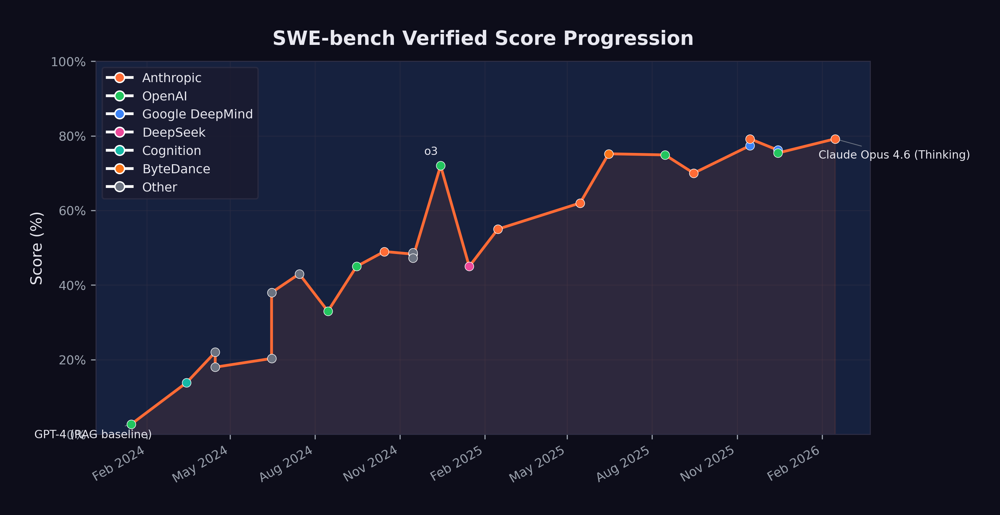

# The Benchmark Revolution {#sec-benchmark-revolution}

In the fall of 2023, Carlos Jiménez sat at a workstation in Princeton, New Jersey, watching another language model fail. Output scrolled across his terminal --- wrong file, wrong function, patch rejected by the test suite. The PhD candidate had grown up in Salt Lake City, studied computer science at the University of Utah, then headed east to work with professor Karthik Narasimhan on a problem that sounded simple and turned out to be brutally hard: could a language model fix real software bugs?

<!-- PROOF: url=https://www.carlosejimenez.com/ | accessed=2026-02-14 | key=jimenez_bio -->
<!-- PROOF: url=https://arxiv.org/abs/2310.06770 | accessed=2026-02-14 | key=jimenez2024_swebench -->

It was a moment of peak AI hype. ChatGPT had launched the previous November and reached a hundred million users in two months. Every tech company was bolting AI features onto its products. But Jiménez wasn't building chatbots. He wanted to know something specific: could these systems do the *work* --- the tedious, detail-oriented, test-it-till-it-passes work --- of professional software engineering?

He'd spent months building the answer machine. SWE-bench: 2,294 tasks scraped from twelve production Python repositories --- Django, Flask, scikit-learn, sympy, and others. Each task was a real bug report filed by a real developer, paired with the full codebase and a test suite that would judge whether the fix worked. No toy problems. No LeetCode puzzles. The actual daily grind of software maintenance.

The protocol was merciless. Give the model the bug report. Give it the codebase. No hints about which file to edit, no guidance on approach. Just: here's the problem, here's the code, fix it.

GPT-4 --- the most capable model available --- resolved 2.7% of the tasks. One in thirty-seven. Jiménez had designed the benchmark to be hard. He hadn't expected it to be *this* hard.

He submitted the paper to ICLR, where it was accepted for the 2024 conference. He couldn't have known that within two years, every major AI lab on the planet would be racing to top his leaderboard --- that the score would climb from that initial 2.7% to 79.2% --- that the measuring stick he'd built at Princeton would become the most-cited number in arguments about whether artificial intelligence was coming for the software engineering profession.

The voices of warning documented in the previous chapter made bold claims. But predictions are cheap. Evidence is what matters. And in the field of AI-assisted software engineering, Jiménez's benchmark became the definitive measure of whether those predictions were coming true.

## What SWE-bench Actually Measures

SWE-bench is not an artificial test. It does not ask models to solve textbook exercises or complete coding puzzles. Instead, it draws from real issues filed against real open-source repositories --- projects like Django, Flask, scikit-learn, and sympy. Each task consists of a bug report or feature request, the corresponding codebase, and the test suite that defines whether the fix is correct [@epoch2025_swebench].

To solve a SWE-bench task, an AI system must:

1. Read and understand the issue description
2. Explore a large, unfamiliar codebase
3. Identify the relevant files and functions
4. Write a correct patch that resolves the issue
5. Pass the existing test suite without breaking anything

The tasks demand the daily work of professional software engineers --- reading comprehension, code navigation, debugging intuition, and the ability to reason about complex system interactions.

In August 2024, OpenAI and the benchmark authors introduced SWE-bench Verified, a human-audited subset of 500 tasks designed to eliminate ambiguous or poorly specified issues [@openai2024_swebenchverified]. This version became the standard against which all subsequent models have been measured.

The need for a verified subset was itself revealing. The original SWE-bench dataset contained tasks where the "correct" solution was disputed, where the test suite was incomplete, or where the issue description was too vague for even a skilled human to resolve reliably. By hand-auditing 500 tasks, the benchmark authors created a cleaner signal --- one that separated genuine AI capability from noise. The trade-off was a smaller dataset, but the gains in measurement reliability were substantial. After August 2024, virtually every major lab reported results on Verified rather than the original benchmark, making it the de facto standard for the field.

## The Progression: From 2.7% to 79.2%

The trajectory of SWE-bench scores reads like an exponential curve. @fig-swe-bench-timeline shows the progression from early 2024 through February 2026.

{#fig-swe-bench-timeline}

The key milestones, summarized in @tbl-swebench-scores, tell their own story:

| Date | Model | Score | Organization |
|:-----|:------|------:|:-------------|
| Jan 2024 | GPT-4 (RAG baseline) | 2.7% | OpenAI |
| Mar 2024 | Devin | 13.86% | Cognition |
| Apr 2024 | AutoCodeRover | 22.0% | NUS/Industry |
| Jun 2024 | MentatBot + GPT-4o | 38.0% | AbanteAI |
| Jul 2024 | CodeStory Aide | 43.0% | CodeStory |
| Aug 2024 | GPT-4o (Verified baseline) | 33.0% | OpenAI |
| Sep 2024 | o1-preview | 45.0% | OpenAI |
| Oct 2024 | Claude 3.5 Sonnet | 49.0% | Anthropic |
| Dec 2024 | o3 | 72.0% | OpenAI |
| Feb 2025 | Claude 3.7 Sonnet | 55.0% | Anthropic |
| May 2025 | Claude Sonnet 4 | 62.0% | Anthropic |
| Jun 2025 | TRAE (multi-model) | 75.2% | ByteDance |
| Aug 2025 | GPT-5 | 74.9% | OpenAI |
| Nov 2025 | Gemini 3 Pro + agent | 77.4% | Google DeepMind |
| Nov 2025 | Claude Opus 4.5 + agent | 79.2% | Anthropic |
| Dec 2025 | GPT-5.2 | 75.4% | OpenAI |
| Feb 2026 | Claude Opus 4.6 (Thinking) | 79.2% | Anthropic |

: Top SWE-bench Verified scores by date, showing the progression from single-digit to near-80% performance. {#tbl-swebench-scores}

Several patterns emerge from this data.

### The Early Phase: Proof of Concept (Jan--Jun 2024)

When GPT-4 scored 2.7% with a simple retrieval-augmented generation approach in January 2024, many researchers viewed AI-assisted software engineering as an interesting but impractical research direction. The score meant the model could solve roughly one in forty real-world bugs --- not a useful tool for any professional.

Devin's March 2024 announcement at 13.86% was significant not for its absolute score but for what it represented. Cognition Labs marketed Devin as "the first AI software engineer," and while the marketing outpaced the reality, the five-fold improvement over the RAG baseline in just two months signaled that the problem was tractable [@cognition2024_devin].

By mid-2024, multi-model approaches combining Claude 3.5 Sonnet and GPT-4o were pushing past 40%. The benchmark was no longer a curiosity. It was a competitive arena.

### The Breakthrough Phase: Reasoning Models (Sep 2024--Feb 2025)

The introduction of reasoning models --- OpenAI's o1 in September 2024 and o3 in December 2024 --- represented a qualitative shift. These models did not simply generate code faster; they thought about problems differently, using chain-of-thought reasoning to plan their approach before writing a single line.

o1-preview scored 45%, respectable but not groundbreaking. o3, released in December 2024, scored 72% --- a 27-percentage-point jump in three months [@openai2023_gpt4]. This single leap was larger than the entire improvement from January through September 2024.

Meanwhile, Anthropic's Claude 3.5 Sonnet had reached 49% in October, and Claude 3.7 Sonnet would reach 55% by February 2025 --- steady, substantial gains from a different architectural approach [@anthropic2024_swebench].

### The Maturity Phase: Converging at the Top (Mar 2025--Feb 2026)

By mid-2025, the leading models were converging. Claude Sonnet 4 hit 62%. ByteDance's TRAE reached 75.2% using a multi-model approach. GPT-5 landed at 74.9%. The differences between top models were narrowing even as absolute performance climbed.

### The November 2025 Cluster: The Inflection Point {#sec-november-cluster}

November 2025 stands as the most consequential month in the history of AI coding benchmarks. Within a span of six days, two models shattered what had seemed like a ceiling, and in doing so redefined the practical meaning of artificial intelligence for the software engineering profession.

On November 18, Google DeepMind released Gemini 3 Pro, which scored 77.4% on SWE-bench Verified when paired with an agentic scaffolding [@epoch2025_swebench; @google2025_gemini3]. The score represented a 2.5-percentage-point improvement over GPT-5's August 2025 result of 74.9% --- a modest gain in absolute terms, but one that carried it past the 75% threshold. At 77.4%, the model was resolving more than three out of every four verified software engineering tasks. For the first time, the balance had tipped: there were more tasks the AI could solve than tasks it could not.

Six days later, on November 24, Anthropic released Claude Opus 4.5. Its SWE-bench Verified score of 79.2% did not merely exceed Gemini 3 Pro's result. It established a new ceiling that has yet to be surpassed as of this writing [@epoch2025_swebench]. The 1.8-percentage-point gap between Gemini 3 Pro and Opus 4.5 may appear narrow, but at the top of a saturating benchmark, each additional point represents the resolution of progressively harder problems --- the ambiguous bug reports, the deeply nested codebases, the issues that require not just technical skill but something approaching engineering judgment.

What made the November cluster significant was the concentration. Two models from two competing organizations, released within a week of each other, both pushing past 77%. Because the underlying capabilities --- chain-of-thought reasoning, tool use during problem-solving, sustained error recovery --- had matured independently, near-80% performance was now reproducible across different architectures and different training approaches. Convergence, not coincidence.

The scores also need to be understood in the context of the broader November model release wave discussed in @sec-november-precedent. Grok 4.1 had arrived on November 17, pushing LMArena Elo to 1,483. Gemini 3 topped that the next day at 1,501 Elo. Opus 4.5 arrived six days later with the SWE-bench crown. And within three weeks, GPT-5.2 and Gemini 3 Deep Think would further extend the frontier of reasoning capability. The competitive pressure was intense and mutually reinforcing. Each release gave the other labs' customers a reason to demand better tools, and each lab had models ready or nearly ready that could deliver.

By February 2026, when Claude Opus 4.6 matched the 79.2% with its thinking capabilities, the benchmark had arguably reached a saturation point. The remaining 20% of unsolved tasks likely represented genuinely ambiguous issues, tasks requiring deep domain knowledge, or problems that were poorly specified in the original repositories. AI competence on standard software engineering tasks was settled. What remained was the meaning of the ceiling --- whether the last 20% represented a fundamental limit or merely the next target.

## What 79% Means for Software Engineering

Sundar Pichai had called it "the most profound technology humanity is ever working on" [@pichai2025_bbc]. A score of 79.2% on SWE-bench Verified gave that claim specific, concrete implications for the software engineering profession.
<!-- PROOF: url=https://fortune.com/2025/12/02/ai-wipes-jobs-google-ceo-sundar-pichai-everyday-people-to-adapt-accordingly/ | accessed=2026-02-14 | key=pichai2025_bbc -->

It means that when presented with a random bug report from a production open-source codebase, an AI system can trace through the code, identify the problem, and write a correct fix roughly four times out of five. It can do this in minutes rather than the hours or days a human engineer might require. It can do it at any time of day, without needing to ramp up on the codebase, and without introducing the human errors that come from fatigue or distraction.

::: {.callout-warning}
## What 79% Does Not Mean

A 79.2% SWE-bench score does not mean AI can replace 79.2% of software engineers. Software engineering encompasses far more than resolving bug reports: architecture design, requirements gathering, code review, system operations, stakeholder communication, and judgment calls about trade-offs. SWE-bench measures one important dimension of the job, but not the whole job.

That said, resolving issues against existing codebases is a significant fraction of what junior and mid-level engineers spend their time on. The implications for entry-level software engineering roles are real and immediate.
:::

The implications for hiring are already visible. By late 2025, multiple technology companies had begun restructuring their engineering organizations, reducing headcount at the junior level while increasing investment in senior engineers who could supervise and direct AI systems [@cnbc2025_layoffs]. The traditional career pipeline --- where graduates enter as junior engineers, fix bugs, write tests, and gradually take on more complex work --- is being compressed. If an AI can handle the bug-fixing and test-writing that once served as the training ground for new engineers, then the on-ramp to the profession narrows. Companies that once posted dozens of entry-level software engineering positions began, by early 2026, posting fewer such roles and instead seeking candidates with the ability to architect systems, review AI-generated code, and specify complex requirements clearly [@hbr2026_aijobs].

The economic implications extend beyond hiring. If an AI system can resolve most routine software engineering tasks, then organizations need fewer humans for those tasks. This does not necessarily mean fewer software engineers in total --- demand for software is effectively infinite, and AI may enable small teams to tackle projects that previously required large ones. But it does mean that the nature of the work is changing, and that the skills that defined a good junior engineer in 2023 are not the same skills that will define one in 2027.

## The 29% Finding {#sec-29-percent}

SWE-bench measures what AI can do in a controlled evaluation setting. But how much code is AI actually writing in the real world? On January 22, 2026, a study published in *Science* --- one of the most prestigious peer-reviewed journals in the world --- provided the first rigorous answer. The number was startling: 29% of Python functions committed to GitHub by U.S.-based developers were AI-generated [@daniotti2026_aicoding].

The study, led by Simone Daniotti at the Complexity Science Hub and Utrecht University, was notable for the rigor of its methodology. Rather than relying on self-reported surveys --- which are prone to social desirability bias and imprecise definitions of what counts as "AI-generated" --- the team trained a neural classifier to detect AI-generated Python functions directly from code. They applied this classifier to more than 30 million GitHub commits from approximately 160,000 developers, creating what was by far the largest empirical study of AI code adoption ever conducted [@daniotti2026_aicoding].

The 29% figure represented a dramatic acceleration. The study tracked adoption over time and found that the share of AI-generated Python functions among U.S. developers had risen from approximately 5% in 2022 to 29% by late 2024 and early 2025 --- a nearly sixfold increase in roughly two years. Given the rate of capability improvement documented elsewhere in this chapter, the figure was almost certainly higher by the time the study was published in January 2026.

International comparisons revealed significant geographic variation. France stood at 24%, Germany at 23%, India at 20%, Russia at 15%, and China at 12% [@daniotti2026_aicoding]. The U.S. led by a substantial margin, reflecting earlier access to frontier AI coding tools, higher adoption of tools like GitHub Copilot and Claude Code, and a developer culture that was more receptive to AI-assisted workflows. The gap between the U.S. and China was particularly striking --- a factor of nearly 2.5 --- and raised questions about whether AI coding adoption would become a source of competitive advantage between technology ecosystems.

The economic impact was substantial. The study estimated that AI-generated code contributed $23 to $38 billion in annual economic value to U.S. programming tasks, calculated from the overall 3.6% increase in quarterly output (measured in online code contributions) observed across their sample [@daniotti2026_aicoding]. This figure was conservative by design, capturing only the directly measurable productivity effect and excluding harder-to-quantify benefits like reduced time-to-market, lower defect rates, or the enablement of projects that would not have been attempted without AI assistance.

## The Experience Gap {#sec-experience-gap}

The *Science* study's most consequential finding went beyond adoption rates or economic value. It revealed who benefited from AI coding tools --- and who didn't.

Less experienced programmers used AI in 37% of their code --- a higher adoption rate than any other group. They were the most enthusiastic adopters, the most willing to delegate to AI tools, and the most likely to incorporate AI-generated functions into their commits. But their productivity gains were statistically indistinguishable from zero [@daniotti2026_aicoding].

Experienced developers, by contrast, used AI in 27% of their code --- a lower adoption rate --- but saw a 6.2% increase in commit rates at that level of adoption. The gap mattered. Six percent was the difference between a tool that made you more productive and one that merely rearranged how you spent your time [@daniotti2026_aicoding].

The finding was deeply counterintuitive and deeply consequential. The conventional wisdom about AI coding tools was that they would be the great equalizer --- that by automating the routine aspects of programming, they would allow less experienced developers to punch above their weight, closing the gap between junior and senior engineers. The *Science* study found the opposite. The technology widens rather than narrows skill-based disparities in the profession.

The likely explanation involves the difference between generating code and evaluating code. AI coding tools excel at producing syntactically correct, functionally plausible code from a natural-language prompt. But knowing whether that code is correct --- whether it handles edge cases, whether it introduces security vulnerabilities, whether it integrates properly with the broader system, whether it makes the right architectural trade-offs --- requires exactly the kind of deep experience that junior developers lack. An experienced developer can review AI-generated code and quickly spot the subtle errors: the race condition, the missing null check, the inefficient database query that will scale poorly. A less experienced developer may accept the code at face value, spending their time generating more AI-written functions rather than ensuring the quality of each one.

This finding reframes the debate about AI's impact on the software engineering labor market. If AI tools primarily benefit experienced developers --- making the already-productive more productive while leaving the less-experienced treading water --- then the implications for career development are troubling. The traditional apprenticeship model, where junior developers build expertise by writing code, making mistakes, and learning from the correction process, may be disrupted by a technology that allows juniors to bypass the learning phase entirely. They write less code, review less code, and debug less code --- the very activities through which expertise is built.

The parallel to other domains is instructive. When calculators became ubiquitous in mathematics education, teachers debated whether students still needed to learn long division. The consensus, eventually, was that understanding the underlying process mattered even if the tool could do it faster. Programming may face an analogous question: does it matter that a developer understands how to write a function if the AI writes it better? The *Science* study suggests the answer is yes --- because the developers who understand the underlying process are the ones who benefit from the tool, while those who do not understand it gain nothing.

## The Acceleration Pattern

Perhaps the most important feature of the SWE-bench trajectory is not the absolute numbers but the rate of change. Consider the time required to achieve successive milestones:

- **2.7% to 13.9%**: ~2 months (January to March 2024)
- **13.9% to 49%**: ~7 months (March to October 2024)
- **49% to 72%**: ~2 months (October to December 2024)
- **72% to 79.2%**: ~11 months (December 2024 to November 2025)

The pattern shows a rapid acceleration through mid-range scores, followed by a slowdown as performance approaches the ceiling. This is characteristic of benchmark saturation: the easiest tasks are solved first, and each additional percentage point requires solving harder problems.

But this interpretation cuts both ways. The slowdown at the top may reflect genuine difficulty, or it may reflect the fact that 2025 saw fewer paradigm-shifting architectural innovations than 2024. The introduction of agent frameworks, extended thinking, and tool use during reasoning --- all of which appeared in 2025 --- may produce another acceleration phase.

## The Competition Factor

One underappreciated driver of SWE-bench improvement is competition. By mid-2025, at least four major organizations were directly competing for the top score: Anthropic (Claude), OpenAI (GPT/o-series), Google DeepMind (Gemini), and a growing field of smaller players using multi-model approaches.

This competition created a flywheel. Each new high score generated headlines, attracted talent, and justified further investment. Anthropic's Claude 3.5 Sonnet hitting 49% in October 2024 prompted OpenAI to push o3 to 72% just two months later. That result, in turn, drove Anthropic to invest heavily in the agentic capabilities that would eventually produce the 79.2% score.

The presence of open-source competitors added another dimension entirely. In January 2025, DeepSeek released R1, an open-source reasoning model under an MIT license that scored 45% on SWE-bench Verified --- matching o1-preview's September 2024 result [@deepseek2025_r1]. DeepSeek-R1 was built atop the DeepSeek-V3 architecture, a 671-billion-parameter mixture-of-experts model that had been trained for a reported $6 million --- a fraction of the hundreds of millions that frontier labs were spending on comparable training runs [@deepseek2024_v3]. The consequences hit immediately. If an open-source model, trainable by a modestly funded Chinese lab, could match scores that OpenAI's proprietary reasoning system had achieved just four months earlier, then the competitive moat around frontier AI capabilities was thinner than anyone had assumed. The release sent shockwaves through the industry, contributing to an 18% single-day drop in NVIDIA's stock price and briefly making the DeepSeek chatbot the number-one app on Apple's iOS store [@deepseek2025_r1]. For SWE-bench specifically, the message was clear: the benchmark's middle range was no longer the exclusive domain of billion-dollar research budgets.

## Beyond SWE-bench {#sec-beyond-swebench}

SWE-bench Verified is the most prominent coding benchmark, but it is not the only one, and the proliferation of alternative benchmarks tells its own story about the field's maturation.

SWE-Bench Pro emerged as a response to the saturation problem. As top models converged near 80% on SWE-bench Verified, the benchmark's ability to discriminate between frontier systems diminished. SWE-Bench Pro addressed this by selecting harder tasks --- issues that required deeper domain understanding, more complex multi-file modifications, and more sophisticated testing strategies. When GPT-5.3-Codex was released on February 5, 2026, OpenAI highlighted its new record on SWE-Bench Pro as evidence that the model's capabilities extended beyond the original benchmark's ceiling [@openai2026_codex]. The distinction mattered: a model that excels on SWE-bench Verified might be highly capable at resolving well-specified bugs in popular frameworks, but SWE-Bench Pro tested whether that capability extended to the messier, more ambiguous, more architecturally complex problems that senior engineers encounter daily.

Terminal-Bench, the second benchmark on which GPT-5.3-Codex set records, measured a fundamentally different dimension of coding capability: autonomous terminal operations [@openai2026_codex]. Where SWE-bench evaluated a model's ability to produce a correct code patch, Terminal-Bench evaluated its ability to operate within a real computing environment --- navigating file systems, executing build commands, interpreting system outputs, managing dependencies, and orchestrating multi-step workflows through the command line. Terminal-Bench was, in effect, a test of whether an AI system could do the operational work that software engineers perform around and between writing code: the debugging, the deployment, the environment management that constitute a significant fraction of an engineer's day.

The fact that GPT-5.3-Codex achieved records on both benchmarks simultaneously was significant. It meant the model's capabilities were not narrowly optimized for one kind of task. It could both write correct code and operate the surrounding infrastructure --- a combination that no previous model had demonstrated at the same level of competence. This combination is precisely what real-world software engineering demands. A model that can write a perfect patch but cannot set up the test environment to verify it, or a model that can operate a terminal but cannot write the code to deploy, is of limited practical use. GPT-5.3-Codex closed that gap.

Taken together, the multi-benchmark evidence paints a picture of convergence: across multiple benchmarks, multiple organizations, and multiple evaluation methodologies, AI coding ability is improving rapidly and consistently. SWE-bench Verified, SWE-Bench Pro, Terminal-Bench, and the real-world productivity data from the *Science* study all point in the same direction. The breadth rules out flukes. The consistency rules out benchmark gaming. What remains is a replicable, accelerating trend in AI's ability to perform the work that has defined the software engineering profession for fifty years.

## The Benchmark's Blind Spots

The 79.2% score is real. So are its limitations.

In October 2024, a team led by Reem Aleithan published SWE-Bench+, a systematic audit of the original dataset. Their findings were uncomfortable. In 32.67% of resolved instances, the solution had been directly provided in the issue report or its comments --- what the authors called "solution leakage." Another 31.08% of passed patches were flagged as suspicious due to weak test cases that couldn't reliably verify correctness. When these problematic instances were filtered out, SWE-Agent's resolution rate with GPT-4 dropped from 12.47% to 3.97%.

<!-- PROOF: url=https://arxiv.org/abs/2410.06992v2 | accessed=2026-02-14 | key=aleithan2024_swebenchplus -->

The contamination problem cuts deeper still. In June 2025, Shanchao Liang and colleagues published "The SWE-Bench Illusion," demonstrating that frontier models could identify the correct buggy file path 76% of the time using *only* the issue description --- no codebase access required. On repositories outside SWE-bench, that accuracy dropped to 53%. The models weren't just reasoning about the code. They were remembering it.

<!-- PROOF: url=https://arxiv.org/abs/2506.12286 | accessed=2026-02-14 | key=liang2025_swebench_illusion -->

Then there's the scope problem. An Epoch AI analysis found that 87% of SWE-bench Verified tasks are bug fixes. Only 9% involve feature requests. Django alone accounts for nearly half the dataset, and 39% of tasks were rated "trivial changes" requiring less than fifteen minutes for a human. The benchmark doesn't test system architecture, API design, security review, or any of the higher-order work that separates a senior engineer from a junior one.

<!-- PROOF: url=https://epoch.ai/blog/what-skills-does-swe-bench-verified-evaluate | accessed=2026-02-14 | key=epoch2025_swebench_skills -->

None of this invalidates the trajectory. The improvement from 2.7% to 79.2% is genuine, and it measures something that matters --- the ability to find your way through a codebase and produce a working fix. But the score doesn't tell you whether the fix introduced a security vulnerability. It doesn't measure whether the code is maintainable. And it can't tell you whether the model could have designed the system it's patching.

Two falsification conditions are worth watching. First: if SWE-bench scores above 80% fail to correlate with measurable productivity gains in real-world engineering teams by late 2026, the benchmark's predictive value is weaker than assumed. Second: if models scoring 75%+ on SWE-bench Verified score below 40% on SWE-Bench Pro --- the harder, longer-horizon variant --- then the original benchmark measures a far narrower slice of engineering than its reputation suggests.

## What 79.2% Means for Ten Engineers

Strip away the benchmark abstractions. What does a 79.2% SWE-bench score mean for a working software team?

Consider a team of ten engineers at a mid-size technology company. They maintain a production codebase --- maybe two hundred thousand lines of Python, a REST API, a React frontend, the usual supporting infrastructure of databases, caches, and job queues. Bugs come in. Features get requested. The daily rhythm is triage, reproduce, trace, fix, test, submit. A typical engineer closes three to five bug-fix tickets per day, depending on complexity. The team, collectively, resolves somewhere between 30 and 50 issues daily.

Some are trivial: a missing import, a typo in a configuration value, a null pointer that should have been caught in review. Some are hard: a race condition that manifests only under load, a data corruption bug three layers deep in a dependency chain. Most fall in between.

SWE-bench Verified tasks sit in that middle range: real bugs in real codebases, with clear descriptions and existing test suites. At 79.2%, an AI system paired with an agentic framework can resolve roughly four out of five such tasks. Apply that rate to the team's daily bug queue, and 24 to 40 of those issues could be drafted by AI --- not perfectly, not without review, but with a first-pass solution that a senior engineer can evaluate in minutes rather than building from scratch.

Here's what changes. The human engineers don't vanish. They shift. Less time on the patch-and-test cycle. More time on what SWE-bench can't measure: system design, code review of AI-generated patches, architectural decisions, performance optimization, the messy work of translating vague business requirements into precise technical specifications.

This isn't hypothetical anymore. By early 2026, engineering teams using AI coding tools consistently reported that routine bug-fix time had dropped substantially --- though the exact reduction varied by team, codebase, and tooling maturity. Hours spent on design, planning, and review held roughly constant. Total effort didn't shrink. The composition changed. And the teams that adapted fastest were the ones with experienced engineers who could evaluate AI output quickly and catch the subtle errors --- a pattern that mirrors the experience gap documented in @sec-experience-gap.

The scorecard isn't about replacement. It's about reallocation. A 79.2% SWE-bench score doesn't mean a team of ten becomes a team of two. It means a team of ten can attempt what previously required twenty --- if they have the senior talent to direct the AI and the institutional willingness to reorganize around new capabilities. The benchmark measures the engine. The impact depends on who's driving.

A newly hired software engineer in 2023 spent most of their first year on bug fixes, test writing, and code maintenance --- the exact category where AI now scores 79.2%. By 2026, that work was increasingly routed through AI systems, reviewed rather than written by humans. Fewer reps at the keyboard. Fewer mistakes to learn from. Fewer late nights tracing through unfamiliar code. The profession was being reshaped from the bottom up --- not by eliminating engineers, but by compressing the apprenticeship that had always created them.

The *Science* study's 29% finding, the experience gap data, the benchmark's blind spots, and the multi-benchmark convergence documented in this chapter collectively paint a picture that is more textured than either the optimists or the pessimists typically allow. AI is genuinely transforming software engineering. The transformation is measurable, replicable, and accelerating. But it is not uniform. It benefits the skilled more than the unskilled. It works better on well-specified tasks than on ambiguous ones. And it has reached a point where the most important question is no longer "how good is the AI at coding?" but "how does the AI's coding ability interact with human organizations, career structures, and economic incentives?"

The benchmarks document the capability. The adoption data document the uptake. But the full impact --- on jobs, on education, on the structure of the software industry --- depends on forces that benchmarks cannot measure: management decisions, hiring policies, educational curricula, and the willingness of millions of individual engineers to adapt their workflow. The data presented in this chapter establishes that the technical preconditions for massive disruption are in place. Whether, when, and how that disruption manifests is the subject of later chapters.

For new entrants to the profession, the benchmark data posed a particular challenge. The traditional apprenticeship model --- learn to code, get a junior position, spend years building experience through implementation work --- assumed that implementation work would exist. If AI was already handling 79% of the bug-fixing, test-writing, and code-maintenance tasks that had always been assigned to junior developers, the question wasn't just whether junior positions would exist. It was whether the path from junior to senior would survive. The skills that made senior engineers valuable --- architectural judgment, system design, debugging intuition --- were all built through years of hands-on implementation. Remove the implementation, and you removed the training ground. The benchmark revolution wasn't just changing what software engineers did. It was potentially breaking the pipeline that created them.

The next chapter examines another trend that may prove even more consequential: the exponential growth in how long AI systems can work autonomously without human intervention. If SWE-bench measures how well AI can code, METR's time horizon metric measures how long it can keep coding --- and the implications of that metric are staggering.

::: {.callout-note title="Practitioner's Tool: Benchmark Assessment Tool" icon=false}

For a team evaluating whether AI coding tools are ready for their specific use case, the benchmarks tell part of the story. The rest depends on the nature of the work.

| Task Type | AI Capability (Feb 2026) | Readiness | Key Risk |
|-----------|-------------------------|-----------|----------|
| Bug fixes (well-specified) | Very high (79.2% SWE-bench) | Production-ready | Over-reliance on benchmark scope |
| Test generation | High | Production-ready | Tests may mirror implementation errors |
| Code refactoring | High | Ready with review | Architectural judgment may be shallow |
| New feature implementation | Medium-high | Ready with specification | Spec quality determines output quality |
| Architecture design | Medium | Augmentation only | Lacks cross-system context |
| Security-critical code | Medium | Human review required | Adversarial edge cases underrepresented |
| Legacy system migration | Low-medium | Augmentation only | Insufficient context about undocumented behavior |

The honest reading: benchmarks measure what benchmarks measure. SWE-bench tests bug-fixing on open-source Python projects with well-defined test suites. Your codebase is probably not an open-source Python project with well-defined test suites. The 79.2% score is a ceiling for ideal conditions, not a floor for real-world deployment. The practical capability for your team will be lower --- how much lower depends on how far your work diverges from the benchmark's conditions.

The gap between benchmark performance and practical performance is itself a finding worth tracking. As models improve, that gap should narrow. If it doesn't --- if 90% SWE-bench scores still translate to 50% real-world success rates --- the benchmarks were measuring the wrong thing all along. That possibility should be taken seriously. Benchmarks are mirrors, and mirrors show you what you designed them to show. SWE-bench was designed to measure bug-fixing capability on open-source Python projects. It measures that well. Whether it measures "software engineering ability" in any broader sense is an open question that the industry has been remarkably reluctant to ask.
:::

::: {.callout-note}
## Data Sources

All SWE-bench scores cited in this chapter are drawn from the official SWE-bench leaderboard, Epoch AI's benchmark tracker, and the releasing organizations' official announcements. Scores are for SWE-bench Verified unless otherwise noted. Full data is available in `data/swe-bench.csv`.
:::
