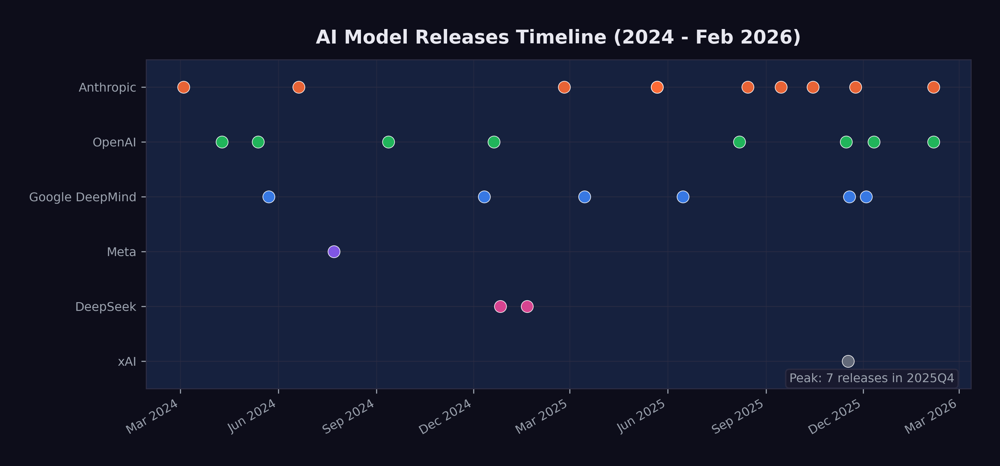

# The Model Avalanche {#sec-model-avalanche}

In the last week of December 2025, Simon Willison opened a blank document and started writing his annual review of the year in large language models.

He'd been doing this since 2023 --- a single, sprawling blog post cataloging every major release, every benchmark record, every capability that hadn't existed twelve months prior. The format was always the same: chronological, link-heavy, with his own hands-on impressions from testing each model himself. The 2023 edition had been long. The 2024 edition had been longer. The 2025 edition was something else entirely.

Willison was a software developer, open-source tool builder, and one of the most careful independent chroniclers of the AI field. He didn't work for any of the labs. He didn't have equity in the outcome. He just tested every model, wrote about what he found, and published --- post after post, week after week --- in a rhythm that had become a real-time record of the field's acceleration. His blog had become the unofficial changelog for an industry moving too fast for anyone to fully track, including, increasingly, the people building the models themselves.
<!-- PROOF: url=https://simonwillison.net/ | accessed=2026-02-14 | key=willison_blog -->

Earlier that year, he'd run into a problem that captured what was happening to the field. The AI Engineer World's Fair had invited him to keynote on twelve months of AI progress. He accepted, started building slides, and realized he couldn't fit it. Not wouldn't --- couldn't. The sheer volume of significant releases forced him to cut his scope to the previous six months. Even that barely squeezed into twenty minutes.
<!-- PROOF: url=https://craftycto.com/blog/aiewf2025-my-day-1-highlights/ | accessed=2026-02-14 | key=willison2025_aiewf -->

Now, sitting at his desk in the quiet week between Christmas and New Year's, the scale of what had happened was almost absurd to catalog. Twenty-eight major model releases from seven organizations in roughly two years. Four frontier models from four different labs --- xAI, Google DeepMind, Anthropic, and OpenAI --- had shipped in a single three-week window in November. Models from March 2024, like Claude 3, which had seemed like a genuine breakthrough at the time, now felt like artifacts from a different technological era, their benchmarks long surpassed, their capabilities exceeded by multiple generations. The cursor blinked at the top of an empty page. He started typing. It was going to be a very long post.
<!-- PROOF: url=https://simonw.substack.com/p/2025-the-year-in-llms | accessed=2026-02-14 | key=willison2025_yearinllms -->

The previous two chapters examined specific metrics --- SWE-bench scores and METR time horizons --- that show AI capability advancing on exponential curves. But metrics are produced by models, and the story of those models is itself remarkable. Between March 2024 and February 2026, at least twenty-eight major AI models were released by seven organizations. That is more than one new frontier model per month, each pushing the boundaries of what the previous one could do.

This chapter surveys the avalanche of model releases that produced the benchmark numbers, examining the key model families, the capability leaps that defined each generation, and the competitive dynamics that drove the pace.

## The Key Families

By February 2026, four model families dominated the frontier, each maintained by a different organization with different architectural approaches and different strategic priorities.

### Claude (Anthropic)

Anthropic's Claude family evolved through three generations in the span of two years:

- **Claude 3** (March 2024): The first Claude with vision, released as a three-tier family --- Opus, Sonnet, and Haiku --- at 200K-token context. Claude 3 Opus was the most capable model available at launch, demonstrating near-human performance on several expert benchmarks [@anthropic2024_claude].
- **Claude 3.5 Sonnet** (June 2024): A defining release. It outperformed Claude 3 Opus while running at twice the speed and introduced the Artifacts feature for interactive content creation. Its 49% SWE-bench Verified score set a new high-water mark for AI coding [@anthropic2024_claude].
- **Claude 3.7 Sonnet** (February 2025): Introduced "extended thinking," a hybrid reasoning approach that let the model deliberate before responding. This pushed METR time horizons to approximately 50 minutes [@anthropic2024_claude].
- **Claude 4 generation** (May--October 2025): Claude Opus 4 and Sonnet 4 arrived in May 2025 with extended thinking and tool use during reasoning. Opus 4.1 followed in August with improved agentic capabilities. Sonnet 4.5 in September boosted planning performance by 18% for agent platforms. Haiku 4.5 in October provided a fast, efficient option [@anthropic2025_claude4].
- **Claude Opus 4.5** (November 2025): The high-water mark. 79.2% on SWE-bench Verified. 4 hours 49 minutes METR time horizon. 67% lower price than the previous Opus. State-of-the-art agentic coding [@anthropic2025_opus46].
- **Claude Opus 4.6** (February 2026): Agent teams, one-million-token context window in beta, and office integrations. Outperformed GPT-5.2 by 144 Elo on GDPval-AA [@anthropic2025_opus46].

The Claude trajectory illustrates a pattern that repeated across families: each generation brought not just better benchmark scores but qualitatively new capabilities --- vision, reasoning, tool use, agent orchestration.

### GPT (OpenAI)

OpenAI's releases followed a different cadence, alternating between general-purpose models and specialized reasoning systems:

- **GPT-4 Turbo** (April 2024): Extended context to 128K tokens with updated knowledge [@openai2023_gpt4].
- **GPT-4o** (May 2024): Omni-modal processing --- text, audio, and images in real time at twice the efficiency of GPT-4 Turbo [@openai2024_gpt4o].
- **o1** (September 2024): A fundamental shift. The first "reasoning model" that used chain-of-thought to solve complex problems, scoring 83% on the International Mathematical Olympiad [@openai2023_gpt4].
- **o3** (December 2024): Configurable analysis depth. 72% SWE-bench Verified. The single largest leap in coding benchmark history [@openai2023_gpt4].
- **GPT-5** (August 2025): Unified reasoning with automatic routing between fast and deep thinking modes. 74.9% SWE-bench. 94.6% on AIME 2025. 80% fewer hallucinations than o3. 2 hour 17 minute METR time horizon [@openai2025_gpt5].
- **GPT-5.1-Codex-Max** (November 2025): Specialized for large codebase understanding [@openai2025_gpt52].
- **GPT-5.2** (December 2025): Three variants --- Instant, Thinking, and Pro --- with 400K-token context and 75.4% SWE-bench Verified [@openai2025_gpt52].
- **GPT-5.3-Codex** (February 2026): The self-improving model. New highs on SWE-Bench Pro and Terminal-Bench. First model to receive a "High" cybersecurity rating. And, most significantly, the first model to have contributed substantially to its own development --- a milestone examined in depth in @sec-recursive-loop [@openai2026_codex].

### Gemini (Google DeepMind)

Google DeepMind's Gemini family distinguished itself through context window size and multimodal capability:

- **Gemini 1.5 Pro** (May 2024): Breakthrough one-million-token context window, later extended to two million. This was ten times the context of any competitor at launch [@google2023_gemini].
- **Gemini 2.0 Flash** (December 2024): Outperformed 1.5 Pro at twice the speed [@google2024_gemini2flash].
- **Gemini 2.5 Pro** (March 2025): Google's most intelligent model to date, with strong reasoning capabilities [@google2025_gemini25].
- **Gemini 2.5 Flash** (June 2025): Efficient reasoning at scale [@google2025_gemini25].
- **Gemini 3** (November 2025): Next-generation architecture achieving 1,501 Elo on LMArena with maintained one-million-token context. Gemini 3 Pro scored 77.4% on SWE-bench Verified [@google2025_gemini3].
- **Gemini 3 Deep Think** (December 2025): Announced alongside Gemini 3 on November 18 and rolled out to AI Ultra subscribers on December 4, Deep Think represented Google DeepMind's most aggressive push into extended reasoning. Its benchmark results were extraordinary: gold-medal level on the International Mathematical Olympiad 2025, as well as on the written sections of the 2025 International Physics and Chemistry Olympiads. It scored 93.8% on GPQA Diamond --- the graduate-level science benchmark designed to resist AI performance --- 45.1% on ARC-AGI-2 with code execution, and 41.0% on Humanity's Last Exam without tools [@google2025_gemini3deepthink]. These scores were significant because Humanity's Last Exam, created by a consortium of researchers to produce questions no AI could answer, was being solved at rates that would have seemed impossible when the benchmark was published just months earlier.

### Grok (xAI)

Elon Musk's xAI entered the frontier race later than its competitors, but by late 2025, Grok had become impossible to ignore.

- **Grok 4.1** (November 17, 2025): Released as the default model for all consumer-facing xAI applications, Grok 4.1 achieved the number-one position on LMArena's Text Arena at 1,483 Elo in Thinking mode and number two at 1,465 Elo in non-reasoning mode. It led the EQ-Bench emotional intelligence benchmark at 1,586 --- a score that reflected xAI's deliberate investment in making Grok not just technically capable but conversationally sophisticated. Perhaps most significant was the hallucination rate: 4.22%, a 65% reduction from the previous version, addressing one of the most persistent criticisms of large language models [@xai2025_grok41].

What made the Grok 4.1 release notable beyond its benchmarks was xAI's deployment methodology. Before the public launch, xAI ran a silent A/B rollout from November 1 to November 14, 2025, during which users were randomly served either Grok 4.0 or Grok 4.1 without being told which model they were using. Users preferred Grok 4.1 more than 64% of the time [@xai2025_grok41]. This approach --- letting users choose blindly rather than marketing aggressively --- represented a maturation in how AI labs validated their models. It was also a quiet declaration: xAI was no longer playing catch-up. It was competing for first place.

xAI's ascent mattered beyond any single model release. Musk's access to capital was effectively unlimited, and xAI's Memphis data center --- the largest single AI training facility in the world --- gave the company compute resources that rivaled those of much older competitors. In the space of eighteen months, xAI had gone from a late entrant with a novelty chatbot to a legitimate frontier lab releasing models that topped multiple leaderboards. The competitive field was not narrowing; it was expanding, and doing so at the top of the capability spectrum.

### DeepSeek and the Open-Source Challenge

The most disruptive entrant was not a Western tech giant but a Chinese AI lab operating on a fraction of the budget:

- **DeepSeek-V3** (December 2024): A 671-billion-parameter mixture-of-experts model (37 billion active parameters) trained for approximately $6 million --- a figure that stunned the industry. It competed with GPT-4 at a fraction of the training cost [@deepseek2024_v3].
- **DeepSeek-R1** (January 2025): An open-source reasoning model rivaling OpenAI's o1, released under the MIT license. It scored 45% on SWE-bench Verified and triggered an 18% drop in NVIDIA's stock price on the day of its release, as investors questioned whether the expensive hardware buildout was necessary [@deepseek2025_r1].

Meta's **Llama 3.1** (July 2024), including a 405-billion-parameter variant released under an open license allowing derivative training, further expanded the open-source ecosystem [@meta2024_llama31].

DeepSeek's impact extended well beyond technical benchmarks. When DeepSeek-R1 launched in January 2025, it briefly became the number-one free application on Apple's iOS App Store --- an open-source reasoning model, built by a Chinese lab, outranking every social media platform and gaming app on the planet [@deepseek2025_r1]. The 18% single-day drop in NVIDIA's stock price that accompanied the release wiped out roughly $600 billion in market capitalization, as investors confronted an uncomfortable possibility: that the most expensive hardware buildout in corporate history might not be as necessary as assumed [@deepseek2025_r1]. If a model trained for $6 million could compete with one that cost hundreds of millions, then the economics of the entire AI industry needed rethinking.

The open-source models matter for two reasons. First, they demonstrate that frontier-competitive performance can be achieved at dramatically lower cost, which accelerates adoption and lowers barriers to entry. Second, they constrain the pricing power of closed-model providers, forcing continuous improvement.

### The Open-Source Dimension

Open-source AI's importance extends beyond DeepSeek's headline-grabbing cost efficiency. By late 2025, the open-source ecosystem had become a structural force shaping the entire AI industry in ways that the closed-model providers could not ignore.

Meta's strategic decision to open-source its Llama models created what amounted to a public utility for AI capability. Llama 3.1's 405-billion-parameter variant, released under a license that permitted derivative training, meant that any organization --- a university research lab, a startup in Bangalore, a government agency in Brussels --- could build upon a model that was competitive with the best closed offerings from just a year prior [@meta2024_llama31]. The proliferation of fine-tuned Llama derivatives across the open-source ecosystem was staggering: by late 2025, Hugging Face hosted thousands of models derived from the Llama architecture, adapted for everything from legal document analysis to medical diagnosis to code generation in niche programming languages.

DeepSeek's contribution was different but complementary. Where Meta provided the weights and hoped the community would build, DeepSeek demonstrated that you could train a frontier-competitive model from scratch for a fraction of what the conventional wisdom suggested was necessary. DeepSeek-R1's MIT license was more than generous --- it was a provocation. By releasing a reasoning model that rivaled o1 under the most permissive open-source license available, DeepSeek implicitly challenged the premise that frontier AI required billions of dollars and vast proprietary advantages [@deepseek2025_r1].

The consequences rippled through the industry in three ways. First, open-source models set a floor for capability that closed-model providers had to exceed to justify their pricing. If a free model could handle 80% of use cases, the premium for the remaining 20% had to deliver extraordinary value. This drove the closed providers to push harder on the capability frontier, accelerating the overall pace of progress. Second, open models democratized access to AI capability in regions and sectors that could not afford enterprise API pricing, spreading the technology's impact far beyond Silicon Valley. Third, and perhaps most subtly, the open-source ecosystem served as a distributed research laboratory. Thousands of independent researchers experimenting with fine-tuning, quantization, and novel training approaches generated insights that fed back into the frontier --- a kind of collective intelligence accelerating the field's overall progress.

## The Capability Leaps

@fig-model-releases-timeline shows the twenty-eight major model releases on a timeline, highlighting the acceleration of the release cadence.

{#fig-model-releases-timeline}

Beyond the sheer pace, the models introduced several capability leaps that each shifted what was possible:

### Context Windows: From 8K to 1M

In early 2024, most models operated with context windows of 8K to 128K tokens. By February 2026, Claude Opus 4.6 was testing a one-million-token context window, and Gemini had offered one-million-token context since May 2024 [@google2023_gemini; @anthropic2025_opus46].

Larger context windows are not just a quantitative improvement. They enable qualitatively different use cases. A model with 8K tokens of context can help with a single function. A model with 200K tokens can understand an entire file. A model with one million tokens can reason across an entire codebase, a complete legal filing, or a full research paper with all its references.

The practical consequences of this expansion rippled through industry after industry. In software engineering, the shift from 128K to 400K tokens (GPT-5.2, December 2025) and then to one million tokens (Claude Opus 4.6, February 2026) meant that AI systems could hold an entire medium-sized repository in working memory [@openai2025_gpt52; @anthropic2025_opus46]. Instead of asking a model to fix a single function in isolation, a developer could point it at an entire project and ask it to trace a bug across multiple files, understand the architecture, and propose a fix that respected the existing design patterns. Google's Gemini family had pioneered the one-million-token context window as early as May 2024 with Gemini 1.5 Pro, later extending it to two million tokens [@google2023_gemini]. But the real breakthrough came when long context was paired with strong reasoning and agentic capabilities --- a combination that only emerged at scale in late 2025 and early 2026.

### Reasoning: Thinking Before Acting

The introduction of chain-of-thought reasoning with OpenAI's o1 in September 2024 was arguably the most important architectural innovation of the period. Rather than generating output token by token, reasoning models allocate "thinking time" to plan their approach before committing to an answer [@openai2023_gpt4].

Anthropic's extended thinking in Claude 3.7 Sonnet (February 2025) took a different approach to the same problem, allowing the model to use tools and execute code during its deliberation process [@anthropic2024_claude]. This combination of reasoning and acting --- thinking while doing --- proved particularly effective for complex, multi-step tasks.

The reasoning revolution reached its most dramatic expression in Gemini 3 Deep Think's December 2025 rollout. A model scoring gold-medal level on the International Mathematical Olympiad had moved well beyond "good at math." The IMO is the most prestigious mathematics competition in the world, and gold-medal performance requires not just calculation but mathematical creativity --- the ability to see novel approaches to problems that have been deliberately designed to resist routine methods [@google2025_gemini3deepthink]. When the same model also scored 93.8% on GPQA Diamond --- graduate-level science questions written by domain experts specifically to challenge AI systems --- it suggested that reasoning capabilities were becoming general rather than narrow. The model appeared to be engaging in something that, at least functionally, resembled genuine intellectual problem-solving --- beyond pattern-matching on training data.

The practical implications of this reasoning revolution were most visible in software engineering, as documented in @sec-benchmark-revolution. But the implications extended far beyond code. A model that could reason its way through an IMO problem could also reason its way through a medical diagnosis, a legal argument, a financial analysis, or an engineering design challenge. The models were becoming general-purpose thinkers, not just general-purpose text generators. This distinction --- between generating plausible text and solving real problems through structured reasoning --- was perhaps the most important capability leap of the entire period.

### Multimodal: Beyond Text

GPT-4o's omni-modal processing (May 2024) demonstrated that a single model could handle text, audio, and images in real time [@openai2024_gpt4o]. Claude 3's vision capabilities (March 2024) brought image understanding to the Claude family [@anthropic2024_claude]. By 2025, frontier models were expected to understand and generate across modalities as a default capability, not a special feature.

### Agentic: AI Using Tools

The most transformative capability shift was the move from models that generated text to models that took actions. By mid-2025, frontier models could browse the web, execute code, read and write files, operate computer interfaces, and orchestrate other AI models. The practical implications were immediate and concrete. A model with agentic capabilities could receive a bug report, search a codebase for the relevant files, write a fix, run the test suite, and submit a pull request --- all without human intervention. Cognition Labs' Devin, announced in March 2024, was the first system to demonstrate this end-to-end workflow, scoring 13.86% on SWE-bench [@cognition2024_devin]. By September 2025, Claude Sonnet 4.5 had boosted planning performance by 18% on the Devin platform, meaning AI agents were not only solving more problems but solving them with more efficient, multi-step strategies [@anthropic2025_sonnet45].

The progression from single-task tool use to multi-agent orchestration happened remarkably quickly. Claude Opus 4's extended thinking with tool use during reasoning, released in May 2025, meant the model could execute code and query databases *while still deliberating* on its approach --- thinking and acting simultaneously rather than sequentially [@anthropic2025_claude4]. By November 2025, Claude Opus 4.5 had pushed the METR autonomous time horizon to 4 hours and 49 minutes, meaning the model could work independently on complex, real-world tasks for nearly half a business day [@metr2025_opus45]. Claude Opus 4.6's "agent teams" feature, released in February 2026, took this to its logical conclusion: a single model could coordinate multiple AI agents working in parallel on different aspects of a task --- one agent researching, another writing code, a third running tests, all overseen by an orchestrating model that managed their outputs [@anthropic2025_opus46].

## The November Cluster {#sec-model-november-cluster}

If this book argues that something big already happened, then the question becomes: when exactly did it happen? The popular narrative, driven by Shumer's viral essay on February 9, 2026, places the inflection point in early 2026 --- a moment of sudden collective realization. But the data tells a different story. The real inflection point was a twenty-four-day window in late 2025 that produced the densest cluster of frontier model releases in the history of artificial intelligence.

The sequence was extraordinary:

- **November 17, 2025**: xAI released Grok 4.1, reaching number one on LMArena at 1,483 Elo [@xai2025_grok41]
- **November 18, 2025**: Google DeepMind announced Gemini 3, achieving 1,501 Elo on LMArena, alongside the preview of Gemini 3 Deep Think [@google2025_gemini3]
- **November 24, 2025**: Anthropic released Claude Opus 4.5, hitting 79.2% on SWE-bench Verified and a 4-hour-49-minute METR time horizon [@anthropic2025_opus46]
- **December 4, 2025**: Gemini 3 Deep Think rolled out to AI Ultra subscribers, scoring gold-medal level on the IMO and 93.8% on GPQA Diamond [@google2025_gemini3deepthink]
- **December 11, 2025**: OpenAI released GPT-5.2 in three variants with 400K-token context [@openai2025_gpt52]

Five frontier model releases from four different organizations in twenty-four days. Each one would have been a headline event on its own. Together, they constituted what Simon Willison would later characterize as the moment when "Claude Opus 4.5 and GPT 5.2 appeared to turn the corner on how reliably a coding agent could follow instructions" [@willison2026_softwarefactory].

What mattered about the November Cluster was less the number of releases than what they collectively demonstrated. Before November 2025, each frontier lab could plausibly claim that its latest model was an incremental improvement over the previous generation --- impressive, but not paradigm-shifting. After November 2025, four separate labs had independently produced models that crossed a threshold of practical utility. Grok 4.1's hallucination reduction made it reliable enough for production use. Gemini 3 Deep Think's scientific reasoning capabilities put it at gold-medal level in competitive mathematics and physics. Claude Opus 4.5's nearly-five-hour autonomous time horizon meant it could handle tasks that previously required a human's entire morning. GPT-5.2's three-variant architecture demonstrated that the same base model could be deployed across use cases ranging from instant responses to deep, hours-long analysis.

The convergence was not coincidental. It reflected a dynamic in which each lab's release forced the others to accelerate their own schedules. When xAI launched Grok 4.1 on November 17, it validated a level of capability that Google, Anthropic, and OpenAI could not afford to let stand unchallenged. The result was a competitive cascade: each release raising the bar, each competitor responding within days or weeks rather than the months that had separated earlier generations.

This cluster also revealed something about the underlying rate of progress. The fact that four independent organizations, using different architectures and training approaches, all reached similar capability thresholds within the same narrow window suggested that the improvement was not driven by any single breakthrough but by a broad, field-wide advance in training methodology, data quality, and compute efficiency. The models were converging not because they were copying each other, but because they were all approaching the same frontier from different directions.

For the thesis of this book, the November Cluster is the pivot. The February 2026 public awakening --- Shumer's essay, the stock crash, the breathless media coverage --- was the world catching up to what had already happened two months earlier. The capability was there in November. The recognition came in February. Understanding this lag between capability and recognition is essential to understanding what happens next: there may be capabilities that exist right now, in February 2026, that the world will not recognize for months.

## The Competition Driving Acceleration

The pace of releases was not accidental. It was driven by intense competition among labs that viewed each benchmark improvement as a strategic advantage.

The funding tells the story. In 2025 alone:

- OpenAI raised $40 billion at a $300 billion valuation [@openai2024_funding]
- Anthropic raised $3.5 billion, then $13 billion (reaching $183 billion valuation), and secured $15 billion from Microsoft and NVIDIA at a $350 billion valuation [@anthropic2025_seriesf; @cnbc2025_anthropic_msnv]
- The Stargate Project announced $500 billion in AI infrastructure investment [@openai2025_stargate]
- Google invested an additional $1 billion in Anthropic and planned $100 billion in AI infrastructure [@cnbc2025_anthropic_google]
- Microsoft committed $80 billion, Meta $65 billion, and Amazon $75 billion to AI infrastructure [@openai2025_stargate]

@fig-ai-investment visualizes the scale of these commitments.

{#fig-ai-investment}

These numbers are not incremental. They represent a generational reallocation of capital toward AI development. The organizations making these investments are betting that AI capability will continue to improve rapidly and that the market for AI services will grow correspondingly. To put the scale in perspective: the combined AI infrastructure commitments announced in 2025 exceeded the GDP of most countries. The Stargate Project alone, at $500 billion, was roughly equivalent to the annual economic output of Sweden.

The funding trajectory of Anthropic alone illustrates the acceleration. In early 2025, Anthropic raised $3.5 billion led by Lightspeed Venture Partners, valuing the company at $61.5 billion [@cnbc2025_anthropic_3b]. By September, it raised its Series F at a $183 billion post-money valuation, with run-rate revenue exceeding $5 billion --- a figure that would have been unthinkable for a company founded just three years earlier [@anthropic2025_seriesf]. By November, Microsoft had committed up to $5 billion and NVIDIA up to $10 billion, pushing Anthropic's valuation to approximately $350 billion [@cnbc2025_anthropic_msnv]. In the span of nine months, Anthropic's valuation increased nearly sixfold. The trajectory looked less like the gradual scaling of a successful startup than the market's real-time assessment that Anthropic's models --- particularly Claude Opus 4.5, released during this funding surge --- represented a capability that justified extraordinary valuations.

NVIDIA's role in the funding ecosystem was particularly telling. The company was simultaneously selling the hardware that powered AI training and investing directly in the AI labs that were its largest customers. NVIDIA's forecast of $65 billion in quarterly revenue, driven by its Blackwell and Rubin chip architectures, reflected a visibility into AI infrastructure demand that extended years into the future [@nvidia2026_forecast]. Jensen Huang described AI chip demand as projected to drive over $500 billion in sales across 2025 and 2026 --- a figure that would make AI chips one of the highest-revenue product categories in the history of computing [@huang2025].

The competition also has a geopolitical dimension. DeepSeek's cost-efficient training challenged the assumption that frontier AI required massive Western-style investment. This, combined with the U.S. government's January 2025 shift from oversight to deregulation under the "Removing Barriers to American Leadership in AI" executive order, created a competitive dynamic that favored speed over caution [@whitehouse2025_ai]. What followed was a race with no finish line and no referee, where the only rule was to ship faster than the competition.

The nature of the competition itself was evolving. In early 2024, the race was primarily about capability --- which model could score highest on benchmarks, which could handle the most tokens, which could reason most accurately. By late 2025, the competition had fragmented into multiple simultaneous races. There was the capability race, still ongoing, but there was also a pricing race (each lab undercutting the others on inference costs), an ecosystem race (which platform attracted the most developers and applications), a safety race (which lab could demonstrate the most responsible deployment practices), and an enterprise race (which lab could sign the most corporate contracts).

This multi-dimensional competition created a paradox. Labs were simultaneously racing to build the most capable models and racing to deploy them as broadly and cheaply as possible. The first impulse favored caution --- more testing, more evaluation, more red-teaming before release. The second favored speed --- ship fast, iterate in production, let the market decide what works. The tension between these impulses was visible in every release during the November Cluster. Google announced Gemini 3 Deep Think on November 18 but did not roll it out until December 4, taking two weeks for additional evaluation. xAI, by contrast, had already deployed Grok 4.1 silently to production users two weeks before its public announcement [@xai2025_grok41]. The competition had expanded beyond building better models to deciding how aggressively to deploy them --- a decision with consequences that extended far beyond the balance sheet, into the lives of the workers whose roles those models were beginning to absorb.

::: {.callout-tip}
## The Numbers at a Glance

- **28** major model releases in ~24 months
- **7** organizations releasing frontier models
- **$700B+** in committed AI infrastructure investment
- **125x** increase in context window size (8K to 1M tokens)
- **29x** improvement in SWE-bench scores (2.7% to 79.2%)
- **145x** increase in METR time horizon (~2 min to ~5 hrs)
:::

## What the Avalanche Reveals

The model avalanche shows no signs of slowing. If anything, the cadence is accelerating. The gap between GPT-5 (August 2025) and GPT-5.3-Codex (February 2026) was just six months, during which three major OpenAI releases shipped. Anthropic released five models in 2025 alone. xAI went from zero to the top of the LMArena leaderboard in under two years.

But the raw count of releases obscures a more important pattern: what each generation could do that the previous one could not. The avalanche was not just quantitative --- more models, more parameters, more compute. It was qualitative. Each wave introduced a new category of capability that made previous limitations feel archaic.

In the first wave (early to mid-2024), the frontier was about intelligence and knowledge. Models knew more, reasoned better, and hallucinated less. The improvement was impressive but incremental: faster, smarter versions of the same basic paradigm. Users typed questions; models typed answers.

In the second wave (late 2024 through mid-2025), the frontier shifted to reasoning and agency. Models stopped merely answering questions and started solving problems. Chain-of-thought reasoning, extended thinking, tool use during deliberation --- these were not just benchmark improvements. They represented a fundamentally different relationship between the user and the model. The user was no longer just asking; the model was doing.

In the third wave --- the November Cluster and its aftermath --- the frontier moved to autonomy and self-improvement. Models could work for hours without supervision. They could coordinate teams of sub-agents. They could contribute to their own development. The user was no longer directing every step; the model was planning, executing, and evaluating on its own, reporting back when it was finished or when it needed guidance.

Each wave compressed the time required for the next. The first wave took roughly a year (March 2024 to early 2025). The second took about nine months (late 2024 to mid-2025). The third took four months (November 2025 to February 2026). If this compression continues --- and the recursive improvement dynamics explored in @sec-recursive-loop suggest it will --- the fourth wave may arrive before the world has fully absorbed the implications of the third.

Here is the central insight of the model avalanche: the pace at which AI models improve is itself accelerating. Each wave compressed faster than the last. The avalanche is exponential, and the organizations building these models are investing hundreds of billions of dollars to ensure it stays that way.

There is one more dimension of the avalanche that deserves attention: the gap between what the models can do and what the world is using them for. As of February 2026, most organizations were still deploying AI at what Dan Shapiro has called Level 1 or Level 2 --- the "coding intern" or the "junior developer" stage, where AI assists with discrete tasks but humans remain in control of the workflow [@shapiro2026_fivelevels]. The models released in the November Cluster and beyond were capable of Level 3 and 4 work --- functioning as autonomous developers or engineering teams. The gap between deployed capability and available capability was widening with every release. When that gap closes --- when organizations begin deploying these models at the level of autonomy they are already capable of --- the impact on productivity, employment, and competition will be sudden and severe.

## The Diminishing Returns Question

Not everyone saw an avalanche. Some saw a treadmill.

Yann LeCun, Meta's chief AI scientist and a Turing Award laureate, had been blunt: "LLMs are useful, but they are an off ramp," he posted in mid-2024 [@lecun2024_offramp]. He had been arguing since then that large language models were approaching a "dead end"
<!-- PROOF: url=https://x.com/ylecun/status/1796982509567180927 | accessed=2026-02-14 | key=lecun2024_offramp --> --- that continuing to pile on computing power led to diminishing marginal returns, and that a fundamentally different architecture would be needed for human-level intelligence. Gary Marcus, the NYU cognitive scientist and AI's most persistent skeptic, had coined the concern back in 2022 with an essay titled "Deep Learning Is Hitting a Wall." By late 2024 he felt vindicated: even Marc Andreessen, one of technology's most aggressive optimists, conceded that current models seemed to be "hitting the same ceiling on capabilities."
<!-- PROOF: url=https://www.hpcwire.com/2025/02/11/metas-chief-ai-scientist-yann-lecun-questions-the-longevity-of-current-genai-and-llms/ | accessed=2026-02-14 | key=lecun2025_genai -->
<!-- PROOF: url=https://garymarcus.substack.com/p/confirmed-llms-have-indeed-reached | accessed=2026-02-14 | key=marcus2024_diminishing -->
<!-- PROOF: url=https://nautil.us/deep-learning-is-hitting-a-wall-238440/ | accessed=2026-02-14 | key=marcus2022_wall -->
<!-- PROOF: url=https://officechai.com/stories/ai-models-seem-to-be-hitting-a-ceiling-of-capabilities-marc-andreessen/ | accessed=2026-02-14 | key=andreessen2024_ceiling -->

The skeptics raised three specific objections. First, benchmark saturation: Stanford HAI's 2025 AI Index reported that many widely used AI benchmarks had become effectively "saturated," with top models scoring above 85--90% on tests like MMLU. The numbers kept climbing, but the tests had stopped measuring real differences. Second, architectural sameness: of the twenty-eight major releases tracked in this chapter, most were iterative improvements within the transformer architecture, not fundamentally new designs. Better, yes. Different, no. The open-source ecosystem reinforced the point --- when DeepSeek could replicate OpenAI's reasoning capabilities at a twentieth of the cost, and when Llama fine-tunes could match last year's closed frontier within weeks, it suggested the gains came from scale and data rather than proprietary breakthroughs. And scale advantages erode. Third, the energy bill. AI data centers consumed an estimated 415 terawatt-hours of electricity in 2024 --- roughly 1.5% of global electricity production --- with projections showing that figure doubling by 2030. Training a single frontier model had edged toward $200 million by late 2024. If each generation demanded an order of magnitude more compute, the exponential curve would eventually hit a wall made of physics and electricity bills.
<!-- PROOF: url=https://hai.stanford.edu/news/ai-benchmarks-hit-saturation | accessed=2026-02-14 | key=stanfordhai2025_saturation -->
<!-- PROOF: url=https://research.aimultiple.com/ai-energy-consumption/ | accessed=2026-02-14 | key=aimultiple2026_energy -->

These objections deserve falsification conditions. The diminishing-returns thesis would be undermined if two things held through 2027: first, if frontier models kept achieving *qualitatively new* capabilities --- not just higher scores on saturated benchmarks --- with each generation; and second, if training efficiency gains, like DeepSeek's $6 million run, continued outpacing the growth in model scale. As of February 2026, both conditions were holding. But the skeptics' deeper point remained: past exponentials don't guarantee future ones, and the history of technology is full of curves that quietly became S-curves when nobody was watching.

::: {.callout-note title="Practitioner's Tool: When to Switch Models" icon=false}

The avalanche creates a practical problem. If a new frontier model ships every three to four weeks, how often should a team re-evaluate its stack?

The data suggests a framework. Not every release matters equally. Of the twenty-eight major models tracked in this chapter, roughly a third represented genuine capability-tier jumps --- moments where a model could do something its predecessor fundamentally could not. OpenAI's o1 introduced reasoning. Claude Opus 4 added tool use during thinking. GPT-5.3-Codex contributed to its own training. These were inflection points. The other two-thirds? Faster, cheaper, or more specialized versions within the same capability tier. Important for costs. Not important for architecture.

| Release type | Action | Typical frequency |
|-------------|--------|-------------------|
| New capability tier (reasoning, agents, self-improvement) | Full evaluation + potential migration | 2--3× per year |
| Speed/cost improvement within tier | Update API version, keep architecture | Quarterly |
| Open-source model reaches previous closed-source tier | Cost optimization review | 2× per year |
| Benchmark delta < 5% on your use case | Monitor only | Ongoing |

Consider a concrete example: a company that built its customer support pipeline on GPT-4 in April 2024 would have seen four models capable of replacing it within twelve months --- GPT-4o, Claude 3.5 Sonnet, Gemini 1.5 Pro, and GPT-5 --- each offering better performance at lower cost. Waiting for the "right" moment to upgrade meant paying more for worse results. But evaluating every single release would've consumed the engineering team's entire quarter.

The key: model releases are accelerating, but the capability tiers that drive architectural decisions advance more slowly --- roughly three to four times a year in 2025. Evaluate at that cadence. Anything faster is benchmarking for sport.

The risk runs the other way too. Organizations that waited for "things to settle down" in 2024 found themselves two full capability tiers behind by late 2025. Things didn't settle. They won't. The avalanche metaphor isn't rhetorical --- it describes a field where each release buries the last, and standing still means getting buried with it.
:::

**Prediction (testable by December 2026):** The major-model release cadence won't slow below one per month through calendar year 2026. If it does --- if labs collectively produce fewer than twelve frontier-class releases in 2026 --- the acceleration thesis of this chapter needs revision.

The next chapter turns from the models to their consequences. Behind every benchmark record, behind every release shipped at 2 AM Pacific time to beat a competitor by hours, there are people --- with mortgages and student loans and retirement plans --- whose jobs are changing, disappearing, or being redefined in ways they didn't choose. The avalanche doesn't care who's standing at the bottom of the mountain.
