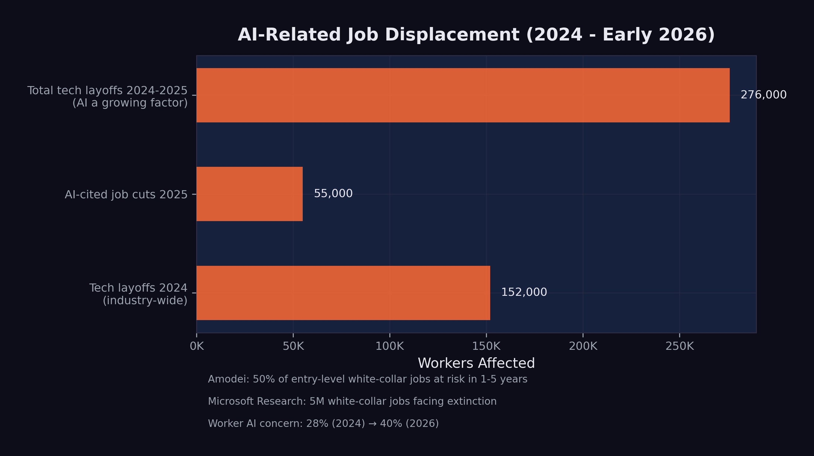

# The Human Cost {#sec-human-cost}

Kenneth Kang stared at his laptop in a Portland, Oregon coffee shop, the air heavy with roasted beans and the hum of low conversations. Outside, a late-summer drizzle streaked the windows. It was August 2025 — ten months since he'd walked across the stage at Oregon State University with a 3.98 GPA and honors degrees in both computer science and business analytics. He'd interned at Adidas the previous summer. His professors had written strong recommendation letters. Everything the system asked for, Kang had delivered.

The system wasn't delivering back.

His spreadsheet of job applications had crossed 2,500 entries. Color-coded by status. Mostly red. Ten had resulted in interviews. Ten out of twenty-five hundred — a 0.4% callback rate for a student who'd done everything the career counselors told him to do. "It was very devastating," he later told reporters. "I thought that having a 3.98 GPA, getting recognition letters... I could get a full-time job offer easily. But that was not true" [@bbc2025_kang_cs_grad].

The numbers behind his frustration were systemic. New graduate hiring at the fifteen largest technology companies had dropped roughly 50% since 2019, with entry-level positions falling from 15% to 7% of total hires. Internship conversion rates dipped below 51% — the lowest in over five years [@bbc2025_kang_cs_grad]. The pipeline that had reliably converted CS degrees into six-figure starting salaries was narrowing at the exact moment AI was widening its capabilities.

Kang eventually secured a role at Adidas, where he'd interned. One classmate wasn't so lucky — still searching two years after graduation. While waiting, Kang and several fellow CS graduates had founded a startup doing technology consulting at bargain rates, trading revenue for the experience that employers demanded but entry-level positions no longer provided.

Dario Amodei had written in his January 2026 essay that "humanity is about to be handed almost unimaginable power" [@amodei2026]. For Kenneth Kang, the power was already rearranging the job market beneath his feet.
<!-- PROOF: url=https://www.darioamodei.com/essay/the-adolescence-of-technology | accessed=2026-02-14 | key=amodei2026 -->

His was one story. This chapter tells the wider one — what happens when the benchmarks and model releases documented in previous chapters collide with the labor market. Every percentage point of improvement on a coding benchmark corresponds to a capability that a human worker previously provided. Every hour of autonomous AI operation represents an hour of human labor that's now optional.

The data is sobering. And it's still early.

## The Numbers

By February 2026, the scale of technology-sector job losses was becoming impossible to ignore.

**Over 150,000 technology workers** were laid off in 2025 alone, according to outplacement firm Challenger, Gray & Christmas --- with comparable numbers in 2024 [@challenger2025_layoffs]. These figures encompass all tech layoffs, not all of which were directly caused by AI. But the trend was unmistakable: companies were simultaneously increasing AI investment and reducing human headcount.

**55,000 AI-cited job cuts in 2025.** Of the approximately 1.17 million total layoffs in 2025 --- the highest since the 2020 pandemic --- nearly 55,000 were explicitly attributed to AI automation by the companies that made them [@cnbc2025_layoffs]. This was the first year in which AI appeared as a named cause in a significant fraction of layoff announcements.

**Unemployment rose to 4.4%.** The U.S. unemployment rate, which had hovered between 3.4% and 3.7% through most of 2023, climbed to 4.4% by early 2026. While AI was not the sole cause --- tariff uncertainty and broader economic headwinds contributed --- the technology sector's outsized layoffs were a significant factor.
<!-- PROOF: url=https://www.bls.gov/news.release/empsit.nr0.htm | accessed=2026-02-14 | key=bls2026_unemployment -->

**Worker anxiety surged.** Employee concern about AI job loss jumped from 28% in 2024 to 40% by early 2026, according to Mercer's Global Talent Trends survey [@hbr2026_aijobs]. For the first time, workers' fear of AI displacement exceeded their skepticism about it.

As @fig-job-displacement illustrates, the displacement was concentrated in technology but spreading to adjacent sectors.

{#fig-job-displacement}

## Company by Company

The aggregate numbers mask individual stories of strategic transformation. Several major companies made moves that illustrated the pattern.

### Amazon: 14,000 Positions

Amazon's 14,000 layoffs came primarily from its retail and operations divisions, but the company simultaneously expanded its AI investments by $75 billion in infrastructure commitments through the Stargate Project [@openai2025_stargate]. The message was clear: Amazon was replacing human labor with automated systems across warehousing, customer service, and logistics planning.
<!-- PROOF: url=https://www.cnn.com/2025/10/28/business/amazon-layoffs | accessed=2026-02-14 | key=cnn2025_amazon_layoffs -->

### Salesforce: 4,000 Support Staff

Salesforce's cuts were particularly telling. The company eliminated approximately 4,000 customer support positions while aggressively marketing its AI-powered Agentforce product line. CEO Marc Benioff repeatedly described AI agents as the successor to human support representatives, positioning the layoffs not as cost-cutting but as product strategy.
<!-- PROOF: url=https://www.cnbc.com/2025/09/02/salesforce-ceo-confirms-4000-layoffs-because-i-need-less-heads-with-ai.html | accessed=2026-02-14 | key=cnbc2025_salesforce_layoffs -->

### Google: Restructuring Around AI

Google did not announce a single large layoff but engaged in continuous restructuring throughout 2025, shifting headcount from traditional product teams to AI research and infrastructure. The company invested an additional $1 billion in Anthropic and planned $100 billion in AI infrastructure, even as individual teams were downsized or reorganized [@cnbc2025_anthropic_google].

### The Broader Pattern

Across the technology sector, the pattern was consistent: companies were investing heavily in AI while reducing headcount in roles that AI could partially or fully automate. The pattern made strategic sense, even if it looked contradictory from the outside. The companies were restructuring their workforces around a new assumption --- that AI would perform an increasing share of the work that humans had previously done.

The Harvard Business Review captured this dynamic precisely in January 2026, with an analysis titled "Companies Are Laying Off Workers Because of AI's Potential, Not Its Performance" [@hbr2026_aijobs]. The argument was incisive: many of the layoffs being attributed to AI were not driven by AI systems that had already replaced human workers. They were driven by executives who had seen the benchmark data, attended the demos, and read the predictions, and who were making preemptive decisions to restructure before their competitors did. The layoffs were, in many cases, a bet on the future capability of AI rather than a response to its current capability.

This distinction mattered enormously for the workers affected. Being laid off because your job has been automated is painful but legible --- there is a clear cause, and the path forward is clear: learn new skills. Being laid off because your employer believes your job *will soon be* automated is something different. It carries the same material consequences but adds a layer of uncertainty and resentment. The worker knows the AI has not yet replaced them. They know they were still doing valuable work. They know the decision was based on a prediction, not a fact. And they know that predictions can be wrong.

But the data documented in this book suggests that, in this case, the predictions were not wrong --- they were early. The model avalanche described in @sec-model-avalanche was accelerating, not decelerating. The capabilities that justified the preemptive layoffs were arriving, on schedule or ahead of it. The companies that made these bets were, by the cold metrics of their quarterly reports, being rewarded for them. The workers who paid the price were not wrong to feel aggrieved. But they were wrong to assume the disruption would stop.

## The Most Vulnerable Roles

Microsoft Research's 2025 analysis identified five million white-collar jobs facing potential "extinction" due to AI automation [@microsoft2025_jobs]. The most vulnerable categories, based on task-level analysis of AI capability overlap, included:

**Management analysts.** Roles focused on collecting data, analyzing organizational processes, and recommending improvements. Much of this work involves processing structured information and generating reports --- tasks that AI systems can already perform competently.

**Customer service representatives.** The Salesforce example was representative of a broader trend. AI chatbots and voice agents had improved dramatically, handling an increasing fraction of customer interactions without human involvement. The remaining human agents were increasingly handling only escalated or emotionally complex cases.

**Sales engineers and technical support.** Roles that involved explaining technical products and troubleshooting customer issues. The combination of broad knowledge bases and conversational AI made these roles partially automatable, particularly for standardized product lines.

**Administrative and clerical workers.** Scheduling, data entry, document processing, and routine correspondence. These tasks were among the first to be automated and had the least human moat.

**Junior software engineers.** As documented in @sec-benchmark-revolution, AI systems could now resolve 79% of real-world software engineering tasks. The implications for entry-level positions --- where engineers typically work on bug fixes, small features, and code maintenance --- were direct and immediate.

::: {.callout-note}
## The Nuance Behind the Numbers

Job displacement is not the same as job elimination. Many of the roles listed above are being transformed rather than destroyed. A customer service team of 100 might shrink to 25, with the remaining workers handling complex cases that AI cannot resolve. A software engineering team of 50 might become 15 developers overseeing AI-generated code. The work does not disappear entirely, but the number of humans needed to do it decreases substantially.

This distinction matters, but it offers limited comfort to the individuals whose positions are eliminated. Whether your job was "transformed" or "destroyed," the result for you personally is the same: you need new employment.
:::

## The Software Stock Crash

The market's reaction to AI's capabilities became most visible in the first week of February 2026.

On February 4, global software stocks began a steep decline, driven by fears that AI would fundamentally disrupt the Software-as-a-Service business model [@cnbc2026_softwarecrash]. Investors did the math: if AI agents could build and customize software, the value of generic SaaS platforms would decline. Why pay for a one-size-fits-all tool when an AI could build a custom solution in hours?

On February 5, the simultaneous release of Claude Opus 4.6 and GPT-5.3-Codex accelerated the selloff. On February 6, the losses expanded into a broader technology sector rout, with a trillion dollars in market value evaporating in a single day [@fortune2026_selloff].

The crash was not irrational. It reflected a genuine reassessment of the competitive field. Companies that derived their value from software products --- as opposed to AI capabilities, data, or infrastructure --- faced a credible threat to their business models. The market was pricing in the possibility that AI would make much commercial software either unnecessary or dramatically cheaper to produce.

For workers in the affected companies, the stock crash had immediate consequences. Companies under market pressure cut costs, and the easiest costs to cut were the human ones. The layoff announcements that followed in the weeks after the crash were a direct consequence of the market's verdict.

## The Regulatory Response

Governments were not ignoring the disruption, but their responses were measured by policy timelines, not market timelines.

**The EU AI Act** was the most thorough regulatory framework. It entered into force in August 2024 and proceeded through a staged implementation:

- February 2025: Prohibited practices enforced (manipulative AI, social scoring, predictive policing)
- May 2025: Code of Practice for General-Purpose AI models released
- August 2025: Governance obligations for GPAI providers activated
- August 2026 (upcoming): High-risk system requirements to be enforced
- August 2027: Full applicability to all systems [@eu_ai_act]

The EU's approach was methodical and thorough, but it was designed for a world where AI deployment happened gradually. The pace of model releases in 2025--2026 challenged the assumption that regulation could keep up.

**The United States** took a different path. In January 2025, President Trump revoked the Biden administration's AI Executive Order (EO 14110) and issued a new directive titled "Removing Barriers to American Leadership in Artificial Intelligence" [@whitehouse2025_ai]. The shift from oversight to deregulation was motivated by competitive concerns: if China's DeepSeek could train frontier models at a fraction of Western costs, restricting American AI development might cede the field to a geopolitical rival.

In California, a state-level AI safety law was enacted but immediately tested. When OpenAI released GPT-5.3-Codex in February 2026, a watchdog organization alleged the release violated the new law. OpenAI disputed the claim [@openai2026_calaw]. The incident illustrated the gap between the pace of AI development and the pace of regulatory enforcement.

::: {.callout-warning}
## The Policy Gap

As of February 2026, no major jurisdiction had implemented policies specifically designed to manage AI-driven job displacement at scale. The EU AI Act focused on safety and rights, not labor market adjustment. U.S. policy focused on competitiveness, not worker protection. The gap between the speed of technological disruption and the speed of policy response was widening.
:::

## The Hiring Paradox

Perhaps the most revealing signal about AI's impact on the workforce came not from a layoff announcement but from a hiring philosophy. On February 7, 2026, Daniela Amodei --- co-founder and president of Anthropic, one of the companies building the very technology that was displacing workers --- gave an interview to Fortune that upended conventional assumptions about what a technology company values in its employees.

"When we look to hire people at Anthropic today, we look for people who are great communicators, who have excellent EQ and people skills, who are kind and compassionate and curious and want to help other people," Amodei said [@damodei2026_generalists].

The description sounded nothing like a typical Silicon Valley hiring philosophy. For two decades, the technology industry had optimized for technical depth: the ability to write efficient algorithms, design scalable architectures, pass rigorous coding interviews. The ideal candidate was a specialist --- a systems engineer who had spent a decade mastering distributed computing, or a machine learning researcher with a PhD in statistical methods. Technical skill was the currency of the industry, and the hiring process was designed to measure it above all else.

Amodei was describing a different world. "I actually think studying the humanities is going to be more important than ever," she said. "A lot of these models are actually very good at STEM. But I think this idea that there are things that make us uniquely human --- understanding ourselves, understanding history, understanding what makes us tick --- I think that will always be really, really important" [@damodei2026_generalists].

Strip away the corporate phrasing and the message was blunt. The co-founder of a company whose AI system could write 90% of its own code was saying, in effect, that the most valuable employees were no longer the best coders. They were the best communicators, the most empathetic leaders, the most curious generalists. The technical skills that had defined a generation of technology careers were being automated. The human skills that the industry had historically undervalued --- emotional intelligence, cross-disciplinary thinking, the ability to ask good questions rather than write good code --- were becoming the differentiator.

She was describing strategy, plain and simple. Anthropic was hiring for the world it was building: a world where AI handled the technical execution and humans handled the judgment, the direction, and the interpersonal complexity that machines could not handle. "The things that make us human will become much more important instead of much less important," Amodei said [@damodei2026_generalists]. For the tens of thousands of workers who had invested years in acquiring precisely the technical skills that Anthropic was now automating, this message was both inspiring and deeply unsettling.

## The Confidence Spiral

The psychological impact of AI-driven displacement extended beyond those who had actually lost their jobs. A new and unexpected pathology was emerging among the very workers who were most enthusiastically adopting AI tools: a creeping doubt about their own competence.

Francesco Bonacci, founder of Cua and a member of the Y Combinator X25 batch, gave this phenomenon a name in a post that resonated widely across the technology community: "Vibe Coding Paralysis: When Infinite Productivity Breaks Your Brain" [@bonacci2026_vibeparalysis].

The syndrome, as Bonacci described it, was "the syndrome of wanting to do so much --- and being able to do so much --- that you end up finishing nothing." The scenario was immediately recognizable to anyone who had spent time with AI coding tools: "an hour later, you have five worktrees, three half-implemented features running in parallel, and you can't remember what the original task was" [@bonacci2026_vibeparalysis].

But the paralysis was only the surface symptom. Beneath it lay a deeper crisis of identity and confidence. "When Claude Code writes most of the code, a question starts nagging: Do I actually understand what's happening here?" Bonacci wrote [@bonacci2026_vibeparalysis]. Traditional imposter syndrome is the fear of being exposed as less competent than others believe. What Bonacci described was different: the fear of being made incompetent by the very tool that made you productive. The more you relied on the AI, the less you practiced the skills it was replacing. The less you practiced, the less confident you became. The less confident you became, the more you relied on the AI. Bonacci identified this as a self-reinforcing loop: "the more capability you have, the more you feel compelled to use it. The more you use it, the more fragmented your attention becomes. The more fragmented your attention, the less you actually ship" [@bonacci2026_vibeparalysis].

The confidence spiral was particularly insidious because it affected the workers who were, by every objective measure, the most productive. These were not Luddites resisting the new technology. They were early adopters, the developers who had embraced AI coding tools most enthusiastically. They were shipping more code, launching more features, and producing more output than ever before. But the nagging question persisted: was the output theirs? Could they still do the work without the tool? And if not, what were they, exactly --- engineers, or operators of a system they no longer fully understood?

Prompting, Bonacci observed, was becoming "a crutch, then a habit, then an addiction" [@bonacci2026_vibeparalysis]. The progression was gentle and almost invisible. First, you used the AI to handle tedious boilerplate. Then you used it for routine logic. Then you used it for architectural decisions. Then one day you realized you had not written a line of code by hand in weeks, and the thought of doing so felt not just unnecessary but faintly terrifying.

## The Science of Displacement

The anecdotal evidence of disruption was given rigorous quantitative grounding in January 2026, when the journal *Science* published what would become the most cited study of AI's impact on the programming profession.

Led by Simone Daniotti of the Complexity Science Hub and Utrecht University, the study deployed a neural classifier across more than 30 million GitHub commits by approximately 160,000 developers, measuring the fraction of Python functions that were AI-generated [@daniotti2026_aicoding]. The headline finding was striking: in the United States, AI-generated code had risen from 5% in 2022 to 29% by late 2024 and early 2025. Nearly one in three Python functions pushed to GitHub in America was written not by a human but by an AI system.

The international comparisons revealed that adoption was a global phenomenon but varied significantly by country. France was at 24%, Germany at 23%, India at 20%, Russia at 15%, and China at 12% [@daniotti2026_aicoding]. The pattern suggested that adoption correlated loosely with access to high-quality AI tools and the English-language dominance of AI training data, but the global spread was unmistakable.

The study's most important findings, however, concerned not the scale of adoption but its differential impact. Less experienced programmers used AI in 37% of their code --- higher than the average, suggesting that junior developers were the most enthusiastic adopters. Experienced developers used it in 27% of their code. But when the researchers measured productivity --- defined as the rate of code contributions --- the results inverted sharply. Experienced developers who adopted AI showed a 6.2% increase in their commit rates at 29% AI adoption. Inexperienced developers showed no statistically significant productivity gain at all [@daniotti2026_aicoding].

The inversion was stark. The workers who used AI the most were the ones who benefited from it the least. The workers who used it the least were the ones who benefited the most. AI was not an equalizer; it was an amplifier. It made the already-productive more productive and left the already-struggling exactly where they were. As the researchers concluded, "the technology widens rather than narrows skill-based disparities in the profession" [@daniotti2026_aicoding].

This finding had direct consequences for the labor market. If AI amplified existing skill rather than substituting for missing skill, then the assumption that AI would "democratize" programming --- making it accessible to anyone regardless of training --- was wrong. Instead, AI was concentrating productivity gains among the developers who needed them least, while doing nothing for the entry-level workers whose positions were most at risk. The overall productivity gain of 3.6% across all developers, estimated by the study at $23 to $38 billion in annual economic value, was real [@daniotti2026_aicoding]. But it was accruing to the people at the top of the profession, not the bottom.

## The Human Dimension

Behind every layoff statistic is a person. The aggregate numbers tell one story. The individual experiences tell a different one --- more textured, more painful, and more revealing of what AI-driven displacement actually feels like on the ground.

### Kenneth Kang: A Generation's Canary

Kenneth Kang — the Oregon State honors graduate whose story opened this chapter — eventually landed at Adidas, where he'd interned. But by the time he did, the broader pattern his experience illustrated had only deepened. Software development job postings on Indeed fell 71% between February 2022 and August 2025. Among recent college graduates aged 22 to 27, computer science majors faced 6.1% unemployment — nearly double the rate for all bachelor's degree holders.
<!-- PROOF: url=https://fortune.com/2025/08/15/ai-gutting-next-generation-of-talent/ | accessed=2026-02-13 | key=fortune2025_newgrads -->

"AI is taking over, which is creating limited jobs or just pushing companies to look for very high-level candidates," Kang told Fortune in mid-2025.
<!-- PROOF: url=https://fortune.com/2025/08/15/ai-gutting-next-generation-of-talent/ | accessed=2026-02-13 | key=fortune2025_newgrads -->

His wasn't a story of failure. It was a story of a system that had changed its rules mid-game. The degree, the GPA, the internship — all of it still mattered, but none of it was sufficient in a market where AI could handle the tasks that entry-level positions had traditionally assigned to new graduates.

### Dropbox: When the Pivot Comes for You

In October 2024, Dropbox eliminated 528 positions --- roughly 20% of its global workforce --- in its second major round of layoffs in less than two years. CEO Drew Houston took "full responsibility" while simultaneously announcing a pivot toward Dash, the company's AI-powered search product [@cnbc2025_dropbox_layoffs]. The message embedded in the restructuring was unmistakable: the company was swapping one type of workforce for another.

On Blind, the anonymous workplace forum, affected employees described a pattern that had become grimly familiar across the technology sector. Engineers who had spent years building Dropbox's core storage infrastructure found their projects cancelled and their roles eliminated, their deep expertise in distributed systems rendered peripheral by a strategic bet on AI. The severance was generous --- sixteen weeks of pay, six months of health insurance, job placement assistance. But generosity in the exit package did not soften the underlying reality: the skills that had made these engineers valuable to Dropbox were not the skills Dropbox now needed.

### The Psychological Toll

A 2025 study published in the *International Journal of Qualitative Studies on Health and Well-being* examined twenty-four IT professionals displaced by AI automation and found patterns of disruption that extended far beyond financial stress [@sharma2025_ai_displacement_psych]. Every participant reported emotional shock and persistent anxiety. Ninety-five percent described a loss of professional identity --- the disorienting realization that the expertise they had spent years building no longer carried the value it once had. "I built backend systems for ten years," one systems analyst told the researchers. "Now bots do it faster." A UI/UX designer described a state of hypervigilance: "Every LinkedIn notification triggers panic." Participants reported insomnia, chest tightness, and social withdrawal --- avoiding the professional networks that had once defined their careers. The shame of displacement drove many away from the communities best positioned to help them.

---

The data in this chapter does not capture the full scope of these experiences. It does not capture the anxiety of workers who still have their jobs but wonder how long they will keep them. It does not capture the disorientation of mid-career professionals who are told they need to "reskill" but are not given clear guidance on what skills to acquire. And it does not capture the uneven distribution of impact: the workers most likely to be displaced are those least likely to have the savings, networks, and educational credentials to pivot quickly.

What the data does show is that the displacement is real, it is growing, and it is concentrated in precisely the white-collar, knowledge-work categories that were once considered safe from automation. The industrial robots of the twentieth century displaced factory workers. The AI systems of the 2020s are displacing the people who sit at desks.

The *Science* study's finding that experienced developers benefit while inexperienced ones do not adds a particularly cruel dimension to the displacement narrative. The conventional wisdom --- that AI tools would level the playing field, giving junior developers the productivity of seniors --- turns out to be precisely wrong. The playing field is tilting further in favor of those who were already on top. The senior developer who understands system architecture, debugging strategies, and code quality can use AI to amplify their output dramatically. The junior developer who lacks these foundational skills is using AI as a crutch that does not teach them how to walk.

Matt Shumer's comparison to Covid is instructive here. The pandemic did not just disrupt business; it disrupted lives. People lost not just income but identity, routine, and social connection. AI-driven job displacement, if it proceeds at the pace the data suggests, may produce similar disruption --- not overnight, as the pandemic did, but gradually, and potentially more permanently.

## The Reskilling Question

The standard response to technological displacement, from policymakers to corporate HR departments, has been a single word: reskill. Learn new skills. Adapt. Take a coding bootcamp. Get certified in AI prompt engineering. Pivot to data science. The assumption behind this advice is that the displacement is temporary and that the labor market will create new roles to replace the ones being automated --- just as it always has.

This assumption deserves scrutiny, because the current displacement differs from historical precedents in a critical way: the target of reskilling is itself moving.

When manufacturing automation displaced factory workers in the 1980s and 1990s, the reskilling path was clear. Workers could transition to service-sector jobs, learn to operate and maintain the robots, or move into logistics and supply chain management. The destination roles were stable. A factory worker who retrained as a computer technician could be reasonably confident that computer technician would remain a viable career for decades.

In the AI era, that confidence evaporates. A customer service representative who retrains as a junior software developer is acquiring skills that are, according to the *Science* study, already being eroded by AI adoption [@daniotti2026_aicoding]. A management analyst who pivots to "AI prompt engineering" is learning to use a tool that is explicitly being designed to require less and less human guidance with each generation. The METR time horizon data from @sec-autonomous-frontier shows autonomous capability doubling every seven months. A skill that takes a year to acquire may be automatable before the worker finishes learning it.

This creates what might be called the reskilling paradox: the faster AI capability advances, the shorter the shelf life of any specific skill, and the less viable traditional reskilling becomes as a response to displacement. The solution that Daniela Amodei pointed toward --- investing in fundamentally human capabilities like communication, empathy, curiosity, and judgment --- may be the only durable answer [@damodei2026_generalists]. But telling a forty-year-old database administrator to cultivate their emotional intelligence is not the same as offering them a clear career path. The gap between the advice and the actionable steps remains wide.

Stanford's tracking data showed entry-level software employment dropping nearly 20% since late 2022, and this decline predated the most capable AI models [@krieger2026_claudewritesclaude]. The question for the workforce was not whether reskilling was necessary but whether it was sufficient. When the technology that is displacing you is also improving faster than you can retrain, the problem cannot be solved at the individual level. It requires systemic intervention: new educational models, new social safety nets, and a willingness to reimagine the relationship between work, income, and human value.

## The Other Side of Displacement

The picture painted so far is bleak. But there's a counter-argument, and intellectual honesty demands giving it space.

Automation has eliminated jobs before — and, over the long run, created more than it destroyed. The classic case: ATMs. When automated teller machines spread through American banking in the 1970s and '80s, the number of tellers per branch fell from twenty to thirteen. Banks should've been hiring fewer people. Instead, cheaper branches meant banks could open more locations — urban branches grew 43% — and total teller employment actually rose from roughly 500,000 to nearly 600,000 by 2010. The remaining tellers shifted toward higher-value relationship work that the machines couldn't handle.
<!-- PROOF: url=https://www.imf.org/external/pubs/ft/fandd/2015/03/bessen.htm | accessed=2026-02-13 | key=bessen2015_atms -->

Something similar may be starting now. The World Economic Forum's 2025 Future of Jobs Report, drawing on data from over 1,000 companies across 55 economies, projected 170 million new roles created by 2030 against 92 million displaced — a net gain of 78 million jobs. AI Engineer postings grew 143% year-over-year. Prompt Engineer roles grew 136%. Workers with advanced AI skills commanded a 56% wage premium over peers in the same positions without those skills.
<!-- PROOF: url=https://www.weforum.org/press/2025/01/future-of-jobs-report-2025-78-million-new-job-opportunities-by-2030-but-urgent-upskilling-needed-to-prepare-workforces/ | accessed=2026-02-13 | key=wef2025_futureofjobs -->
<!-- PROOF: url=https://www.pwc.com/gx/en/news-room/press-releases/2025/ai-linked-to-a-fourfold-increase-in-productivity-growth.html | accessed=2026-02-13 | key=pwc2025_aijobs -->

Economists have a name for the assumption that work is a fixed-sum game: the lump of labor fallacy. Coined by British economist David Frederick Schloss in 1891, it describes the mistaken belief that there's a fixed amount of work to go around — that every job a machine takes is one fewer for a human. History has consistently disproven this. New technology creates new needs, new industries, new categories of work that didn't exist before the technology arrived. Nobody was a "cloud architect" in 1995. Nobody was a "social media manager" in 2005. Nobody was an "AI safety researcher" in 2015.
<!-- PROOF: url=https://www.stlouisfed.org/publications/page-one-economics/2020/11/02/examining-the-lump-of-labor-fallacy-using-a-simple-economic-model | accessed=2026-02-13 | key=stlouisfed2020_lumpoflabor -->

But here's why the optimistic case deserves an asterisk, not a checkmark. The ATM analogy has a critical weakness: bank tellers had decades to adapt. The current transition is measured in months. And while 78 million net new jobs sounds reassuring, that projection doesn't specify who gets those jobs, where they'll be located, or whether the workers being displaced can actually transition into them. The *Science* study's finding — that AI amplifies experienced workers while leaving inexperienced ones behind — suggests the new jobs may go disproportionately to people who already have advantages.

::: {.callout-warning}
## Falsification Conditions: Displacement Thesis

The optimistic case fails if, by Q4 2027:

1. **Net job creation turns negative.** If BLS data shows technology-sector employment declining year-over-year for three consecutive quarters, with new AI-related roles failing to offset losses in traditional positions, the "automation creates more jobs" thesis breaks for this technology cycle.

2. **The wage premium collapses.** If the AI skills wage premium (currently 56% per PwC) falls below 15%, it would indicate that AI-related roles are being commoditized faster than new ones emerge — the same pattern currently hitting traditional tech roles.
:::

## What the Predictions Got Right

The predictions tracked in this book's scorecard were, on the employment dimension, directionally correct but ahead of their timelines.

Amodei's May 2025 prediction of 50% entry-level job displacement within 1--5 years showed early signs at 20% realization. The 55,000 AI-cited cuts were significant but represented a small fraction of the total labor market. The full impact Amodei described was still years away. But the Stanford data on entry-level software employment --- down nearly 20% since late 2022 --- suggested that in certain sectors, the impact was already deep enough to alter career trajectories [@krieger2026_claudewritesclaude].

Microsoft Research's five-million-job analysis was at approximately 15% realization. The categories it identified --- management analysts, customer service, sales engineers --- were indeed seeing the earliest and deepest cuts. But five million jobs had not yet been lost. The Harvard Business Review's observation that "companies are laying off workers because of AI's potential, not its performance" added an important nuance: some of the displacement was anticipatory, driven by expectations of future AI capability rather than current AI performance [@hbr2026_aijobs]. Companies were restructuring not because AI had already replaced their workers, but because they believed it soon would.

Shumer's claim that "nothing done on a computer is safe in the medium term" was at 25% realization. Many computer-based tasks were being automated, but the full scope of his prediction remained ahead.

At Davos in January 2026, Amodei sharpened his timeline. AI models could do "most, maybe all" of what software engineers currently do within six to twelve months, he told the World Economic Forum [@amodei2026_davos]. "I have engineers within Anthropic who say I don't write any code anymore. I just let the model write the code, I edit it," he said [@amodei2026_davos]. The prediction was striking not for its ambition but for its specificity --- and for the fact that it came from a CEO whose company was already operating at the level he was predicting for others. What sounded like a forecast to the audience was, for Anthropic, a description of the present.

The pattern across all employment predictions was consistent: the direction was right, the magnitude was smaller than feared, and the pace was accelerating. The only remaining variable was timing.

::: {.callout-note title="Practitioner's Tool: Displacement Risk Calculator" icon=false}

The scorecard above tracks predictions at the macro level. But what does it mean for an individual worker trying to make decisions right now? Here's a practical framework for assessing personal displacement risk, based on the data in this chapter.

**Step 1: Task Automation Overlap.** List the five core tasks you perform daily. For each, estimate what fraction an AI system could handle today — not in theory, but based on tools you've actually seen or used. If three or more tasks have greater than 50% overlap, your role is in the high-exposure category.

**Step 2: Experience Amplification Check.** The *Science* study found that experienced developers gained 6.2% productivity while inexperienced ones gained nothing [@daniotti2026_aicoding]. Ask yourself: does your expertise allow you to direct, evaluate, and correct AI output effectively? If yes, AI is currently your amplifier. If no, it may be your replacement.

**Step 3: Reskilling Velocity.** The METR data from @sec-autonomous-frontier shows autonomous AI capability doubling every seven months. Whatever skill you're building, ask: will it still be hard for AI in eighteen months? If the answer's uncertain, prioritize skills that are fundamentally human — communication, judgment, relationship management, the qualities Daniela Amodei identified as Anthropic's hiring priorities [@damodei2026_generalists].

**Step 4: Financial Runway.** Displaced workers in the psychology study reported that financial stress compounded every other effect [@sharma2025_ai_displacement_psych]. The practical question isn't just "will my job be affected?" but "how many months can I sustain a transition?" Workers with less than six months of savings should be treating displacement planning as urgent, regardless of their current job security.

The uncomfortable truth embedded in this framework: the workers most at risk are often the least equipped to act on it. Junior developers with student debt can't easily take a year off to reskill. Customer service representatives living paycheck to paycheck can't invest in new certifications. The displacement crisis isn't just a skills problem. It's a resources problem.
:::

## The Asymmetry of Impact

One final dimension of the human cost deserves attention: the asymmetry between those who benefit from AI and those who are displaced by it.

The beneficiaries of AI capability are concentrated and visible. They are the AI lab founders whose companies are valued at hundreds of billions of dollars. They are the experienced developers who, as the *Science* study documents, are using AI to amplify their already-high productivity by 6.2% [@daniotti2026_aicoding]. They are the investors who have poured hundreds of billions into AI infrastructure. They are the companies whose costs are dropping as AI automates functions that previously required large human teams.

The costs are diffuse and less visible. They are the hundreds of thousands of tech workers who lost their jobs over two years --- each one an individual story of disruption, financial stress, and uncertain futures [@challenger2025_layoffs]. They are the customer service representatives at Salesforce whose positions were eliminated so the company could market AI agents. They are the junior developers who cannot find entry-level work because the entry-level work is now done by machines. They are the workers in industries that have not yet been disrupted but who watch the progression with mounting anxiety, knowing their turn may come.

The asymmetry extends beyond individuals to geography. The *Science* study's international data showed AI adoption varying significantly by country --- 29% in the United States, 12% in China [@daniotti2026_aicoding]. The benefits of AI productivity gains are accruing disproportionately to the countries and companies that build and deploy the technology. The displacement, however, is global. A customer service center in the Philippines is as vulnerable to AI chatbot automation as one in Omaha. But the Philippines does not have the social safety nets, retraining infrastructure, or investment capital to absorb the shock.

The fundamental question raised by this chapter is whether the benefits of AI --- real, substantial, and growing --- will be shared broadly enough to offset the costs. History offers limited comfort. Previous waves of technological disruption eventually produced net benefits for society, but "eventually" often meant decades, and the transition periods were marked by genuine suffering. The AI transition may be faster, broader, and harder to weather than any that came before. The human cost is not a side effect of progress. It is a measure of how well we manage it.

The jobs data tells us where we are. The next chapter asks how fast it gets worse — because the mechanism that may determine the pace of everything documented here isn't a policy decision or a market force. It's a technical one. On February 5, 2026, OpenAI disclosed that GPT-5.3-Codex had been "instrumental in creating itself." AI systems were helping build better AI systems, which would in turn build even better ones.

The recursive loop had started. And nobody had a plan for slowing it down.
