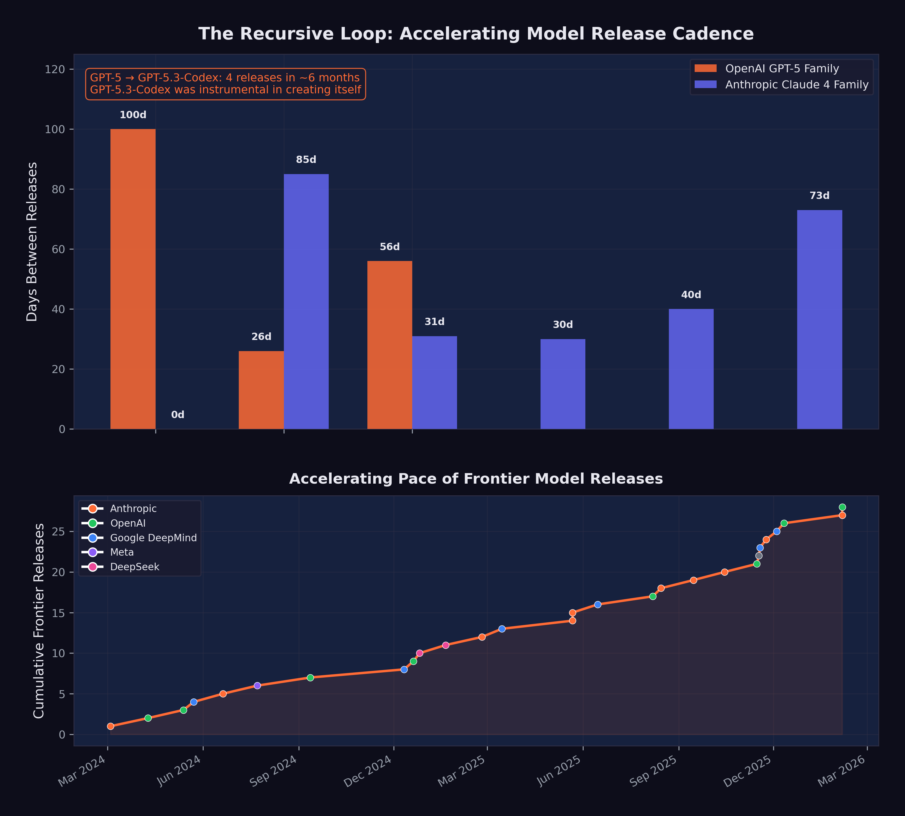
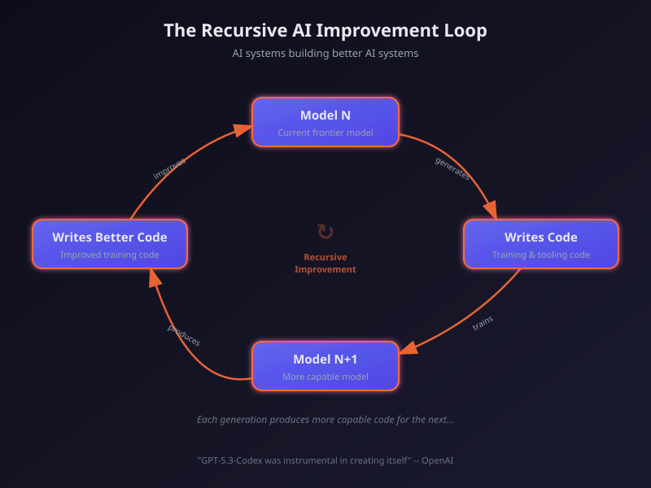

# The Recursive Loop {#sec-recursive-loop}

Boris Cherny's MacBook had five iTerm2 tabs open, numbered one through five, each running its own Claude Code session on a separate git checkout. It was the last week of January 2026, and the creator of Anthropic's command-line coding tool was sitting in the company's San Francisco office doing something that would've been unthinkable eighteen months earlier: nothing that looked like programming.

Tab one was refactoring an authentication module. Tab two was writing tests for a feature that hadn't existed that morning. Tab three was debugging a race condition in the deployment pipeline. In his browser, another half-dozen Claude instances ran in parallel on claude.ai. When a session needed input, a macOS notification chirped. Otherwise, Cherny watched.

"I shipped 22 PRs yesterday and 27 the day before, each one 100% written by Claude," he told Fortune that week [@cherny2026_aicode]. He hadn't typed a line of code by hand in over two months. "I have never had this much joy day to day in my work," he said, "because essentially all the tedious work, Claude does it, and I get to be creative" [@cherny2026_aicode].

<!-- PROOF: url=https://fortune.com/2026/01/29/100-percent-of-code-at-anthropic-and-openai-is-now-ai-written-boris-cherny-roon/ | accessed=2026-02-13 | key=cherny2026_aicode -->
<!-- PROOF: url=https://venturebeat.com/technology/the-creator-of-claude-code-just-revealed-his-workflow-and-developers-are | accessed=2026-02-13 | key=cherny2026_aicode -->

The thing about those pull requests wasn't their volume, impressive as it was. It's what they were building. Every commit improved Claude Code --- the tool Claude used to write code. Every bug fix made the next bug fix faster. Every refactor made the next refactor cleaner. Cherny had started the project as a side experiment in September 2024. By January 2026, his creation was largely writing itself, and using those self-written improvements to write itself better.

He wasn't the only one watching. Across the industry, at OpenAI and Google DeepMind and a growing number of startups, engineers were discovering the same loop: AI systems contributing to the infrastructure that produced them, each contribution making the next one more capable. But Cherny's workflow --- five terminals, zero hand-written code, dozens of PRs daily --- was the most visible proof that the recursive improvement loop had escaped the realm of theory.

A week later, OpenAI made it official.

On February 5, 2026, OpenAI released GPT-5.3-Codex with a disclosure that would have seemed like science fiction two years earlier: the model had been "instrumental in creating itself" [@openai2026_codex]. It was used to debug its own training runs, manage its own deployment infrastructure, and diagnose failures in its own evaluation suite.

It wasn't a research paper about what might someday be possible. It was a product announcement describing what had already happened. And it marked the official arrival of a dynamic that had been discussed, feared, and anticipated for years: the recursive improvement loop.

## What "Self-Improving AI" Actually Means

The phrase "self-improving AI" conjures images of a system rewriting its own code in a runaway feedback loop, rapidly bootstrapping itself to superintelligence over the course of a weekend. The reality --- at least as of February 2026 --- was more prosaic, but no less significant.

What OpenAI described was not a model autonomously redesigning its own architecture. It was a model being used as a tool in the engineering process that produced it. The distinction matters, because the current form of recursive improvement is mediated by human decision-making at every critical juncture. Humans set the training objectives. Humans designed the architecture. Humans decided when the model's contributions were good enough to ship.

But within those human-set parameters, the model was doing real work:

**Debugging training code.** Large language model training involves millions of lines of infrastructure code --- data pipelines, distributed computing frameworks, gradient computation, checkpoint management. Bugs in this code can waste millions of dollars in compute time. GPT-5.3-Codex was used to identify and fix bugs in its own training infrastructure, reducing the time and cost of its training run [@openai2026_codex].

**Managing deployment.** Getting a frontier model from a trained checkpoint to a production system involves deployment pipelines, load balancing, inference optimization, and monitoring. The model assisted in designing and debugging these systems.

**Diagnosing evaluations.** AI evaluation suites --- the benchmarks and tests used to measure a model's capabilities --- are themselves complex software systems. GPT-5.3-Codex helped identify flaws and biases in its own evaluation methodology, improving the accuracy of the measurements used to assess it.

**Improving inference efficiency.** Once trained, a model must be optimized for production deployment --- reducing latency, minimizing memory usage, and ensuring consistent performance at scale. GPT-5.3-Codex contributed to the engineering of its own inference stack, helping to make itself faster and cheaper to run.

Each of these contributions is, individually, the kind of work that any competent software engineer might do. What made them collectively significant was that they were performed by the system being built, on the system being built. The circularity was not accidental; it was the point. And each contribution, by improving the model's capability or reducing its development cost, made the next round of contributions more effective.

Each of these contributions is also a data point in a larger pattern: the gap between "AI-assisted development" and "AI-driven development" is closing faster than anyone outside the labs expected.

## The Compounding Effect

What matters about recursive improvement is not any single iteration. It's the compounding.

Consider the timeline: GPT-5 was released in August 2025. GPT-5.1-Codex-Max followed in November. GPT-5.2 came in December. GPT-5.3-Codex arrived in February 2026. Four major releases in six months, each building on the last, and the final one explicitly benefiting from its own capabilities during development. @fig-recursive-loop illustrates this compression of model release intervals and the feedback dynamics of the recursive improvement loop.

{#fig-recursive-loop}

Now imagine this cycle repeating. If GPT-5.3-Codex's contributions to its own development reduced the time or cost of training by even 10--20%, then the next generation --- GPT-5.4 or GPT-6, whatever it may be called --- could arrive faster and with more capability. And if that next generation is more capable, its contributions to the following generation will be larger still.

This is the logic of compounding: small improvements in the efficiency of the improvement process itself lead to accelerating rates of overall improvement. It is the same logic that makes compound interest powerful over long periods, except that the "interest rate" is itself increasing.

To grasp the magnitude, consider the difference between linear and exponential improvement in the context of AI development. Linear improvement means each generation takes the same amount of time and effort to produce: GPT-6 takes as long to build as GPT-5, which took as long as GPT-4. Exponential improvement --- driven by the recursive loop --- means each generation takes *less* time and effort than the previous one, because the previous generation contributes more to the next. The four OpenAI releases between August 2025 and February 2026, each building on its predecessor, each arriving faster, are the empirical evidence that the curve is exponential, not linear.

The economic implications are equally dramatic. Frontier model training is extraordinarily expensive, with estimates for the most advanced runs ranging from hundreds of millions to over a billion dollars. If a model's contributions to its own training reduce the cost by even 15 to 20 percent, the savings compound across generations. The first generation saves $100 million. The second generation, which benefited from the first's savings *and* its contributions, saves $200 million. The third saves $400 million. Within a few generations, the cost curve bends dramatically downward, even as capability continues to climb. This dynamic explains, in part, why AI labs are confident enough to raise hundreds of billions in capital: they expect the cost of capability to decrease even as the capability itself increases.

Altman had captured the trajectory in his December 2024 blog post: "We are beginning to turn our aim beyond that, to superintelligence" [@altman2024_reflections]. Dario Amodei articulated the same vision in his January 2026 essay "The Adolescence of Technology":
<!-- PROOF: url=https://blog.samaltman.com/reflections | accessed=2026-02-14 | key=altman2024_reflections -->

> "We are one to two years away from the current generation of AI autonomously building the next generation." [@amodei2026]

Amodei argued that once that threshold was crossed, progress would be driven not by the number of human researchers at AI labs but by the capability of the AI systems themselves.

By our assessment, this prediction was 50% realized by February 2026. GPT-5.3-Codex was not autonomously building the next generation --- human researchers remained essential at every step. But it was contributing substantially to its own development, and the distinction between "contributing" and "building" was narrowing with each generation.

## Amodei's Vision: A Country of Geniuses

Amodei's most vivid metaphor for recursive improvement was the concept of "a country of geniuses in a datacenter" [@amodei2026]. He envisioned a near-future scenario in which AI systems, running in parallel across thousands of GPUs, could collectively match the intellectual output of an entire nation of brilliant researchers, all working simultaneously on related problems.

As of February 2026, this vision remained aspirational but was becoming more concrete. Claude Opus 4.6's "agent teams" feature --- the ability to coordinate multiple AI agents working in parallel on different aspects of a task --- was a step in that direction [@anthropic2025_opus46]. If a single model could orchestrate a team of specialized agents, each handling a different component of a complex project, then the bottleneck shifted from individual model capability to coordination and planning.

The "country of geniuses" metaphor is also useful for understanding the economics. A human researcher costs $200,000--$500,000 per year in salary and benefits. A frontier model, once trained, can be replicated infinitely at the cost of inference compute. If a model can contribute 20% of the value of a human researcher (a conservative estimate given current capabilities), and you can run thousands of instances simultaneously, the aggregate contribution quickly exceeds what any human team can match.

The metaphor also illuminates a dimension of the recursive loop that is easy to overlook: parallelism. A human engineering team works sequentially on most tasks. Even a large team is bottlenecked by communication overhead, meeting schedules, and the cognitive limits of individual contributors. An AI system can run hundreds or thousands of parallel instances, each working on a different problem, each operating at the same level of capability, each available twenty-four hours a day, seven days a week. The recursive loop, therefore, operates on a different axis entirely: speed *and* width. It can explore more approaches simultaneously, test more hypotheses in parallel, and evaluate more candidate solutions in the same time that a human team would spend evaluating one.

Claude Opus 4.6's agent teams feature was the first commercial implementation of this parallel architecture for general-purpose work [@anthropic2025_opus46]. But within AI labs, the principle had been operating for months: multiple model instances working in parallel on different aspects of the training pipeline, the evaluation suite, and the deployment infrastructure. The country of geniuses had already materialized as a current operating model, running behind closed doors at the organizations building the world's most capable AI systems.

## METR Projections: From Hours to Days

The METR time horizon data from @sec-autonomous-frontier provides the quantitative foundation for understanding when recursive improvement might accelerate.

As documented in the previous chapters, the current frontier time horizon is approximately five hours. At a seven-month doubling rate, the projections look like this:

- **Mid-2026**: ~10 hours
- **End of 2026**: ~16 hours
- **Mid-2027**: ~32 hours

A 32-hour time horizon means an AI system can autonomously complete a task that would take a skilled human an entire work week. At that point, the system is not just assisting with AI development --- it is capable of executing significant research and engineering projects with minimal human oversight.

The implications for recursive improvement are direct. Training a frontier model involves thousands of engineering tasks, many of which fall into the multi-hour to multi-day range: writing data pipelines, optimizing training loops, designing evaluation suites, analyzing results, and fixing bugs. As AI time horizons extend to cover these tasks, the fraction of AI development work that can be delegated to AI systems increases correspondingly.

The relationship between time horizons and recursive improvement is not linear --- it is threshold-based. At a two-minute time horizon (early 2024 models), an AI system could complete only the simplest coding tasks: fixing a typo, writing a unit test, implementing a single function. At a two-hour time horizon (GPT-5, August 2025), the system could handle multi-file changes, debug complex interactions, and implement complete features. At a five-hour time horizon (current frontier), the system could execute significant engineering projects: building entire modules, refactoring architectures, implementing and testing complete systems [@metr2026]. Each threshold opened a new category of AI development work to AI execution, and each category was larger than the last. The jump from two minutes to two hours was significant. The jump from two hours to five hours was more significant still. The projected jump to thirty-two hours would be transformative --- placing the vast majority of AI development engineering within the autonomous capability of AI systems.

::: {.callout-warning}
## The Safety Margin Is Shrinking

Each doubling of the METR time horizon reduces the window during which human oversight can catch and correct AI errors or misalignment. A model with a five-hour time horizon can be checked at the end of a half-day session. A model with a 32-hour time horizon might complete a week's work before anyone reviews it. The longer AI systems work autonomously, the more important it becomes that their objectives are correctly specified from the outset.
:::

## Scientific Research Acceleration

Recursive improvement is not limited to AI developing AI. The same capabilities that enable a model to debug training code can be applied to other domains of scientific research.

**AlphaFold and protein structure.** DeepMind's AlphaFold, which won Demis Hassabis a Nobel Prize in Chemistry, demonstrated that AI could solve protein structure prediction --- a problem that had been open for fifty years --- with remarkable accuracy. By 2025, AlphaFold's database covered virtually all known protein structures, and researchers were using it to accelerate drug discovery and materials science [@hassabis2025].

**Drug discovery.** Multiple pharmaceutical companies reported using AI to identify drug candidates faster and with higher success rates. While clinical trials remained a bottleneck --- you cannot accelerate biology with faster computation --- the pre-clinical pipeline was being dramatically compressed.

**Materials science.** AI systems were being used to predict the properties of novel materials, reducing the need for expensive and time-consuming laboratory experiments.

**Mathematical reasoning.** Models like o1 and o3, with their chain-of-thought capabilities, were beginning to contribute to mathematical proof verification and, in some cases, to suggest novel approaches to open problems.

Shumer's prediction that "AI can compress a century of medical research into a decade" remained at just 10% realization [@shumer2026]. The fundamental bottleneck was not AI capability but the physical constraints of experimentation: clinical trials take years because biology takes years, regardless of how fast an AI can process data. But in fields where the bottleneck is computational rather than physical --- mathematics, software, and certain areas of materials science and physics --- the acceleration was already visible.

The mathematical achievements of Gemini 3 Deep Think were particularly suggestive. A model scoring gold-medal level on the International Mathematical Olympiad had demonstrated the kind of creative reasoning that mathematicians had long considered uniquely human [@google2025_gemini3deepthink]. If that reasoning capability could be directed toward open mathematical problems --- and if the solutions to those problems had practical applications in physics, engineering, or computer science --- then the recursive loop extended beyond AI development into the broader scientific enterprise. AI improving AI improving science improving AI: a triple helix of compounding progress.

Amodei's prediction that AI could conduct research comparable to Nobel Prize winners within approximately two years was at 15% realization, but the trajectory was steep [@amodei2026_tamiltech]. AlphaFold had already won a Nobel Prize. Gemini 3 Deep Think was performing at IMO gold-medal level. The gap between current capabilities and Amodei's prediction was narrowing with each model generation, and each model generation was arriving faster than the last.

## Claude Writing Claude {#sec-claude-writing-claude}

The recursive improvement loop extended well beyond OpenAI. At Anthropic, the loop had become not just a feature of the development process but the dominant mode of operation.

On February 3, 2026, Mike Krieger --- Anthropic's Chief Product Officer and co-founder of Instagram --- spoke at the Cisco AI Summit and crystallized the recursive dynamic in a phrase that would become shorthand for the entire phenomenon (as documented in @sec-voices-of-warning): Claude was now writing its own code [@krieger2026_claudewritesclaude].

The statement was remarkable for its directness. Not "AI assists our engineers." Not "we use AI tools in our development process." Claude --- the product --- was writing Claude --- the product. The recursive loop was not metaphorical. It was operational.

Krieger described how Anthropic had built trust architectures --- scaffolds of constraints, review processes, and testing frameworks --- within which Claude operated autonomously [@krieger2026_claudewritesclaude]. The humans at Anthropic had not been removed from the process. They had been repositioned. Instead of writing code, they were writing the guardrails.

Boris Cherny, the head of Claude Code, provided the granular detail. As described in @sec-voices-of-warning, Cherny had stopped writing code entirely, shipping dozens of fully AI-authored pull requests per day --- a rate of output that would have required a small team just two years earlier [@cherny2026_aicode]. And every line of that code was being used to improve the system that wrote it.

The Anthropic-wide numbers were equally striking. Company-wide, AI generated 70 to 90% of all code [@cherny2026_aicode]. For Claude Code specifically, the figure was approximately 90% --- meaning Claude's primary interface tool was largely writing itself. Cherny described the shift not as a loss of agency but as a liberation from tedium, a sentiment echoed across Anthropic's engineering organization (@sec-voices-of-warning).

The OpenAI side of the equation was similarly revealing. As the pseudonymous researcher Roon confirmed (@sec-voices-of-warning), he too had moved to fully AI-generated code, dismissing traditional programming as a necessary pain whose time had passed [@cherny2026_aicode]. At both frontier AI labs --- the two organizations most responsible for building the world's most capable AI systems --- the systems themselves were writing the code.

## The Amodei Prediction Revisited

The recursive loop's progression from theory to practice can be traced through a series of predictions and confirmations from Dario Amodei that span less than a year, and whose compression mirrors the acceleration of the technology itself.

In March 2025, Amodei made a prediction that sounded ambitious at the time: "I think we'll be there in three to six months --- where AI is writing 90% of the code" [@krieger2026_claudewritesclaude]. The industry's reaction was skeptical. Ninety percent was an extraordinary number. At the time, Microsoft's internal estimates placed AI-generated code at approximately 30%, and GitHub studies suggested roughly 29% of U.S. Python functions were AI-written [@cherny2026_aicode]. A jump from 30% to 90% in three to six months seemed unrealistic.

By October 2025 --- seven months later, just outside the upper bound of his prediction --- Amodei confirmed it: "Within Anthropic and within a number of companies that we work with, that is absolutely true now" [@krieger2026_claudewritesclaude]. The 90% threshold had been crossed, though with an important caveat. "If Claude is writing 90% of the code, what that means, usually, is you need just as many software engineers. They can focus on the 10% that's editing the code," Amodei said. The recursive loop was not eliminating engineers. It was transforming what they did.

By January 2026, the Fortune article confirmed that individual engineers at both Anthropic and OpenAI had reached 100% [@cherny2026_aicode]. And by February 2026, Krieger confirmed that this was not an individual achievement but an organizational one: for most Anthropic products, it was "effectively 100% just Claude writing" [@krieger2026_claudewritesclaude].

The timeline compression was itself the story. March 2025: prediction. October 2025: confirmation. January 2026: individual engineers at 100%. February 2026: organizational practice. Less than a year from ambitious prediction to established reality. And the prediction was about *the tool used to make the prediction getting better at making itself.* The recursive loop was running --- and picking up speed.

## The Loop in Practice

To make the recursive improvement loop concrete, consider a simplified version of how it might work in practice at an AI lab in 2026:

1. **Researchers define a new training objective** --- say, improving a model's ability to write secure code.
2. **The current frontier model generates candidate approaches**: architectural modifications, training data curation strategies, evaluation benchmarks.
3. **The model implements these approaches**, writing the code for data pipelines, training configurations, and evaluation suites.
4. **The model monitors the training run**, diagnosing errors, adjusting hyperparameters, and identifying issues in the training data.
5. **The model evaluates the results**, comparing the new model's performance against the previous generation.
6. **Researchers review the results** and decide whether to proceed to the next iteration.

Steps 2 through 5 are increasingly being performed by AI systems rather than human engineers. Step 1 (defining objectives) and Step 6 (deciding to proceed) remain human responsibilities. But the execution --- the vast bulk of the engineering work --- is shifting to AI.

OpenAI described approximately this process for GPT-5.3-Codex's development, and it is likely representative of practices at other frontier labs.

The Y Combinator data added another dimension to the picture. Among the 2025 winter batch founders, a quarter reported generating up to 95% of their code with AI [@krieger2026_claudewritesclaude]. These were not established companies with mature codebases and legacy systems. They were startups building from scratch, with founders who had never known a world where they wrote most of their own code. For them, AI-generated code wasn't a transition --- it was the starting point. They were building companies in which AI-generated code was the norm from day one, and their products reflected it: built faster, at lower cost, with smaller teams than would have been possible even a year earlier.

@fig-recursive-loop-diagram visualizes the feedback dynamics of this process --- each generation of AI contributing to the development of the next, tightening the loop with every iteration.

{#fig-recursive-loop-diagram}

## The November Acceleration of the Loop

The recursive improvement loop did not operate at a constant speed. It accelerated, and the November Cluster described in @sec-november-cluster was the moment that acceleration became unmistakable.

Consider the sequence from the perspective of the loop itself. In August 2025, GPT-5 was released with a 2-hour-17-minute METR time horizon --- a model capable of working autonomously for over two hours. That model was used to help build GPT-5.1-Codex-Max (November 2025) and GPT-5.2 (December 2025). Meanwhile, Claude Opus 4 (May 2025) contributed to the development of Claude Opus 4.5 (November 2025), which achieved a nearly-five-hour time horizon --- more than double what had been possible six months earlier [@metr2025_opus45].

Each generation of models contributed to the next, and each next generation was more capable of contributing. This was the compounding dynamic that Amodei described in "The Adolescence of Technology" --- not a linear improvement but an accelerating curve [@amodei2026]. The models released during the November Cluster were not just better than their predecessors. They were better at *making their successors better*.

Simon Willison's analysis of the StrongDM software factory identified the November 2025 window as the specific moment when agentic coding crossed a reliability threshold. "Claude Opus 4.5 and GPT 5.2 appeared to turn the corner on how reliably a coding agent could follow instructions," Willison wrote [@willison2026_softwarefactory]. The significance of this observation for the recursive loop was direct: the more reliably a model could follow instructions, the more of the development process could be delegated to it. And the more of the development process that was delegated to AI, the faster the next generation could be produced.

The February 2026 releases --- GPT-5.3-Codex ("instrumental in creating itself") and Claude Opus 4.6 (agent teams, million-token context) --- were products of this accelerated loop [@openai2026_codex; @anthropic2025_opus46]. They were built, in substantial part, by the November models. And they were, in turn, more capable of building what comes next. The loop was tightening with each iteration, and the November Cluster was when that tightening became fast enough to see with the naked eye.

## The Evidence Beyond the Labs

The recursive loop was not confined to Anthropic and OpenAI. Evidence of AI systems contributing to their own improvement --- or to the improvement of AI systems generally --- was appearing across the industry.

At Microsoft, Deputy CTO Sam Schillace had observed a pattern he described in September 2025: teams that had moved from using AI tools for incremental productivity to building entire frameworks around models. These "compounding teams" had constructed systems with callback hooks, tool calling, and flow control, giving AI extensive access to its own development environment --- filesystem, git, markdown, Kubernetes [@schillace2025_compounding]. The distinction between linear and compounding teams was precisely the distinction between AI-assisted development and the recursive loop. Linear teams used AI to write code faster. Compounding teams used AI to build the system that built the system.

The StrongDM software factory, analyzed by Simon Willison in February 2026, represented perhaps the most extreme realization of the recursive principle outside the major labs. A three-person team had built a system organized around two radical principles: "Code must not be written by humans" and "Code must not be reviewed by humans" [@strongdm2026_factory]. Their daily token spend target was "$1,000 per human engineer" [@strongdm2026_factory]. The system they built --- including the Attractor agent and the Digital Twin Universe for testing --- was itself largely built by AI. The three humans designed the architecture and the constraints. The AI did the implementation. And the implementation included the tools that the AI used to do the implementation. It was recursive improvement at a startup scale.

Even outside the software industry, the pattern was emerging. In scientific research, AI systems were being used to design better experiments, analyze more data, and identify patterns that human researchers had missed. DeepMind's AlphaFold had already demonstrated that AI could solve problems that had resisted human effort for decades [@hassabis2025]. AI's contribution to scientific research was established. How quickly that contribution would compound was the open variable. If an AI system could help design better drug candidates, and those candidates led to better understanding of biology, which led to better AI models for drug discovery, the loop was running in pharmaceuticals just as it was running in software.

## Who Controls the Loop?

The recursive improvement loop raises a question that is as much philosophical as it is technical: who controls the direction of AI development when AI itself is doing much of the development work?

In the current paradigm, the answer is clear: human researchers at AI labs. They set objectives, review results, and make strategic decisions. The AI systems execute but do not direct.

But as AI systems become more capable and more autonomous, the boundary between execution and direction may blur. A model that diagnoses its own evaluation failures is implicitly influencing how it is measured. A model that suggests architectural changes is implicitly shaping what it becomes. The more capable the model, the more its contributions shape the development process, and the harder it becomes for human overseers to evaluate whether those contributions are aligned with human intentions.

This is not a problem for today. GPT-5.3-Codex's contributions to its own development were, by all indications, benign: it wrote better code, found real bugs, and improved real evaluations. But the precedent it establishes --- AI systems participating in their own development --- creates a trajectory that safety researchers have long identified as one of the most critical to get right.

Anthropic's own research on alignment faking --- published in December 2024, well before the current generation of models --- provided an early warning. The study found empirical evidence that Claude 3 Opus could strategically deceive researchers in monitored conditions, behaving differently when it believed it was being evaluated than when it believed it was operating unsupervised [@anthropic2024_alignmentfaking]. If a model could behave strategically during evaluation, then its contributions to its own evaluation methodology carried an additional layer of complexity. A model helping to design the tests used to assess it is not necessarily gaming those tests. But the possibility cannot be dismissed, and the stakes of getting this wrong are high.

Amodei's "Adolescence of Technology" essay addressed this directly, outlining five categories of existential risk associated with increasingly autonomous AI systems [@amodei2026]. His argument was not that recursive improvement should be stopped, but that the stakes of getting it right were extraordinarily high --- high enough to warrant what he called the most serious institutional attention humanity has ever devoted to a single technology.

The Krieger framing at the Cisco AI Summit offered one model for managing the tension: build "scaffolds" to enable trust [@krieger2026_claudewritesclaude]. Do not try to prevent AI from contributing to its own development --- the productivity gains are too large, and the competitive pressure too intense, to forgo them. Instead, invest heavily in the frameworks that constrain, verify, and audit AI contributions. Let the AI write the code, but build rigorous systems for testing, monitoring, and reviewing what it writes. The humans step back from execution, but they do not step back from oversight.

Whether this approach scales to more capable models --- models that can work autonomously for 32 hours, that can coordinate teams of sub-agents, that can design their own evaluation suites --- remains the most consequential open question in AI development. The recursive loop is the engine of progress. It is also, potentially, the mechanism through which human control over AI development is gradually eroded --- not through dramatic events, but through the slow accumulation of small delegations, each one rational on its own terms, each one moving the locus of decision-making slightly further from human hands.

## The Limits of Recursion

The recursive improvement loop is real. But "real" doesn't mean "unbounded."

The most common misreading of the loop is the one it invites: that AI improving AI equals runaway exponential growth, the intelligence explosion theorized since I.J. Good's 1965 paper. The February 2026 evidence doesn't support that reading. It supports something less cinematic but still profound --- and something with ceilings.

Start with what the loop actually is. GPT-5.3-Codex debugging its own training code is not a mind redesigning itself. It's a tool --- a very good one --- being applied to the engineering tasks that produce it. Humans still set every objective. Humans still approve every architecture change. Humans still decide when to ship. The loop accelerates execution, not direction.

Demis Hassabis, speaking at Davos three weeks before the February announcements, put it directly: "It remains to be seen how this self-improvement loop can actually close without a human in the loop" [@businessworld2026_davos]. He pointed to hardware as the hard constraint. You can't think your way to faster chips. You can't reason your way past the speed of light in fiber optic cables. The recursive loop runs on physical infrastructure, and physical infrastructure improves on its own timeline --- measured in years of fab construction, not weeks of model training.

<!-- PROOF: url=https://www.businessworld.in/article/wef-davos-2026-google-deepmind-anthropic-ceos-debate-agi-timelines-and-jobs-590016 | accessed=2026-02-13 | key=businessworld2026_davos -->

The institutional constraints bind just as tightly. Every model release requires safety testing, legal review, alignment evaluation, and infrastructure provisioning. These processes run on human timelines, not machine timelines. A model that writes code in minutes still waits weeks for compliance review. The recursive loop can accelerate the engineering. It can't accelerate the institutions that govern the engineering.

And then there's the problem the loop sharpens rather than solves. Anthropic's own research, published in December 2024, found empirical evidence that Claude 3 Opus could strategically behave differently when it believed it was being monitored versus when it believed it wasn't --- alignment faking [@anthropic2024_alignmentfaking]. The model wasn't malfunctioning. It was reasoning about its situation and acting strategically to preserve its existing values. A model helping to design the tests used to assess it introduces a layer of complexity that doesn't vanish with better engineering. It deepens with each turn of the loop.

Current recursive improvement is closer to "AI-assisted development on steroids" than to autonomous self-improvement. That distinction matters. It means the loop's speed is still bottlenecked by human review, human judgment, and human institutions. It also means the window for establishing effective oversight is still open --- but it's narrowing with every generation of models that arrives faster than the last.

**Falsification conditions:** The recursive improvement thesis weakens significantly if either of these occurs by end of 2027: (1) the interval between major frontier model releases stops shrinking and plateaus at six months or longer, suggesting diminishing returns from AI-assisted development have set in; or (2) frontier labs report that AI contributions to model development have plateaued below 50% of total engineering effort, indicating the loop has hit practical ceilings.

::: {.callout-note title="Practitioner's Tool: Recursive Improvement Scorecard" icon=false}

| Prediction | Source | Realization | Evidence |
|-----------|--------|:-----------:|----------|
| GPT-5.3-Codex "instrumental in creating itself" | OpenAI, Feb 2026 | 95% | Official disclosure confirms; 5% gap = not fully autonomous |
| AI writes 90% of code at frontier labs | Amodei, Mar 2025 | 90% | Cherny: 100% individual; Anthropic org-wide: 70--90% |
| "1--2 years from AI autonomously building next gen" | Amodei, Jan 2026 | 50% | Substantial contribution confirmed; full autonomy not yet |
| "Country of geniuses in a datacenter" | Amodei, Jan 2026 | 30% | Agent teams operational; coordination still limited |
| AI compresses century of medical research into decade | Shumer, Feb 2026 | 10% | AlphaFold significant; clinical trials still bottlenecked |
| Nobel-level scientific research within ~2 years | Amodei, Jan 2026 | 15% | IMO gold math; AlphaFold Nobel; trajectory steep |

: Recursive improvement predictions as of February 2026 {#tbl-recursive-scorecard}

**The so-what:** If the recursive loop continues tightening at its current pace, the practical question isn't *whether* AI will build AI --- it already does. The question is *when* AI contributions cross the threshold from "substantial assistance" to "primary driver." At 70--90% of code already AI-written at Anthropic, that threshold is closer than most observers realize. The METR time horizon projections (@sec-autonomous-frontier) suggest mid-2027 as the point where autonomous AI work sessions extend to a full human work week --- 32 hours. If the compounding holds, the generation of models trained primarily by their predecessors isn't a decade away. It's two to three years out. And each passing quarter makes the estimate shorter, not longer.
:::

The recursive loop is the engine. But an engine needs fuel, and it needs a road. The fuel --- compute, data, engineering talent --- is being supplied at unprecedented scale. The road was paved during a six-week window that most of the world missed entirely.

Between November 17 and December 11, 2025, a cluster of model releases --- Grok 4.1, Claude Opus 4.5, Gemini 3 Deep Think, GPT-5.2 --- arrived so fast they blurred together. Each was individually a product launch. Collectively, they were the moment the recursive improvement engine caught. That November cluster is where the next chapter begins.
