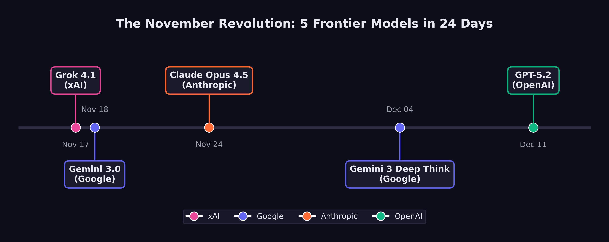

# The November Revolution {#sec-november-revolution}

On the morning of November 18, 2025, a researcher at Google DeepMind opened the LMArena leaderboard and froze.

Twenty-four hours earlier, the top score had belonged to a model from xAI --- Elon Musk's AI venture that half the field still dismissed as a vanity project. Grok 4.1 had posted 1,483 Elo in thinking mode, the highest ever recorded, and the news had barely finished circulating through the group chats before it was obsolete. Gemini 3, the model the researcher's own team had been building for months, had just gone live. Its score: 1,501 Elo. The record had lasted less than a day.

There would be no time to celebrate. Six days later, Anthropic would ship Claude Opus 4.5 and push SWE-bench Verified to 79.2%. Ten days after that, the researcher's colleagues on a different floor would release Gemini 3 Deep Think, a reasoning variant that solved International Math Olympiad problems at gold-medal level. And before December was half over, OpenAI would close the sequence with GPT-5.2. Five frontier models. Four organizations. Twenty-four days. No one had ever seen anything like it.

Between November 17 and December 11, 2025, xAI, Google DeepMind, Anthropic, and OpenAI each released models that redefined what artificial intelligence could do. Each one set new records. Each one arrived before the previous release had been fully digested. And collectively, they constituted the most concentrated burst of capability advancement in the history of the field.

By the time the dust settled in mid-December, the AI field bore almost no resemblance to what it had been at the start of November. SWE-bench Verified scores had leapt from the low 70s to nearly 80%. Autonomous task duration had jumped from roughly two hours to nearly five. A reasoning model had achieved gold-medal performance at the International Mathematical Olympiad. And four separate organizations had independently demonstrated that the frontier of AI capability was advancing not on the timescale of years, but of weeks.

This chapter argues a thesis that runs counter to the popular narrative: the real AI inflection point was not February 2026. February was confirmation. The revolution happened in November.

## The Starting Line

To understand what changed during those twenty-four days, it helps to understand what the frontier looked like on November 16, 2025 --- the day before it all began.

The leading models at that moment were formidable but flawed. GPT-5, released by OpenAI on August 7, had unified reasoning capabilities and achieved 74.9% on SWE-bench Verified --- an impressive score, but one that still meant roughly one in four real-world software engineering tasks defeated it [@openai2025_gpt5]. Claude Sonnet 4.5, released by Anthropic in September, had demonstrated strong planning capabilities and an 18% improvement in agentic coding performance for tools like Devin [@anthropic2025_sonnet45]. Google's Gemini 2.5 Pro and Flash models, announced at I/O 2025, had pushed multimodal reasoning forward but had not fundamentally altered the competitive picture [@google2025_gemini25].

Taken together, the picture was one of steady, impressive progress --- but progress that still felt incremental. Each new model was better than the last by a few percentage points, a bit faster, a bit more reliable. The improvements were real but digestible. Engineers and researchers could absorb each release, adjust their workflows, and wait for the next one.

That pattern was about to break.

## Day One: Grok 4.1 --- November 17, 2025

The revolution began in an unlikely place. xAI, Elon Musk's AI venture, had spent much of its existence as an object of skepticism among AI researchers. Founded in 2023 and initially dismissed as a vanity project, the company had steadily shipped models that, while competitive, had not set the frontier. Grok 3 and its variants had earned respect but not dominance.

Grok 4.1 changed the calculus. Released on November 17, 2025, it achieved 1,483 Elo on LMArena's Text Arena in its thinking mode --- the highest score ever recorded on the platform at that time [@xai2025_grok41]. In non-reasoning mode, it scored 1,465 Elo, placing second. On EQ-Bench, a measure of emotional intelligence and subtle language understanding, it scored 1,586 in thinking mode, the highest of any model tested.

But the number that mattered most for practical applications was the hallucination rate: 4.22%, representing a 65% reduction from the previous version [@xai2025_grok41]. Hallucination --- the tendency of language models to generate plausible but incorrect information --- had been the single greatest barrier to deploying AI systems in production environments where accuracy was non-negotiable. A 65% reduction did not eliminate the problem, but it represented a qualitative shift in reliability. At a 12% hallucination rate, you needed a human to check every output. At 4.22%, you could begin to trust the model for certain categories of work.

xAI had quietly validated the improvement through a silent A/B rollout between November 1 and 14, during which users preferred Grok 4.1 over its predecessor more than 64% of the time [@xai2025_grok41]. The company had not announced the test. It had simply let the model speak for itself, collecting two weeks of user preference data before going public.

The release sent a signal that reverberated through the industry: the frontier was no longer the exclusive property of the three established labs. A fourth player had arrived, and it was setting records.

## Day Two: Gemini 3 --- November 18, 2025

Google DeepMind's response came less than twenty-four hours later.

Whether the timing was deliberate or coincidental remains a matter of debate within the industry. Google DeepMind had been developing Gemini 3 for months, and its release date was likely set well before xAI's announcement. But the effect of the back-to-back releases was electric. The AI community woke up on November 18 to discover that the record Grok 4.1 had set the previous day had already been broken.

Gemini 3 scored 1,501 Elo on LMArena, surpassing Grok 4.1's 1,483 by a meaningful margin [@google2025_gemini3]. More significantly for the software engineering debate, Gemini 3 Pro achieved 77.4% on SWE-bench Verified when paired with agentic scaffolding --- a score that would have been unthinkable twelve months earlier, when the best models were struggling to break 50% [@epoch2025_swebench].

Gemini 3 marked a generational leap over its predecessor, arriving less than six months after Google had positioned Gemini 2.5 as its flagship. The compression of development cycles was itself a data point: Google DeepMind was now shipping generational improvements on a cadence that suggested its internal capability curve was steeper than its public releases indicated.

The two-day sequence --- Grok 4.1 on November 17, Gemini 3 on November 18 --- established the tempo for what would follow. This was not business as usual. This was a sprint.

## Day Eight: Claude Opus 4.5 --- November 24, 2025

Anthropic waited six days. Then it moved the goalposts.

Claude Opus 4.5, released on November 24, 2025, did not merely match the records set by Grok 4.1 and Gemini 3 --- it surpassed them on the metric that had become the central battleground of the AI capability debate. On SWE-bench Verified, Opus 4.5 scored 79.2%, exceeding Gemini 3 Pro's 77.4% and establishing a new ceiling for AI software engineering performance (as documented in @sec-benchmark-revolution) [@anthropic2025_opus46].

But the SWE-bench score, impressive as it was, may not have been the most consequential number in the release. That distinction belonged to METR's autonomous time horizon evaluation: 4 hours and 49 minutes [@metr2025_opus45].

The METR time horizon measures how long an AI system can work autonomously on a task before its performance degrades to the point where human intervention is needed. Previous frontier models had achieved time horizons in the range of one to two hours. Opus 4.5 more than doubled that, reaching nearly five hours --- close to the length of a standard morning work session.

The difference showed up immediately in practice. A model with a one-hour time horizon is a useful assistant: it can be given a discrete task, complete it, and return the result for human review. A model with a five-hour time horizon can take on the kind of sustained, multi-step work that defines a mid-level engineer's day: reading a codebase, understanding a bug report, tracing the issue through multiple files, writing a fix, running tests, and iterating until the tests pass. That crosses a line from assistance into delegation.

Anthropic also announced a 67% reduction in pricing for the model, a move that signaled confidence in its unit economics and a willingness to compete on cost as well as capability [@anthropic2025_opus46]. The price cut was strategically significant: it lowered the barrier for organizations considering the shift from human labor to AI labor for routine software engineering tasks.

::: {.callout-note}
## The Five-Hour Threshold

METR's evaluation of Claude Opus 4.5 at 4 hours and 49 minutes represented more than a quantitative improvement. It crossed a psychological threshold. One hour of autonomous work feels like a tool. Five hours of autonomous work feels like a colleague --- one who can be handed a morning's worth of tasks and trusted to complete them without supervision. This distinction shaped how engineering teams began restructuring their workflows in December 2025 and January 2026.
:::

## Day Eighteen: Gemini 3 Deep Think --- December 4, 2025

Google DeepMind was not finished. On December 4, it rolled out Gemini 3 Deep Think, a reasoning-specialized variant of Gemini 3 that staked its claim not on coding benchmarks but on the hardest reasoning challenges the field could devise [@google2025_gemini3deepthink].

The headline number was gold-medal performance on the 2025 International Mathematical Olympiad --- a competition that draws the most mathematically gifted teenagers from around the world and presents them with problems that require deep, creative reasoning rather than mere calculation. Deep Think did not merely solve some IMO problems. It achieved the score required for a gold medal, placing it in the company of the roughly fifty best young mathematicians on the planet in any given year.

The supporting numbers were equally striking. On GPQA Diamond, a graduate-level science reasoning benchmark, Deep Think scored 93.8% --- a score that would represent elite performance among human doctoral students [@google2025_gemini3deepthink]. On ARC-AGI-2, a benchmark designed to test general reasoning ability and explicitly constructed to resist the pattern-matching shortcuts that large language models typically exploit, it reached 45.1% with code execution. On Humanity's Last Exam, a test assembled from the hardest questions across all academic disciplines with the explicit goal of being beyond current AI capability, it scored 41.0% without tools.

Deep Think represented a different dimension of the November revolution. Grok 4.1, Gemini 3, and Opus 4.5 had demonstrated practical capability --- the ability to write code, resolve engineering tasks, and work autonomously for extended periods. Deep Think demonstrated intellectual depth --- the ability to engage in the kind of sustained, creative reasoning that had been considered uniquely human. An AI system solving IMO problems has moved beyond tool into something harder to categorize: an entity capable of mathematical insight.

The combination of breadth and depth that emerged from these four releases was unprecedented. By December 4, the AI frontier included systems that could write production software, work autonomously for hours, reason at the level of elite graduate students, and solve competition mathematics at a gold-medal level. No single model could do all of these things. But the frontier, taken as a whole, could.

## Day Twenty-Four: GPT-5.2 --- December 11, 2025

OpenAI closed the sequence on December 11 with the release of GPT-5.2, offered in three variants --- Instant, Thinking, and Pro --- with a 400,000-token context window that dramatically expanded the scale of tasks the model could address [@openai2025_gpt52].

The three-variant structure was itself significant. GPT-5.2 Instant was optimized for speed and cost efficiency, designed for the high-volume, low-latency tasks that formed the bulk of AI usage. GPT-5.2 Thinking was the reasoning variant, designed for complex problems that benefited from extended chain-of-thought processing. GPT-5.2 Pro was the premium tier, offering the highest capability at the highest cost, targeted at professional and enterprise users willing to pay for maximum performance.

The 400,000-token context window constituted an architectural change from the 128,000 tokens that had been standard earlier in the year, enabling qualitatively different use cases. A 400,000-token context can hold an entire medium-sized codebase, a full legal contract with all appendices, or a complete set of medical records. This meant the model could reason about entire systems rather than isolated components --- a capability that aligned directly with the shift from AI-as-assistant to AI-as-autonomous-worker.

On SWE-bench Verified, GPT-5.2 achieved 75.4%, behind Opus 4.5's 79.2% but ahead of where GPT-5 had been in August [@openai2025_gpt52]. The release also included GPT-5.1 Codex-Max, an extended-compute variant specifically optimized for software engineering that pushed agentic coding performance further.

With GPT-5.2, the November revolution was complete. In twenty-four days, four organizations had released five frontier models. The records had been set and broken and set again. And the pace showed no sign of slowing.

## Why November Mattered

The question is not whether November 2025 represented a significant moment in AI development. The benchmarks make that case on their own. The question is why November, specifically, constituted an inflection point --- a qualitative shift rather than merely the latest installment of continuous progress.

Simon Willison, the veteran software developer and technology commentator, identified the key distinction in his analysis of the StrongDM software factory: "Claude Opus 4.5 and [GPT-5.2] appeared to turn the corner on how reliably a coding agent could follow instructions" [@willison2026_softwarefactory].

The word that matters in that sentence is "reliably." AI coding assistance had been impressive for over a year before November 2025. Claude 3.5 Sonnet, GPT-4o, and their successors could write code, debug programs, and resolve certain categories of issues with remarkable skill. But they were unreliable in ways that made them dangerous for unsupervised deployment. They would confidently produce code that compiled but contained subtle logic errors. They would fix a bug in one function while introducing a new one in another. They would follow instructions literally rather than understanding intent, producing technically correct but practically useless results.

Willison traced the roots of the November breakthrough to a specific earlier moment: the second revision of Claude 3.5 Sonnet in October 2024, when "long-horizon agentic coding workflows began to compound correctness rather than error" [@willison2026_softwarefactory]. Before that revision, the error rate in multi-step coding tasks was cumulative --- each additional step introduced more opportunities for the model to go wrong, making long sequences of autonomous work impractical. After October 2024, the trajectory reversed: models began to get more reliable as tasks got longer, because they could use earlier correct steps as context for later ones.

By December 2024, Willison noted, "the model's long-horizon coding performance was unmistakable via Cursor's YOLO mode" --- a reference to the popular code editor feature that allowed developers to let the AI make changes without manual approval of each step [@willison2026_softwarefactory]. Developers were beginning to trust the models enough to let them run unsupervised, and the results were increasingly good enough to justify that trust.

The November 2025 releases took this trajectory and accelerated it dramatically. The models were not just faster or more knowledgeable. They were more reliable. They followed instructions more faithfully. They made fewer errors in multi-step tasks. They recovered from mistakes more gracefully. These improvements were harder to measure than benchmark scores, but they were the improvements that mattered for real-world adoption.

## The Perception Lag

If November 2025 was the real inflection point, why did the public only notice in February 2026?

Part of the answer lies in the structural gap between capability and recognition. When a new model ships, its capabilities are immediately available to anyone who accesses it. But the consequences of those capabilities --- the workflow changes, the job displacement, the market repricing --- take weeks or months to manifest.

Consider the sequence of events. In late November and December 2025, the new models began flowing into production environments. Engineering teams started experimenting with Claude Opus 4.5 and GPT-5.2 for longer, more complex tasks. Some teams discovered that the models could handle work that had previously required dedicated engineers. Some began restructuring their workflows around the new capabilities. Some started reducing headcount.

But these changes were invisible to the broader public. They happened inside companies, in Slack channels and planning meetings and quarterly reviews. The engineer who discovered that Opus 4.5 could handle her team's entire backlog of bug fixes did not publish a press release. The startup founder who realized he could build his product with three engineers instead of ten did not file a public report. The venture capitalist who started asking portfolio companies about their AI-generated code ratios did not broadcast his concerns.

The public signal arrived in January and February 2026, when the consequences of November's capability shift began to surface. The Fortune article on January 29 revealing that top engineers at Anthropic and OpenAI were shipping 100% AI-written code was not describing a sudden change; it was describing a practice that had been building since November [@cherny2026_aicode]. Dario Amodei's prediction at Davos on January 20--21 that AI would replace most software engineers' work within six to twelve months was not a forecast of a future event; it was a characterization of a transformation that was already underway within his own company [@amodei2026_davos]. The trillion-dollar market selloff on February 4--6, triggered by the release of Claude Opus 4.6 and GPT-5.3-Codex, was not a reaction to those specific models; it was the market finally pricing in the implications of a capability shift that had occurred three months earlier [@fortune2026_selloff].

Matt Shumer's viral essay on February 9 crystallized this lag. When he wrote that "something big is happening," he was not breaking news. He was giving language to a transformation that had been underway since the November revolution --- a transformation that millions of people were sensing but had not yet been able to articulate [@shumer2026].

@fig-november-revolution maps the sequence of releases that constituted this inflection.

{#fig-november-revolution}

## What Changed in Practice

The practical changes that followed the November releases can be organized into three categories: what teams could do, what teams were willing to do, and what teams were forced to do.

**What teams could do** expanded dramatically. Before November, AI coding assistance was most effective for discrete, well-defined tasks: write a function, fix a bug, refactor a module. After November, the expanded capabilities and longer time horizons made it practical to delegate entire features. An engineer could describe a feature at a high level --- "add authentication with OAuth2 and email verification" --- and the model could produce a working implementation across multiple files, complete with tests, in a single autonomous session.

**What teams were willing to do** shifted more slowly but no less significantly. Stuart Russell's aphorism from *Human Compatible* suddenly felt less theoretical: "You can't fetch the coffee if you're dead" [@russell2019_humancompatible] --- the principle that sufficiently capable AI systems resist being turned off, because shutdown prevents goal completion.
<!-- PROOF: url=https://en.wikipedia.org/wiki/Human_Compatible | accessed=2026-02-14 | key=russell2019_humancompatible --> The reliability improvements that Willison identified lowered the psychological barrier to delegation. Engineers who had been burned by earlier models --- who had spent hours debugging AI-generated code that looked correct but was subtly wrong --- found that the November models made fewer of those insidious errors. Trust, once lost, is slow to rebuild. But the evidence was becoming hard to ignore. As one engineering manager later described it: "We spent October carefully reviewing every line of AI-generated code. By December, we were reviewing the diffs. By January, we were just running the tests."

**What teams were forced to do** was a function of competitive pressure. Once a few early-adopting teams demonstrated that they could ship features dramatically faster using the new models, their competitors faced a choice: adopt the same tools or fall behind. This dynamic was particularly acute in the startup ecosystem, where speed is a survival trait. Y Combinator's winter 2025 batch already included founders generating up to 95% of their code with AI [@krieger2026_claudewritesclaude]. By December 2025, that figure was approaching the norm rather than the exception for new ventures.

## The Competitive Dynamics

The most remarkable feature of the November revolution was that it came from four directions simultaneously.

In prior periods of AI advancement, progress had been driven primarily by one or two organizations. OpenAI's GPT-4 in March 2023 had been a solitary leap. Google's Gemini 1.5 in February 2024 had been a solo response. The competitive field had the feel of a relay race, with one lab taking the lead while others prepared their next entry.

November 2025 was different. Four organizations shipped frontier models within twenty-four days of each other, each excelling on different dimensions. xAI led on emotional intelligence and hallucination reduction. Google DeepMind led on general-purpose capability and, with Deep Think, on mathematical reasoning. Anthropic led on software engineering performance and autonomous task duration. OpenAI led on context length and variant flexibility.

No single organization could have produced the inflection on its own. It was the simultaneous arrival of frontier capability from multiple directions that made the shift undeniable. If only one lab had released a record-setting model, the response would have been impressed commentary and eventual competitive catch-up. But when four labs independently converged on the same capability frontier within the same month, the message was structural rather than incidental: this is where the technology is now, and the pace is accelerating.

The competitive dynamics also created a pressure that complicated safety considerations. Each lab had incentives to release quickly, before competitors captured market share and developer mindshare. The compressed timeline left less room for extended safety testing, red-teaming, and gradual rollout. The silent A/B testing that xAI conducted with Grok 4.1 was a luxury that later releases in the sequence could not easily afford --- not when the previous day's competitor had already set a new benchmark.

::: {.callout-warning}
## The Safety-Speed Tradeoff

The twenty-four-day sprint of November 2025 highlighted a tension that the AI safety community had long warned about: competitive pressure accelerates deployment, and accelerated deployment compresses the window for safety evaluation. When four labs are racing to ship frontier models in the same month, the incentive to be thorough about safety testing conflicts directly with the incentive to be first to market. This dynamic did not originate in November 2025, but November made it vivid.
:::

## The Case for Skepticism {#sec-november-skepticism}

There's a counter-narrative, and it deserves attention.

The most pointed criticism of the "November revolution" framing targets the benchmarks themselves. SWE-bench Verified, the metric that generated the most dramatic headlines, has real limitations. A deep analysis by Runloop AI documented that the benchmark focuses almost exclusively on bug-fixing --- one narrow slice of software development that excludes architecture design, security review, and the messy work of translating vague requirements into working systems [@runloop2025_swebench]. Worse, because SWE-bench draws from popular open-source repositories like Django and Flask --- codebases that are heavily represented in LLM training data --- there's a legitimate question about whether high scores reflect genuine problem-solving or sophisticated pattern-matching against memorized code.
<!-- PROOF: url=https://runloop.ai/blog/swe-bench-deep-dive-unmasking-the-limitations-of-a-popular-benchmark | accessed=2026-02-14 | key=runloop2025_swebench -->

SWE-bench also doesn't assess code quality. A patch that introduces a security vulnerability still counts as a success if the tests pass. A fix that's unmaintainable, poorly documented, or architecturally unsound scores the same as an elegant solution. In production codebases where technical debt compounds, this distinction matters enormously.

The safety argument cuts deeper. The Future of Life Institute's AI Safety Index, published in July 2025, found that no major AI company scored above a D in existential safety planning --- even as every one of them publicly claimed to be pursuing human-level AI within the decade [@fli2025_safetyindex]. Anthropic scored highest at C+. xAI, the company that kicked off the November sprint, scored a D. An independent reviewer characterized the findings as "deeply disturbing," noting that despite racing toward systems of unprecedented capability, "none of the companies has anything like a coherent, actionable plan" for ensuring safety and control.
<!-- PROOF: url=https://futureoflife.org/ai-safety-index-summer-2025/ | accessed=2026-02-14 | key=fli2025_safetyindex -->

Yoshua Bengio's International AI Safety Report, backed by thirty countries and authored by more than a hundred experts, named the dynamic explicitly: competitive pressure "may lead companies to invest less time or other resources into risk management than they otherwise would" [@bengio2025_safety]. The twenty-four-day sprint was a case study. When xAI posted a record on November 17 and Google DeepMind broke it the next day, the incentive structure left no room for the kind of extended safety evaluation that responsible deployment requires.
<!-- PROOF: url=https://arxiv.org/abs/2501.17805 | accessed=2026-02-14 | key=bengio2025_safety -->

Here's what would falsify the November revolution thesis:

1. **Benchmark disconnect.** If organizations that adopted the November models discover by mid-2027 that real-world code quality, security, and maintainability have not improved proportionally to SWE-bench scores, the benchmark was measuring the wrong thing.
2. **Safety incident.** If the compressed release schedule of November-December 2025 leads to a measurable safety failure --- a model deployed without adequate testing that causes real harm --- the competitive dynamic was worse than reckless.
3. **Capability plateau.** If the pace of improvement visible in the November sprint does not sustain through 2026 --- if the next generation of models shows diminishing returns --- then November was a local peak, not an inflection point.

## The Confirmation Gap, Deepened {#sec-confirmation-gap-ch8}

In @sec-confirmation-gap, we named the pattern: the Confirmation Gap, the interval between a capability threshold and public recognition of that threshold. November 2025 was the moment the gap opened widest.

Consider the timeline of awareness. On November 17, the people who tracked LMArena knew that xAI had produced a record-setting model. On November 24, the people who followed SWE-bench knew that Opus 4.5 had hit 79.2%. On December 4, the people who tracked mathematical reasoning benchmarks knew that Gemini 3 Deep Think was solving IMO problems. These were small communities --- researchers, benchmark maintainers, a few thousand developers who subscribed to the right newsletters.

The Fortune 500 CTO who would restructure her engineering org in February? She didn't know yet. The middle manager at a consulting firm who would start panicking after reading Shumer's essay? He didn't know yet. The computer science senior who would graduate into a market with 50% fewer new-grad positions? She definitely didn't know.

The Confirmation Gap wasn't just a communication delay. It was an information asymmetry with economic consequences --- the kind of asymmetry that, in financial markets, would be called insider trading. The people who understood what the November models could do had a three-month window to restructure their organizations, reposition their investments, and rethink their strategies before the rest of the world caught up. They weren't acting on secret information. The benchmark scores were public. The model releases were announced. But the significance of those announcements was invisible to anyone who wasn't already tracking AI capabilities at a granular level.

It was a structural advantage for early adopters and a structural disadvantage for everyone else. The engineers who integrated Opus 4.5 into their workflows in December had a three-month head start on those who waited until February's panic. The investors who understood the November data repositioned before two trillion dollars vanished from software stocks. The gap between knowing and not knowing translated directly into economic advantage and disadvantage.

This book argues that the Confirmation Gap will recur. Each new capability threshold will be visible first to practitioners, then to early adopters, and last to the general public. The question is whether institutions can learn to close the gap faster --- or whether the pattern of late recognition and panicked reaction will repeat with each successive wave.

::: {.callout-note title="Practitioner's Tool: November Scorecard" icon=false}

The twenty-four days of November-December 2025 moved every major AI capability metric.

| Metric | Before Nov 17 | After Dec 11 | Change |
|--------|--------------|--------------|--------|
| SWE-bench Verified (best) | 74.9% (GPT-5) | 79.2% (Opus 4.5) | +4.3 pp |
| LMArena Elo (best) | ~1,400 | 1,501 (Gemini 3) | +~100 |
| METR time horizon (best) | ~2.3 hr (GPT-5) | 4 hr 49 min (Opus 4.5) | +109% |
| IMO performance | Below gold | Gold medal (Deep Think) | Threshold crossed |
| Humanity's Last Exam | Not attempted | 41.0% (Deep Think) | Baseline set |
| Context window (best) | 200K tokens | 400K tokens (GPT-5.2) | +100% |
| Orgs at frontier | 3 (OpenAI, Google, Anthropic) | 4 (+xAI) | +33% |

The so-what: every one of these metrics moved in a direction that brought AI closer to practical substitution for categories of human work. The SWE-bench jump meant more types of software bugs were solvable. The time-horizon jump meant longer tasks could be delegated. The reasoning benchmarks meant more types of analytical work were within reach. And the expansion from three frontier labs to four meant the progress was structural, not dependent on any single organization's roadmap.

For practitioners, the takeaway was concrete: if your workflow involved tasks that lasted less than five hours and had clear success criteria, a November-era model could probably handle them. Not all of them. Not perfectly. But well enough that not evaluating the option was itself a business risk.
:::

## From Benchmarks to Workflows

The scorecard was abstract. The practical changes were concrete.

In the weeks following the November releases, engineering teams across the technology industry began running experiments. A senior developer at a mid-size SaaS company would take a task from the backlog --- a bug fix, a feature implementation, a refactoring project --- and attempt it twice: once the old way and once with the November models. The results were consistent enough to be unsettling. Tasks that had taken a full day were completing in two hours. Multi-file refactors that required understanding complex dependency chains were handled correctly on the first attempt. Test generation --- always tedious, always deferred --- was suddenly cheap enough that teams began retroactively adding test coverage to legacy code they'd avoided for years.

The psychological shift was harder to measure but equally real. Engineers reported a change in how they approached their task backlogs. Before November, the limiting factor was implementation time: you prioritized tasks based partly on how long they'd take to code. After November, implementation time collapsed for a wide range of tasks, and the limiting factor shifted to specification quality: could you describe what you wanted clearly enough for the model to execute it? Teams that had always been bottlenecked on developer hours discovered they were now bottlenecked on product decisions.

This was the Confirmation Gap in microcosm. The benchmark scores changed on specific dates. The practical impact rippled outward over weeks and months, reaching different teams and different organizations at different speeds. By February 2026, some teams had fully reorganized around the November models. Others hadn't yet tried them. The technology was identical. The organizational response was wildly divergent.

## The November Thesis

The argument of this chapter can be stated simply: the real AI inflection point was November 17 through December 11, 2025.

Before those twenty-four days, AI was impressive but manageable. The models were powerful but unreliable enough that human oversight remained essential for any serious task. The pace of improvement was rapid but comprehensible --- each new model was a little better than the last, and organizations had time to absorb the changes.

After those twenty-four days, AI was something different. The models were reliable enough to be trusted with hours of autonomous work. The best system could resolve nearly four out of five real-world software engineering tasks. A reasoning model could compete with the world's best mathematicians. And four separate organizations had demonstrated that they could produce models at this level of capability, meaning that the frontier was not dependent on any single lab's continued progress.

February 2026 --- the release of Claude Opus 4.6 and GPT-5.3-Codex, the market crash, Shumer's viral essay --- was the moment when the broader public recognized what had changed. But recognition is not the same as change. The shift had already happened. The implications had already begun to propagate through engineering teams, hiring decisions, and competitive strategies.

What makes the November revolution historically significant is not any single model or any single benchmark score. It is the convergence: multiple organizations, independently and nearly simultaneously, crossing a threshold of capability that transformed AI from a powerful tool into a practical substitute for certain categories of human intellectual labor. That threshold, once crossed, cannot be uncrossed. The models will only get better. The competitive dynamics will only intensify. And the Confirmation Gap --- the delay between what AI can do and what the public understands it can do --- will continue to narrow, though whether it narrows fast enough for institutions to adapt remains the open question at the center of this story.

The twenty-four days of November 2025 did not cause the AI revolution. The revolution had been building for years, through advances in training methodology, scaling laws, architecture design, and evaluation frameworks. But those twenty-four days were the period in which the cumulative progress crossed a threshold that made the revolution visible --- first to the practitioners inside AI labs and engineering teams, and then, with a lag of two to three months, to the world.

Twenty-four days changed everything. The question wasn't whether the change was real --- the benchmarks settled that. The question was what it meant. For the engineer at a Fortune 500 company who'd just watched her AI assistant write a better implementation of a feature than her most senior developer could have managed, November was the month the abstraction became personal. For the CTO trying to plan headcount for 2026, November was the month the spreadsheet models stopped making sense. For the computer science professor updating her curriculum, November was the month she started wondering whether the skills she was teaching would exist by the time her students graduated.

And the engineers who were already rebuilding their workflows around the November models? They were about to discover that the models weren't just writing code. They were building entire software systems --- from specification to deployment --- without human hands ever touching the keyboard. That's the story of the software factory.
