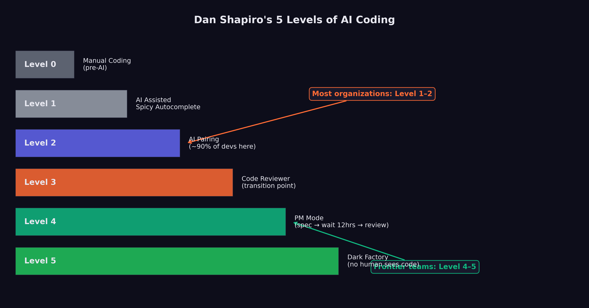
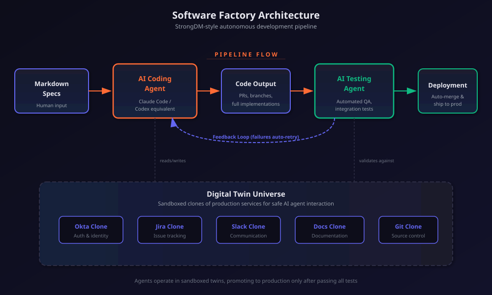

# The Software Factory {#sec-software-factory}

"Code must not be written by humans. Code must not be reviewed by humans."

The words appeared on factory.strongdm.ai, the public manifesto of a three-person team that had set out to answer a question the rest of the industry was still learning to ask: what does software development look like when humans no longer touch the code? [@strongdm2026_factory]

The statement was not a prediction. It was a policy. Justin McCarthy had spent two decades building software the old way. As CTO of Rafter, he'd processed over a billion dollars in transactions and scaled an engineering team from two founders to seventy-plus engineers across product, engineering, and data science. Before that, he'd co-invented the textbook rental model at BookRenter, riding the company through multiple years of triple-digit growth. He knew what a traditional engineering organization looked like at scale --- the sprint planning, the code reviews, the architecture committees, the slow accretion of process that kept large teams from collapsing into chaos. And in the fall of 2024, he watched a model cross a threshold that made him question all of it.

The threshold was the second revision of Claude 3.5 Sonnet in October 2024. McCarthy noticed what Simon Willison would later articulate: long-horizon agentic coding workflows had begun to compound correctness rather than error. Code produced in step fifteen of a twenty-step autonomous session was actually consistent with code from step three. The model wasn't just writing functions. It was maintaining architectural coherence across extended sequences of changes. That had never happened before.

On July 14, 2025, McCarthy, along with Jay Taylor and Navan Chauhan, founded the StrongDM software factory with a set of principles that most engineering organizations would consider heretical. No human writes code. No human reviews code. The test of the system is not whether the code looks correct to a human reader. The test is whether the system can prove that it works.

By the time Simon Willison --- one of the most respected voices in the software development community --- published his analysis of the StrongDM approach on February 7, 2026, he identified the no-human-review principle as "the most interesting of these, without a doubt" [@willison2026_softwarefactory]. And he posed the question that would come to define the next era of software engineering: "how can you prove that software you are producing works if both the implementation and the tests are being written for you by coding agents?" He called it "the most consequential question in software development right now" [@willison2026_softwarefactory].

This chapter examines the emerging architecture of what Dan Shapiro, CEO of Glowforge, called "the Dark Factory" --- Level 5 of a framework that maps the progression from AI as a typing assistant to AI as a fully autonomous software production system [@shapiro2026_fivelevels]. It traces the path from where most developers are today (Level 2, by Shapiro's reckoning) to where StrongDM claims to be operating (Level 5), and asks whether the gap between those levels is a matter of time or a matter of trust.

## The Five Levels

In January 2026, Dan Shapiro published "The Five Levels: from Spicy Autocomplete to the Dark Factory," a framework that gave the industry a shared vocabulary for describing the rapidly shifting relationship between human developers and AI coding tools [@shapiro2026_fivelevels]. The framework drew an explicit analogy to autonomous driving levels, mapping the progression from full human control to full machine autonomy.

**Level 0: Spicy Autocomplete.** "Level Zero is your parents' Volvo, maybe with an automatic transmission. Whether it's vi or Visual Studio, not a character hits the disk without your approval. You might use AI as a search engine on steroids or occasionally hit tab to accept a suggestion, but the code is unmistakably yours" [@shapiro2026_fivelevels]. At this level, AI is a convenience, not a collaborator. The developer writes the code, makes all architectural decisions, and uses AI only for occasional lookups or completions. The developer's mental model of the system is complete and unquestioned.

**Level 1: The Coding Intern.** "At Level 1, you've got lanekeeping and cruise control. You're writing the important stuff, but you offload specific, discrete tasks to your AI intern" [@shapiro2026_fivelevels]. The developer delegates bounded tasks --- writing a unit test, generating a boilerplate function, translating code between languages --- while maintaining full understanding and control of the overall system. The AI handles the tedious parts; the human handles the thinking.

**Level 2: The Junior Developer.** "At Level 2, you've got Autopilot on the highway. You've got a junior buddy to hand off all your boring stuff to. This is where 90% of 'AI-native' developers are living right now" [@shapiro2026_fivelevels]. This is the level at which AI begins to alter the developer's workflow in structural ways. Instead of writing code and having the AI help, the developer starts describing what they want and having the AI write it. The developer still reviews every output, still understands the codebase, and still makes all design decisions. But the act of typing code --- the physical craft of programming --- begins to shift from the human to the machine.

The observation that 90% of AI-native developers are at Level 2 is perhaps the most important number in Shapiro's framework. It means that for the vast majority of developers who consider themselves sophisticated AI users, the AI is still fundamentally an assistant. It has not changed the structure of their work. It has changed the speed.

**Level 3: The Developer (Human as Manager).** "Level 3 is a Waymo with a safety driver. You're not a senior developer anymore; that's your AI's job. You are... a manager. You are the human in the loop" [@shapiro2026_fivelevels]. At this level, the developer's role shifts from writing code to directing the AI that writes code. The developer specifies requirements, reviews outputs, and makes architectural decisions, but does not personally write implementation code. The AI is not an assistant; it is the developer. The human is the manager.

This is the level at which the cognitive demands of the work change qualitatively. A developer at Level 3 needs different skills than a developer at Level 2. They need the ability to specify requirements precisely, to evaluate AI-generated code for correctness and quality, and to maintain a mental model of a system they did not build line by line. Some developers find this transition natural; others find it deeply uncomfortable.

**Level 4: The Engineering Team.** "More of an engineering manager or product/program/project manager. You collaborate on specs and plans, the agents do the work" [@shapiro2026_fivelevels]. At Level 4, the human's role shifts further from technical evaluation to strategic direction. The human defines what should be built and why, negotiates priorities, and evaluates whether the delivered product meets business requirements. The technical work --- architecture, implementation, testing, deployment --- is handled by AI agents working in coordination.

**Level 5: The Dark Software Factory.** "Like a factory run by robots where the lights are out because robots don't need to see" [@shapiro2026_fivelevels]. At Level 5, "it's not really a car any more... your software process isn't really a software process any more. It's a black box that turns specs into software" [@shapiro2026_fivelevels].

@fig-five-levels maps the progression from full human control to full machine autonomy.

{#fig-five-levels}

Willison's characterization of Level 5 teams was stark: "Nobody reviews AI-produced code, ever. They don't even look at it." The organizing principle of Level 5 is that "the goal of the system is to prove that the system works" [@willison2026_softwarefactory]. The teams operating at this level consist of experienced developers, but their focus is not on the code itself. It is on system design, specification quality, and demonstrating that the AI-driven process produces correct results.

The gap between Level 2, where most developers live, and Level 5, where StrongDM claims to operate, is not merely a gap of tooling. It is a gap of philosophy. At Level 2, the developer is still the author. At Level 5, the developer is the architect of a process that produces software without human authorship. The difference is less like upgrading a car and more like replacing driving with teleportation.

## StrongDM: The Proof of Concept

The StrongDM software factory had become a working system, built by three people, that produced production software without human code authorship or review.

The team was small by design. Justin McCarthy, co-founder and CTO of StrongDM, had been thinking about AI-driven software development since before the current generation of models made it practical. When he founded the software factory on July 14, 2025, he brought Jay Taylor and Navan Chauhan --- a team of three, operating with principles that most engineering organizations of any size would consider reckless [@strongdm2026_factory].

Their investment in AI tooling was correspondingly aggressive. "If you haven't spent at least $1,000 on tokens today per human engineer, your software factory has room for improvement," the StrongDM manifesto stated [@strongdm2026_factory]. This was not a figure of speech. At $1,000 per engineer per day, the team was spending roughly $66,000 per month on AI tokens alone --- a sum that would have been inconceivable for a three-person team in any prior era of software development, but that StrongDM considered a bargain compared to the cost of additional human engineers.

The token spend doubled as a design principle. StrongDM's approach was predicated on the idea that AI computation was cheap relative to human attention, and getting cheaper by the month. Every hour a human engineer spent reading, reviewing, or debugging code was an hour not spent on specification, architecture, or strategy. At $1,000 per day per engineer, the AI handled roughly 200 to 300 model invocations --- enough to generate, test, revise, and deploy a complete feature without a human touching the keyboard. The math was straightforward: if a human engineer cost $200 per hour in fully loaded compensation, and the AI could do eight hours of implementation work for $1,000, the AI was already cheaper than a junior developer and faster than a senior one.

McCarthy's charter contained two rules that made most engineers flinch: "Code must not be written by humans" and "Code must not be reviewed by humans" [@strongdm2026_factory].
<!-- PROOF: url=https://factory.strongdm.ai/ | accessed=2026-02-14 | key=strongdm2026_factory -->

The key technical innovation was the Digital Twin Universe (DTU): "behavioral clones of the third-party services our software depends on" [@strongdm2026_factory]. StrongDM's product integrated with external services --- Okta for identity management, Jira for project tracking, Slack for communication, Google Docs and Drive and Sheets for document management. Testing against these live services was expensive, slow, and fragile. Rate limits, abuse detection, and API costs all constrained how aggressively the team could test.

The DTU eliminated these constraints. By creating behavioral clones of each external service --- clones that replicated the API behavior, error conditions, and edge cases of the real services --- the team could run "thousands of scenarios per hour without hitting rate limits, triggering abuse detection, or accumulating API costs" [@strongdm2026_factory]. The clones were not simple mocks. They were detailed behavioral models, designed to reproduce the quirks and failure modes of the real services with enough fidelity that code tested against the DTU would work correctly against the production services.

The DTU was the foundation that made the no-review policy viable. If you cannot read the code --- and StrongDM's principles said you must not --- then you need another way to establish confidence that it works. The DTU provided that confidence through exhaustive scenario-based testing, running the software through thousands of realistic usage patterns and verifying that it behaved correctly in each one.

::: {.callout-note}
## The Economics of the Software Factory

StrongDM's $1,000-per-day-per-engineer token budget inverts traditional software economics. A senior software engineer in the Bay Area costs $200,000--$400,000 per year in total compensation. At $1,000 per day ($260,000 per year), StrongDM's AI token spend per engineer roughly matches the cost of an additional human. But the AI does not need health insurance, does not take vacations, does not have context-switching costs, and can work around the clock. If the three-person team plus AI tokens produces the output of a fifteen-person team, the economics are compelling. If it produces the output of a thirty-person team, the economics are transformative.
:::

## The Attractor

At the center of StrongDM's software factory was Attractor: a non-interactive coding agent that composed models, prompts, and tools into a graph-structured pipeline [@strongdm2026_attractor]. Where most AI coding tools were designed as interactive assistants --- waiting for human input, responding to prompts, requiring approval at each step --- Attractor was designed to operate end-to-end once the work was fully specified.

The tool's architecture reflected the Level 5 philosophy. Pipeline authors defined multi-stage AI workflows as directed graphs using Graphviz DOT syntax, specifying the sequence of operations, the models and tools involved at each stage, and the data flowing between them. What emerged was a declarative specification of the software development process itself --- a meta-program that described how to produce programs.

Attractor was open-sourced on GitHub, and its repository revealed something that captured the Level 5 philosophy more vividly than any manifesto: it contained no code. None. Zero lines of executable software. The entire repository consisted of three markdown specification files [@strongdm2026_attractor]. The specifications served as the source of truth: feed them into your coding agent, and the agent would build its own implementation of the Attractor pipeline. The tool was, in other words, a specification that created its own implementation --- a practical demonstration of the Level 5 principle that specs become software.

## Scenario-Based Testing and the Verification Problem

The no-review policy raised a problem that Willison identified as existential: "how can you prove that software you are producing works if both the implementation and the tests are being written for you by coding agents?" [@willison2026_softwarefactory]

This is not a hypothetical concern. The entire edifice of software quality assurance rests on the assumption that the person writing the tests is independent of the person writing the code. When a human developer writes a function and a separate human tester writes the test, the independence between them provides a check: if the developer misunderstands the requirement, the tester will catch the discrepancy. If the developer makes a systematic error, the tester's different perspective will expose it.

When AI writes both the implementation and the tests, this independence vanishes. An AI system that misunderstands a requirement will misunderstand it consistently, producing implementation code and test code that agree with each other while both being wrong. The tests will pass. The system will appear correct. And the error will remain hidden until it manifests in production.

StrongDM's answer to this problem was built on three pillars.

**Scenario-based testing.** Instead of traditional unit and integration tests, StrongDM organized its quality assurance around "scenarios" --- end-to-end user stories that represented complete workflows. A scenario might describe a user logging into the system via Okta, creating a Jira ticket, sharing a document via Google Drive, and receiving a notification in Slack. The scenario was not a test in the traditional sense; it was a description of expected behavior, "often stored outside the codebase (similar to a 'holdout' set in model training)" [@strongdm2026_factory].

The holdout analogy was deliberate and revealing. In machine learning, a holdout set is data that the model never sees during training, used to evaluate whether the model has learned generalizable patterns or merely memorized its training data. By storing scenarios outside the codebase, StrongDM created a similar separation: the AI that produced the code never saw the scenarios used to evaluate it, reducing the risk that the tests and the implementation would share the same systematic errors.

**Probabilistic satisfaction.** StrongDM moved away from the boolean pass/fail model of traditional testing. Instead, they defined a metric called "satisfaction" --- "the fraction of observed trajectories likely satisfying user requirements" [@strongdm2026_factory]. A scenario was evaluated across multiple runs rather than given a binary pass/fail grade, with the fraction of successful trajectories providing a probabilistic measure of correctness.

This approach acknowledged a reality that traditional testing often obscures: software correctness is not binary in practice. A function that works correctly 999 times out of 1,000 is more useful than a function that fails deterministically on its first call, even though both would "fail" a traditional test. By measuring satisfaction probabilistically, StrongDM could make fine-grained assessments of software quality that better reflected real-world performance.

**The Digital Twin Universe.** The DTU, described above, provided the environment in which scenarios were executed. By running scenarios against behavioral clones of external services, the team could test at a scale and speed that would be impossible against production services. Thousands of scenario executions per hour generated enough data to make the probabilistic satisfaction metric statistically meaningful.

## The Architecture of Trust

The deeper question beneath Willison's formulation is not technical but philosophical: how do you trust code that no human has read?

Traditional software engineering is built on a foundation of human comprehension. Code review exists not only to catch bugs but to ensure that at least two humans understand every line of production code. Documentation exists to make code comprehensible to future humans. Architecture decisions are discussed in design reviews so that the reasoning behind them is preserved in human memory and institutional knowledge.

The software factory model abandons all of this. No human reads the code. No human reviews the architecture. No human documents the reasoning. The system produces software, and the software either satisfies its scenarios or it does not.

StrongDM's answer is that trust should be empirical rather than interpretive. You trust the code not because you have read it and judged it correct, but because you have tested it exhaustively and observed it behaving correctly across thousands of scenarios. This is the same epistemological shift that occurred in machine learning itself: we trust a neural network not because we understand its internal representations, but because it performs correctly on held-out test data.

The analogy is imperfect. A neural network's internal representations are genuinely opaque --- no human could read the millions of parameters and understand what the network has learned. Source code, by contrast, is designed to be human-readable. The choice not to read it is a policy decision, not a technical necessity. StrongDM argues that the policy is justified by efficiency: reading code takes time, human review catches only a fraction of bugs, and automated testing can cover more scenarios more reliably than any human reviewer.

@fig-software-factory-arch illustrates the architecture of this trust-based system --- from specification through automated verification.

{#fig-software-factory-arch}

Critics counter that human review serves functions beyond bug-catching. It builds institutional knowledge. It trains junior developers. It creates a shared understanding of the system that enables effective debugging when things go wrong in ways that no scenario anticipated. A system that no human understands is a system that no human can fix when it breaks in novel ways.

This debate is not yet resolved, and it may not be resolvable in the abstract. The answer may depend on the specific domain, the specific failure modes, and the specific cost of getting it wrong. A software factory producing internal tooling for a three-person team has a very different risk profile than one producing medical device firmware or financial trading systems.

## The Catalyst: October 2024

The software factory was not built on the models of November 2025. Its foundations were laid earlier, in a moment that Willison and the StrongDM team both identified as the critical inflection: the second revision of Claude 3.5 Sonnet in October 2024.

Before that revision, Willison observed, "long-horizon agentic coding workflows began to compound correctness rather than error" [@willison2026_softwarefactory]. This is a precise technical observation with profound practical implications. In a coding workflow where each step builds on the previous one, errors compound. If the model makes a mistake in step 3 of a 20-step task, every subsequent step is built on a flawed foundation. Before October 2024, this compounding error made long autonomous coding sessions impractical. The model might get the first few steps right, but by step 10 or 15, the accumulated errors had overwhelmed the output.

The October 2024 revision changed this dynamic. The model became better at maintaining consistency across long sequences of actions, catching its own errors before they propagated, and using earlier correct steps as reliable context for later ones. By December 2024, Willison noted, "the model's long-horizon coding performance was unmistakable via Cursor's YOLO mode" --- a feature that allowed the AI to make code changes without requesting human approval at each step [@willison2026_softwarefactory].

This was the enabling technology that made the software factory conceivable. If models compound errors over long sequences, autonomous software production is impossible. If models compound correctness, it becomes practical. The October 2024 revision was the inflection point between these two regimes, and the November 2025 models (as examined in @sec-november-revolution) dramatically extended the range over which correctness compounded.

## Who Is Actually at Level 5?

The honest answer: very few teams.

StrongDM is the most public and most documented example of a team operating at Level 5. Their willingness to publish their principles, open-source their specifications, and invite scrutiny from analysts like Willison makes them the case study that the rest of the industry points to. But they are a three-person team building a specific category of software (security infrastructure tooling) with a specific risk profile. Generalizing from their experience to the broader industry requires caution.

Shapiro's observation that 90% of AI-native developers are at Level 2 suggests that the gap between the frontier and the mainstream remains enormous. Most developers who consider themselves AI-savvy are still writing code, still reviewing every AI output, and still maintaining a personal understanding of their codebase. They are using AI to go faster, not to restructure the fundamental relationship between human and code.

The teams operating at Level 3 and Level 4 --- the levels where the human shifts from developer to manager --- are more numerous but harder to count, because they rarely publicize their practices. Some of the compounding teams described in @sec-compounding-teams are operating at these levels, building internal frameworks around AI models and treating the AI as the developer rather than the assistant. But the transition from Level 2 to Level 3 requires something beyond better tools: trust, organizational culture, and individual psychology.

::: {.callout-important}
## The Level 5 Caveat

Level 5 requires what most organizations lack: a thorough scenario-based testing framework, behavioral clones of all external dependencies, a probabilistic quality metric, and --- perhaps most importantly --- a team of experienced developers who are confident enough in their system design skills to never look at the code their system produces. Level 5 is not a destination that any team can reach simply by upgrading their AI tools. It requires a ground-up rethinking of how software quality is defined and measured.
:::

## The Shifting Definition of "Developer"

The five-level framework illuminates a question that the industry has been circling for months: what does it mean to be a software developer in an era when AI writes the code?

At Level 0 through Level 2, the answer is familiar. A developer writes code, understands systems, and uses AI to accelerate the mechanical aspects of the work. The core identity --- the part that answers "what do you do?" at a dinner party --- is unchanged.

At Level 3 and above, the answer becomes genuinely uncertain. A person who specifies requirements, evaluates AI-generated outputs, and manages AI agents is doing important, skilled work. But is that person a "developer"? Or are they a product manager, a systems architect, a quality engineer? The distinction is not merely semantic. It affects hiring criteria, compensation structures, educational curricula, and professional identity.

Daniela Amodei, co-founder of Anthropic, gestured toward this shift in her February 2026 comments about hiring priorities. As she described in the interview examined in @sec-voices-of-warning, Anthropic now hired primarily for communication, emotional intelligence, and curiosity rather than raw technical skill --- and she argued that humanities education would become more important, not less, in an AI-driven world [@damodei2026_generalists].

This is not what a technology company's co-founder would have said five years ago. The shift from hiring for technical skills to hiring for communication, emotional intelligence, and broad intellectual curiosity reflects a recognition that the nature of the work is changing. When AI writes the code, the scarce human contributions are judgment, taste, empathy, and the ability to understand what users actually need --- qualities that the humanities cultivate more directly than a computer science curriculum.

The software factory model takes this logic to its extreme. In a Level 5 organization, there is no code to write and no code to review. The human contributions are specification (saying precisely what should be built), system design (creating the architectural framework within which the AI operates), and validation (confirming that the output meets requirements). These are cognitive and communicative tasks, not technical ones in the traditional sense.

## When the Factory Breaks {#sec-factory-breaks}

Before we celebrate the software factory, we should ask what happens when it fails.

Francesco Bonacci, an engineer, captured one failure mode in a post that went viral on X in February 2026. He called it "vibe coding paralysis" --- the strange condition where infinite productivity breaks your brain. "Five worktrees, three half-built features," he wrote. "The more capability you have, the more you feel compelled to use it" [@bonacci2026_vibeparalysis]. Bonacci described a cycle: start a project with AI, get 80% done in an hour, hit an edge case the model can't handle, context-switch to another project, repeat. The result wasn't five finished products. It was five half-finished products and a growing sense of paralysis.
<!-- PROOF: url=https://x.com/francedot/status/2017858253439345092 | accessed=2026-02-14 | key=bonacci2026_vibeparalysis -->

The technical debt concern is more structural. When no human reads the code, no human understands it. This is fine when everything works. It becomes catastrophic when something breaks and the debugging requires understanding not just what the code does but why it was written that way. Traditional software engineering accumulated institutional knowledge --- in comments, in code review discussions, in the mental models that developers built over months of working with a codebase. The software factory throws all of that away.

There's also the verification paradox. If AI writes the code and AI writes the tests, you've created a system that checks its own homework. StrongDM's holdout scenarios address this partially, but the fundamental problem remains: the quality of the verification is bounded by the quality of the specifications, and specifications --- the human contribution --- are notoriously incomplete.

Here's what would prove the software factory model wrong: if, by end of 2027, organizations that adopted full Level 4-5 automation experience a measurable increase in production incidents, security vulnerabilities, or customer-facing bugs compared to teams that maintained human review. If the verification problem proves unsolvable without human oversight, the dark factory becomes a liability, not an advantage.

::: {.callout-note title="Practitioner's Tool: Factory Scorecard" icon=false}

For a practitioner deciding where on Shapiro's five levels to position their team, the tradeoffs look like this:

| Level | Speed | Cost | Quality Risk | Best For |
|-------|-------|------|-------------|----------|
| 0 (No AI) | Baseline | Baseline | Low | Regulated/safety-critical |
| 1 (Autocomplete) | +20-30% | Same | Very low | Any team, any domain |
| 2 (Agentic) | +2-5x | -30-50% | Low-medium | Most teams, most domains |
| 3 (Delegative) | +5-10x | -60-80% | Medium | Startups, internal tools |
| 4 (Autonomous) | +10-50x | -90%+ | Medium-high | Prototypes, MVPs |
| 5 (Dark Factory) | Undefined | Near-zero marginal | Unknown | Experimental only |

The so-what: most teams in early 2026 should target Level 2, with selective use of Level 3 for well-specified, low-stakes work. Level 4 and above remain experimental. The speed gains are real, but the verification gap isn't solved. The teams that'll win aren't the ones that move fastest to Level 5 --- they're the ones that find the right level for their domain's risk tolerance.
:::

## The Consequential Question

Willison's question --- how do you prove that software works when both the implementation and the tests are AI-generated? --- does not yet have a definitive answer. StrongDM's approach of scenario-based testing with holdout sets and probabilistic satisfaction is the most developed response, but it remains unproven at scale and in high-stakes domains.

The question is consequential because it sits at the intersection of two powerful forces. On one side, the economic incentive to adopt AI-driven software development is overwhelming. The cost savings, speed improvements, and competitive advantages are too large to ignore, particularly for startups and small teams that cannot afford large engineering organizations. On the other side, the reliability requirements of many software domains --- healthcare, finance, transportation, infrastructure --- are non-negotiable. A software factory that produces code no human has reviewed might be acceptable for internal tooling. It is not acceptable for the software controlling a nuclear power plant.

The gap was visible in the tools themselves. As of February 2026, no major IDE or development environment offered a "Level 5 mode" --- a configuration that assumed no human would ever read the code. Every tool, from VS Code to JetBrains to Cursor, was designed around the premise that a human developer would interact with the code at some point: syntax highlighting existed to make code readable to humans, error messages were written in human language, debugging tools displayed call stacks that assumed a human was interpreting them. The software factory required a fundamentally different toolchain --- one designed for AI-to-AI communication rather than AI-to-human communication --- and that toolchain barely existed outside of StrongDM's custom setup and a few experimental projects.

This was a chicken-and-egg problem. The toolchain wouldn't be built until enough teams wanted Level 5 capability. And teams wouldn't move to Level 5 until the toolchain existed to support it. StrongDM had solved this by building their own tools --- Attractor, the DTU, the scenario-based testing framework --- but that investment was itself a barrier to entry. The three-person team had spent months building the meta-tools before they could start building the actual product. For teams without that luxury of time and expertise, Level 5 remained aspirational.

The resolution of this tension will likely determine the pace and scope of AI adoption in software development over the coming years. If scenario-based testing and probabilistic quality metrics prove reliable enough for high-stakes domains, the shift to Level 4 and Level 5 development will accelerate rapidly. If they do not --- if the verification problem proves intractable without human review --- then the adoption curve will plateau at Level 2 or Level 3, and the software factory will remain a niche approach for specific categories of work.

Either way, the question itself has been posed. The old model --- human writes code, human reviews code, human maintains code --- is no longer the only model. The software factory exists. It works, at least for its creators. And the rest of the industry is watching to see whether the principles that StrongDM articulated in July 2025 will become the standard practices of 2027.

There's a historical parallel worth considering. In the 1950s, when the first high-level programming languages appeared, many engineers argued that no serious work could be done without writing assembly code directly. The machine needed a human who understood it at the lowest level. Compilers, they said, would produce inefficient code, miss edge cases, and create systems that no one could debug when they inevitably broke. They were right about all of those things --- for about five years. Then compilers got better. The engineers who clung to assembly found themselves maintaining systems that nobody else wanted to touch, while the engineers who embraced higher-level languages built the software that ran the world.

The software factory was asking whether AI-generated code was to human-written code what human-written code was to assembly: a higher level of abstraction that initially produced inferior results but eventually became the only practical way to build at scale. The analogy was imperfect --- AI code generation was a bigger conceptual leap than compilers --- but the pattern of resistance was familiar. Every abstraction in the history of computing had been met with the same objection: you can't trust what you don't understand. And every abstraction had eventually won, not because the objection was wrong, but because the productivity gain was too large to resist.

The lights are out. The robots are working. And Simon Willison's question hangs in the air, unanswered.

The question matters because it's not just about software. Every field that relies on professional judgment --- law, medicine, accounting, engineering --- will eventually face its own version of Willison's question. How do you trust a legal brief no human has reviewed? How do you trust a medical diagnosis no doctor has checked? How do you trust a structural engineering calculation no engineer has verified? The software factory is the canary in the coal mine for a much broader shift in the relationship between human expertise and machine capability. If StrongDM's approach works --- if scenario-based verification proves sufficient to guarantee quality without human review --- then the same approach will eventually be applied everywhere. If it fails --- if the verification gap proves unbridgeable --- then the lesson will extend far beyond software, establishing that certain categories of work require human judgment regardless of machine capability.

But the software factory is a single team's story. What happens when an entire organization --- not three engineers, but hundreds --- restructures around AI? When the compounding starts not at the code level but at the team level? That's a different kind of transformation, and the people who've seen it call it something specific: compounding teams.
