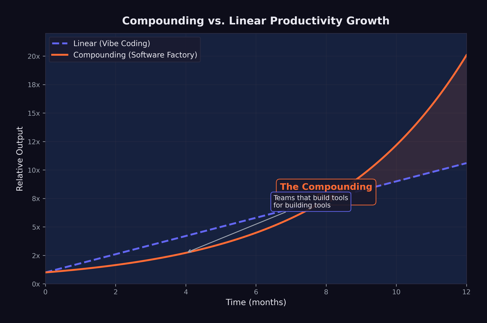
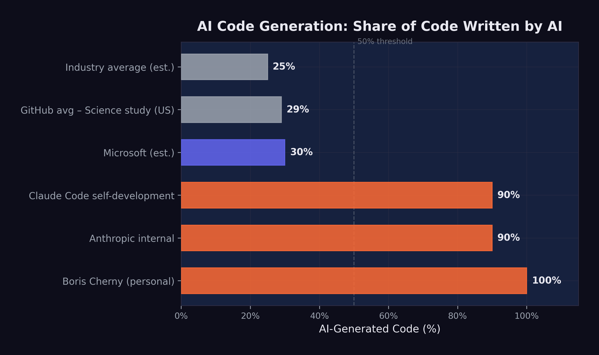

# The Compounding Teams {#sec-compounding-teams}

On September 28, 2025, Sam Schillace woke up, opened his laptop, and wrote something that would make senior engineering managers across Microsoft either nod in recognition or break into a cold sweat. Schillace --- the Deputy CTO of Microsoft, the creator of Google Docs, a person who'd been building software tools for thirty years --- described a pattern he'd observed twice in a single week inside the company. He published it on his Substack newsletter under a title that didn't hedge: "I Have Seen the Compounding Teams" [@schillace2025_compounding].
<!-- PROOF: url=https://sundaylettersfromsam.substack.com/p/i-have-seen-the-compounding-teams | accessed=2026-02-14 | key=schillace2025_compounding -->

Every software team at Microsoft had access to the same AI tools. The difference lay in how teams related to them. Linear teams used AI as a faster way to do the same work. Compounding teams had restructured the work itself around AI capabilities. Linear teams got a boost. Compounding teams got a transformation.

Schillace had observed this pattern twice in a single week, and he suspected many more teams were independently discovering the same approach. He was right. By January 2026, the compounding pattern was visible across the industry --- from Anthropic to OpenAI, from Y Combinator startups to Fortune 500 enterprises. And the gap between compounding teams and linear teams was widening at a rate that alarmed anyone paying attention.

## Linear vs. Compounding

The difference between linear and compounding productivity with AI tools can be illustrated with a simple analogy.

A linear team takes an existing workflow --- write code, review code, test code, deploy code --- and inserts AI into each step. The developer still writes the code, but faster, because the AI suggests completions. The reviewer still reviews the code, but faster, because the AI highlights potential issues. The tester still writes tests, but faster, because the AI generates test cases. Each step is accelerated, but the structure of the work is unchanged. The result is a linear improvement: perhaps 30--50% faster at each step, compounding to maybe a 2x overall speedup.

As Schillace observed in a later post: "The teams that are compounding aren't writing code at all" [@schillace2025_compounding].
<!-- PROOF: url=https://sundaylettersfromsam.substack.com/p/i-have-seen-the-compounding-teams | accessed=2026-02-14 | key=schillace2025_compounding -->

A compounding team redesigns the workflow itself. Instead of writing code and having AI help, they describe what they want and have AI produce it. Instead of reviewing AI-generated code line by line, they verify it through automated testing and scenario execution. Instead of deploying through a human-managed pipeline, they build AI-managed deployment systems that handle rollback, monitoring, and incident response. Each step is not just faster --- it is structurally different, and each structural change enables further structural changes downstream.

The compounding effect comes from the interaction between these changes. When you no longer need to write code, you can spend more time on specification and architecture. Better specifications produce better AI-generated code, which requires less review. Less review time frees more time for specification improvement. The cycle feeds on itself, each improvement amplifying the next.

This is the same dynamic that makes compound interest powerful: the returns from one period become the base for the next period's returns. The difference between linear and compounding growth is small in the first few iterations and enormous over time.

## The Amplifier Framework

Schillace described the technical architecture of the compounding teams he had observed. These teams had built systems with plumbing similar to Claude Code or Codex --- callback hooks, tool calling, and flow control --- but with a key difference: they had given the AI system extensive access to its own development infrastructure [@schillace2025_compounding].

The systems had access to the filesystem, git, markdown documentation, Kubernetes deployment infrastructure, and XML configuration. They were not just writing code. They were managing projects: reading requirements, planning implementations, writing code, running tests, fixing failures, committing changes, deploying updates, monitoring results, and iterating on all of the above.

The teams had also made their AI systems more proactive. Rather than waiting for human instructions at each step, the systems operated with strategies, opinions, and autonomous decision-making about how to approach problems. They were not passive tools. They were active collaborators that could assess a situation, propose a course of action, and execute it.

Schillace described these teams as having "built a framework around a model" --- what he called the Amplifier framework approach. The framework was not a single tool or a single prompt. It was an entire development environment designed from the ground up to be operated by AI, with human involvement limited to strategic direction and quality oversight [@schillace2025_compounding].

The most striking observation was that these compounding teams "aren't writing code at all" [@schillace2025_compounding]. They had shipping products, active users, and revenue. They had not directly touched code in multiple months. Their role was entirely one of direction, specification, and evaluation. The AI did everything else.

## "Code Review Is a Firing Offense"

Schillace relayed an anecdote from one of the compounding teams that captured the cultural shift in a single phrase: the team jokingly considered a code review a "firing offense" because it meant you were getting in the way of the tool [@schillace2025_compounding].

The provocation was deliberate. Code review is one of the most deeply ingrained practices in modern software engineering. It serves multiple functions: catching bugs, maintaining code quality standards, sharing knowledge across the team, and building collective ownership of the codebase. To declare it a "firing offense" was to reject not just a practice but an entire philosophy of software development --- one built on the premise that human comprehension of code is essential.

The logic behind the provocation was not nihilistic. The team's argument was that human code review introduces a bottleneck that negates the speed advantage of AI-generated code. If an AI system can produce a complete feature in twenty minutes, and a human code review takes two hours, then the review process has eliminated 86% of the productivity gain. Worse, the review process introduces its own failure modes: reviewers tire, they miss subtle bugs while catching trivial style issues, and they inject their own opinions about implementation choices that may not be better than the AI's.

The team's alternative was automated verification: thorough test suites, scenario-based testing, and continuous deployment with automated rollback. If the code passed all the tests, it shipped. If it failed, the AI fixed it and tried again. No human needed to read a single line.

This approach is closely aligned with the Level 5 software factory model described in @sec-software-factory, and it carries the same risks. A test suite can only catch the bugs it was designed to catch. A scenario can only test the situations that were anticipated. Novel failure modes --- the kind that emerge from unexpected interactions between components, or from misunderstandings of user intent that no test case captured --- require the kind of contextual reasoning that human code review, at its best, provides.

But the compounding teams' bet was that the scale of automated testing --- thousands of scenarios, running continuously --- would catch more issues than any human reviewer, more quickly and more reliably. And by February 2026, the results from these teams were hard to argue with.

The deeper argument was statistical. A human code reviewer examines code for perhaps thirty minutes before fatigue sets in. They catch certain categories of bugs reliably --- off-by-one errors, null pointer dereferences, obvious security vulnerabilities --- but miss others entirely. Automated testing, running continuously across thousands of scenarios, wasn't infallible either. But it was tireless, consistent, and scalable in ways human attention never could be. The compounding teams' bet was that a thousand hours of automated testing per day caught more bugs than thirty minutes of human review --- and the early evidence suggested they were right.

::: {.callout-note}
## The September Signal

Schillace published his essay on September 28, 2025 --- two months before the November revolution described in @sec-november-revolution. The compounding teams he observed were working with pre-November models: GPT-5, Claude Opus 4, and their contemporaries. The November models were better, but the compounding pattern predated them. This suggests that the compounding effect is not primarily a function of model capability. It is a function of organizational design. Better models accelerate compounding teams, but the compounding itself comes from how teams structure their relationship with the tools.
:::

## Boris Cherny: 22 PRs Per Day

If Schillace described the compounding pattern from the outside, Boris Cherny demonstrated it from the inside.

As documented in @sec-voices-of-warning, Cherny --- the head of Claude Code at Anthropic --- had disclosed in late January 2026 that he had been shipping 100% AI-written code for more than two months, producing over twenty pull requests per day without making a single manual edit [@cherny2026_aicode].

Twenty-plus pull requests per day is not a human-scale output. A productive senior engineer at a large technology company might ship one to three pull requests per day. Cherny was shipping an order of magnitude more, and he was doing it without personally writing a single line of code.

The emotional dimension was as revealing as the quantitative one. As Cherny described (@sec-voices-of-warning), the shift felt less like a loss of craft than a liberation from tedium --- engineers freed to focus on the creative and strategic dimensions of their work [@cherny2026_aicode].

This is a data point that productivity metrics alone cannot capture. Cherny was not describing a situation where the same work was being done faster. He was describing a qualitative shift in the nature of the work --- from implementation (tedious, mechanical, constrained by typing speed and syntax memory) to direction (creative, strategic, limited only by the quality of one's ideas). The AI had not merely accelerated his workflow. It had transformed it into something he found more enjoyable.

The question of whether Cherny's experience is representative or exceptional is important. As the head of Claude Code, he had access to the most advanced versions of Anthropic's models before they were publicly available. He understood the tool's capabilities and limitations more intimately than any other user. His workflow was optimized for AI-driven development in ways that most engineers' workflows are not. But the trajectory he described --- from using AI as an assistant to using AI as the sole author of code --- was one that other engineers were beginning to follow, albeit at different speeds.

## The 100% Club

Cherny was not alone. A loose but growing cohort of prominent engineers had begun publicly disclosing that they had moved to 100% AI-generated code.

Roon, the pseudonymous OpenAI researcher whose blunt dismissal of traditional programming was documented in @sec-voices-of-warning, had reached the same conclusion from across the competitive divide: he too had moved to fully AI-generated code [@cherny2026_aicode].

Roon's framing was deliberately provocative, but it pointed to something genuine: for many software engineers, the act of writing code was never the goal. The goal was building systems, solving problems, and creating tools. Code was the medium, not the message. If a better medium existed --- one that allowed you to specify intent and have the implementation produced automatically --- then the rational response was to adopt it, not to cling to the old medium out of nostalgia or professional identity.

Mike Krieger, Anthropic's Chief Product Officer and co-founder of Instagram, made the recursion explicit at the Cisco AI Summit on February 3, 2026. As he testified (@sec-voices-of-warning), the vast majority of Anthropic's production code was now AI-generated, with human engineers repositioned as architects of the trust scaffolding rather than authors of the code itself [@krieger2026_claudewritesclaude].

The implications deserve unpacking. Krieger's statement does not mean that the AI model has autonomously redesigned its own architecture or initiated its own training runs (that territory belongs to GPT-5.3-Codex's recursive self-improvement, discussed in @sec-recursive-loop). It means that the software infrastructure around the Claude model --- the APIs, the interfaces, the deployment systems, the evaluation frameworks --- is being written by Claude itself, under human direction. The model is not improving itself in a philosophical sense. It is building the tools and systems that deliver itself to users.

Company-wide at Anthropic, the numbers were 70--90% AI-generated code [@cherny2026_aicode]. Standard operating procedure at one of the world's leading AI companies --- not a pilot, not an experiment. For comparison, Microsoft had reported approximately 30% AI-generated code in April 2025, and a GitHub study had found roughly 29% of U.S. Python functions were AI-written as of early 2025 [@cherny2026_aicode]. The gap between Anthropic's 70--90% and the industry's 29--30% was enormous, and it suggested that the compounding pattern --- once a team crossed a threshold of AI adoption, adoption accelerated --- was operating at the organizational level as well as the individual one.

## Vibe Coding Paralysis

The compounding pattern was not without its pathologies.

In February 2026, Francesco Bonacci --- founder of Cua and a Y Combinator X25 participant --- coined the term "Vibe Coding Paralysis" to describe a syndrome he had observed in himself and other developers working at high levels of AI-assisted coding: "the syndrome of wanting to do so much --- and being able to do so much --- that you end up finishing nothing" [@bonacci2026_vibeparalysis].

The description was vivid and recognizable. Bonacci painted a picture of a developer who, empowered by AI tools that could implement any feature in minutes, begins branching into multiple directions simultaneously: "an hour later, you have five worktrees, three half-implemented features running in parallel, and you can't remember what the original task was" [@bonacci2026_vibeparalysis].

The paradox was structural. "The more capability you have, the more you feel compelled to use it. The more you use it, the more fragmented your attention becomes. The more fragmented your attention, the less you actually ship" [@bonacci2026_vibeparalysis]. The AI had eliminated the implementation bottleneck, but in doing so it had exposed a deeper bottleneck: human attention and decision-making.

When implementation was expensive --- when writing a feature took days or weeks of focused coding --- the cost itself provided discipline. You could not pursue five ideas simultaneously because you could not implement five ideas simultaneously. The constraint was frustrating but also structuring. It forced prioritization.

When implementation became cheap --- when an AI could produce a working version of any feature in minutes --- the discipline evaporated. Every idea seemed worth pursuing, because the cost of pursuing it was negligible. But the cost of evaluating, integrating, and maintaining the resulting code was not negligible, and neither was the cognitive cost of tracking five parallel development paths.

Bonacci identified a related phenomenon he called "the Confidence Spiral." "When Claude Code writes most of the code, a question starts nagging: Do I actually understand what's happening here?" [@bonacci2026_vibeparalysis]. Prompting, he observed, becomes "a crutch, then a habit, then an addiction" [@bonacci2026_vibeparalysis]. The developer's relationship with the AI shifts from collaboration to dependence, and with dependence comes a creeping uncertainty about whether the developer could function without it.

::: {.callout-warning}
## The Capability Paradox

Vibe Coding Paralysis reveals a counterintuitive truth about productivity tools: removing a bottleneck does not always increase throughput. When the bottleneck is implementation and the limiting resource is human attention, removing the implementation bottleneck simply shifts the constraint to attention --- which may be harder to scale than implementation was. The teams that avoid this paralysis are those that have developed explicit processes for managing attention: limiting work-in-progress, maintaining clear prioritization systems, and deliberately choosing not to pursue ideas that are possible but not important.
:::

## The Bottleneck Shift

Bonacci's syndrome pointed to a broader pattern that Schillace had identified in his original essay: the bottleneck in software development was shifting from production to coherence.

For decades, the fundamental constraint on software development had been the speed at which code could be produced. Requirements could be gathered quickly. Designs could be sketched on whiteboards. But turning those designs into working code took time --- hours, days, weeks of focused implementation work. Every methodology in software engineering, from waterfall to agile to extreme programming, was fundamentally an approach to managing this production bottleneck.

AI tools were eliminating this bottleneck. When a model could produce working code from a natural-language specification in minutes, the production constraint vanished. But the other constraints --- understanding user needs, maintaining architectural coherence, ensuring security and reliability, coordinating across teams --- remained. And they became the new binding constraints on development speed.

Schillace captured this shift: "Productivity was never the real bottleneck. The bottleneck was always coherence" [@schillace2025_compounding]. The teams that were overwhelmed --- the ones experiencing vibe coding paralysis or drowning in AI-generated features that did not fit together --- were the ones that had focused on removing the production bottleneck without addressing the coherence bottleneck.

Compounding teams had recognized this early. Their frameworks and processes were not primarily about producing more code. They were about maintaining coherence at scale: ensuring that the specifications were consistent, the architecture was sound, the test coverage was thorough, and the deployment pipeline was reliable. The AI handled production. The humans handled coherence.

Here was a genuine reconceptualization of what it meant to build software. In the old model, the human's primary contribution was implementation skill --- the ability to translate a design into working code. In the new model, it was judgment --- the ability to determine what should be built, how it should fit together, and whether it met the needs it was designed to serve.

As @fig-compounding-linear illustrates, the divergence between these two approaches grows exponentially over time.

{#fig-compounding-linear}

## The Experience Paradox

The shift from production to coherence had a counterintuitive implication for who benefited most from AI tools.

In January 2026, a study published in Science --- one of the most rigorous analyses of AI coding adoption to date --- examined over 30 million GitHub commits by approximately 160,000 developers to measure the adoption and impact of generative AI on software development [@daniotti2026_aicoding].

The headline finding was that approximately 29% of Python functions on GitHub in the United States were AI-generated, up from 5% in 2022, with an estimated $23--38 billion in annual economic value for U.S. programming tasks. These were significant numbers, but the more revealing finding was about who benefited.

Less experienced programmers used AI in 37% of their code, compared to 27% for experienced developers [@daniotti2026_aicoding]. On the surface, this looked like a democratization story: newer developers were adopting AI tools more aggressively and producing more code as a result.

But the productivity data told a different story. Experienced developers who adopted AI tools saw a 6.2% increase in their commit rates --- a statistically significant and economically meaningful improvement. Inexperienced developers who used AI tools saw no statistically significant productivity increase at all [@daniotti2026_aicoding].

@fig-ai-code-pct shows the range of AI code generation across organizations and individuals.

{#fig-ai-code-pct}

The data told a clear story: AI amplified existing skill rather than substituting for it. An experienced developer who understood software architecture, design patterns, debugging strategies, and testing methodologies could use AI tools to execute those skills faster. The AI handled the implementation; the human provided the judgment. Output went up.

An inexperienced developer who lacked those skills could also use AI to produce code, but the code was not as well-designed, not as well-tested, and not as well-integrated into the broader system. The AI could write functions, but it could not provide the architectural judgment that makes those functions part of a coherent system. Without that judgment, the additional output did not translate into additional productivity.

This finding had profound implications for the labor market dynamics explored in @sec-human-cost. If AI tools primarily benefited experienced developers, then the "augmentation vs. replacement" debate was more complex than either side acknowledged. AI was augmenting experienced developers and potentially replacing inexperienced ones --- widening the skill premium rather than eliminating it.

In the researchers' characterization, the technology was widening rather than narrowing skill-based disparities in the profession [@daniotti2026_aicoding]. Entry-level developers who hoped that AI tools would help them close the gap with senior engineers were finding the opposite: the gap was growing, because AI gave senior engineers a force multiplier that junior engineers could not effectively wield.

## The Team-of-Five Phenomenon

By early 2026, a pattern had emerged in Y Combinator's latest batch that would have been unthinkable two years earlier: startups with three to five people were shipping products that previously required teams of thirty.

The economics told the story. A five-person team with $15,000 per month in AI token spend --- Schillace's $1,000-per-engineer-per-day guideline --- could produce more features, more quickly, than a fifty-person team using traditional development methods. The five-person team didn't need project managers to coordinate work across sub-teams, because there were no sub-teams. It didn't need code reviewers, because automated testing verified correctness. It didn't need junior developers, because the AI handled implementation. The entire organizational overhead that large teams required --- the standups, the sprint planning, the cross-team dependencies, the merge conflicts --- simply didn't exist.

StrongDM's $1,000-per-day-per-engineer token budget, described in @sec-software-factory, was the extreme version of this approach. But even at more modest AI spending levels --- $200 to $500 per developer per day --- small teams were discovering that the cost of AI tokens was dwarfed by the savings in human coordination overhead. Every person removed from a team eliminated not just their salary but the communication complexity of their interactions with every other team member. In a team of fifty, there are 1,225 possible communication channels. In a team of five, there are ten. The reduction in coordination cost was quadratic, not linear.

The venture capitalists noticed. By February 2026, the median team size at funding for Y Combinator companies had dropped from eight to four. Seed-stage investors were actively suspicious of startups with large engineering teams, viewing headcount as a signal of inefficiency rather than ambition. "If you need twenty engineers to build your MVP," one prominent VC told a founder at a YC demo day, "you don't understand the tools."

## The Organizational Divergence

By February 2026, the cumulative effect of these dynamics was a growing divergence between organizations that had adopted the compounding pattern and those that had not.

Compounding organizations had restructured their teams around AI capabilities. They had fewer engineers, but those engineers were more senior, more focused on architecture and specification, and dramatically more productive in terms of features shipped per person. Their cost structures were different --- higher AI token spend, lower salary costs --- and their competitive position was strengthening as the gap between their output and their competitors' widened.

Linear organizations were still treating AI as a productivity tool, achieving real but modest improvements in developer speed. Their team structures, management hierarchies, and development processes were largely unchanged. They were doing the same work faster, but they were not doing different work.

The implications for hiring were already visible. Dario Amodei's prediction at Davos that AI would replace most software engineers' work within six to twelve months was extreme but directional [@amodei2026_davos]. The more accurate formulation might be: AI would replace most of the work that linear teams were doing, while enabling compounding teams to do work that was previously impossible for teams of their size.

This divergence was not yet widely understood outside the technology industry. The public narrative --- driven by articles about 100% AI-generated code and predictions about mass unemployment --- tended toward binary framing: either AI would replace developers or it would not. The reality was more complex. AI was not replacing "developers" as a category. It was replacing a specific mode of development work --- implementation --- while dramatically increasing the value of another mode --- judgment, specification, and architectural coherence.

The teams and organizations that understood this distinction were the ones that were compounding. The ones that did not were the ones that were either panicking about replacement or dismissing the threat entirely. Both reactions were wrong, and the compounding teams were quietly widening the gap while the debate raged.

## The New Scarce Resource

The pattern that emerges from Schillace's observations, Cherny's productivity data, Bonacci's paralysis syndrome, and the Science study's experience paradox is consistent: the scarce resource in AI-augmented software development is not implementation capacity. It is human judgment.

Judgment is the ability to determine what should be built. It is the ability to evaluate whether a piece of software meets its actual purpose, not just its stated requirements. It is the ability to maintain architectural coherence across a system that is growing faster than any individual can comprehend. It is the ability to prioritize among dozens of possible features, each of which could be implemented in minutes, based on a deep understanding of user needs and business strategy.

These are skills that cannot be automated, at least not with current AI technology. They require contextual understanding, empathy with users, strategic thinking, and the kind of accumulated experience that the Science study found was the key predictor of productivity gains from AI tools.

The compounding teams had recognized this before most of the industry. Their frameworks, their processes, and their hiring decisions were all oriented around the premise that judgment was the bottleneck and that everything else --- implementation, testing, deployment, monitoring --- could be delegated to AI. Teams of five or ten people were producing the output of teams of fifty or a hundred --- not because they were working harder, but because they were working on the right things and letting the AI handle the rest.

Daniela Amodei's call for hiring generalists --- emphasizing communication, emotional intelligence, and humanities backgrounds over raw technical skill, as described in @sec-voices-of-warning --- was the human resources expression of this same insight [@damodei2026_generalists]. In a world where AI handles implementation, the human skills that matter are the skills that implementation used to obscure: the ability to understand people, to communicate clearly, to make careful judgments about competing priorities, and to maintain a vision of what the system should be even as it grows beyond any individual's ability to comprehend its code.

This was, in a real sense, the most radical claim in the entire AI debate. Not that AI would replace programmers --- that was dramatic but conceptually simple. The radical claim was that AI was revealing programming to have been, all along, a bottleneck masquerading as a skill. The thing that had limited software for decades wasn't a shortage of good ideas or clear thinking. It was the sheer difficulty of translating ideas into machine-executable form. Remove that bottleneck, and the constraint shifted to the quality of the ideas themselves --- a domain where technical training was necessary but not sufficient, and where the humanities' emphasis on critical thinking, communication, and ethical reasoning became directly applicable.

The compounding teams were the first to discover this. They'd stumbled onto a truth that management theorists had been circling for decades: the most valuable work in knowledge organizations is not production. It's coordination, prioritization, and the maintenance of shared understanding. AI didn't invent this insight. It revealed it, by making production so cheap that everything else became visible by contrast. The manager who'd always been told that her "soft skills" were secondary to her team's technical output discovered that, in the AI era, those soft skills were the only human contribution that couldn't be automated.

By February 2026, the rest of the industry was beginning to learn it. AI changing how software was built had become a settled fact. What remained open was how quickly organizations could make the transition from linear to compounding --- from using AI as a faster tool to restructuring their work around AI as a fundamentally different kind of collaborator.

The answer, as the divergence between compounding and linear teams was already demonstrating, was: not fast enough for everyone.

The gap had a temporal dimension that made it particularly unforgiving. Every month a linear team remained linear, the compounding teams pulled further ahead. This wasn't a gap that could be closed by working harder or hiring better people. It was a structural divergence --- like the difference between a savings account earning simple interest and one earning compound interest. In the first year, the difference was modest. By year three, the compound account was pulling away. By year five, the simple-interest account was irrelevant.

February 2026 was roughly year one. The compounding teams were visibly outperforming their linear counterparts, but the gap was still small enough that many organizations could convince themselves it wasn't real, or wasn't applicable to their domain, or would be closed by the next generation of AI tools without requiring any organizational change. Those rationalizations would become increasingly difficult to maintain. The tools would keep improving. But the tools weren't the bottleneck. The bottleneck was the willingness to redesign the work.

## The Compounding Illusion {#sec-compounding-illusion}

There's a selection bias problem in the compounding narrative, and it's worth naming directly.

We hear about the teams that compound successfully --- Anthropic's 90% AI-written codebase, the Y Combinator founders shipping with three engineers, StrongDM's dark factory. We don't hear about the teams that tried to compound and failed. The startup that delegated too much to AI and shipped a product with subtle but catastrophic security flaws. The enterprise team that removed human code review and discovered, six weeks later, that their codebase had accumulated architectural debt no one understood. The manager who restructured around AI agents and found that the agents were subtly optimizing for the wrong objective because the specifications were incomplete.

Survivorship bias is the oldest trick in the business literature, and it applies here. The compounding teams that Schillace observed were the ones that worked. By definition, the ones that didn't work aren't in his essay.

There's also the question of institutional knowledge. When you move from a team of fifty engineers who each understand part of the system to a team of five who direct AI agents, you've concentrated decision-making but also concentrated risk. If three of those five leave, the organization may have no one who understands the specifications well enough to direct the agents. The codebase exists, the tests pass, but the judgment layer --- the thing that makes the system coherent --- walks out the door.

The falsification conditions: if by end of 2027, compounding teams show higher turnover-related project failures than linear teams, the model was trading short-term speed for long-term fragility. If the average time-to-recovery after an outage is longer for compounding teams than linear ones, the concentration of knowledge is a bug, not a feature.

::: {.callout-note title="Practitioner's Tool: Compounding Assessment Tool" icon=false}

For a team leader evaluating readiness to compound:

| Factor | Ready to Compound | Not Yet |
|--------|-------------------|---------|
| Team seniority | 70%+ senior/staff | Majority junior |
| Specification quality | Written, testable specs | Verbal/informal |
| Domain risk | Low-moderate (internal tools, MVPs) | High (healthcare, finance, safety) |
| AI literacy | Team has 3+ months daily AI use | New to AI coding tools |
| Architecture clarity | Well-documented, modular | Legacy monolith |
| Hiring pipeline | Can recruit for judgment/communication | Still hiring for implementation |

The honest assessment: most teams in February 2026 weren't ready to compound. They were ready for Level 2 or 3 on Shapiro's framework --- genuine productivity gains, meaningful cost savings, but not the 10x transformation that the compounding narrative promised. The teams that were compounding were exceptional not because they had better AI tools, but because they had better human judgment at the top of the stack.
:::

There was a cruel irony in the assessment tool's implications. The teams best positioned to compound were those with the most experienced engineers --- the people who understood systems deeply enough to specify what they wanted without writing the code themselves. But those same experienced engineers were the ones who found the transition most psychologically difficult. They'd spent decades building a professional identity around craftsmanship: the ability to write elegant, efficient, well-structured code. The compounding model asked them to stop doing the thing they were best at and start doing something they'd never been trained for: managing AI systems, writing specifications, and evaluating outputs they hadn't produced.

Some made the transition with grace. The best senior engineers discovered that their accumulated judgment --- the ability to spot a bad architectural decision, to predict where a system would break under load, to recognize when a requirement was ambiguous --- was more valuable than ever. It just expressed itself differently: not in lines of code but in the quality of the prompts, the thoroughness of the test scenarios, and the precision of the specifications they wrote for their AI collaborators.

Others couldn't make the shift. They'd look at AI-generated code and feel an irresistible urge to rewrite it --- not because it was wrong, but because it wasn't how they would have written it. The compounding teams that succeeded were the ones that learned to suppress that urge, to evaluate code on whether it worked rather than whether it matched their aesthetic preferences. The ones that failed were the ones where senior engineers kept reaching for the keyboard.

The gap between compounding and linear teams was real and growing. But the money flowing into AI infrastructure --- the hundreds of billions being bet on the premise that this transformation would sweep the entire economy --- was a separate question. And the scale of that bet was, by February 2026, unlike anything the technology industry had ever seen.
