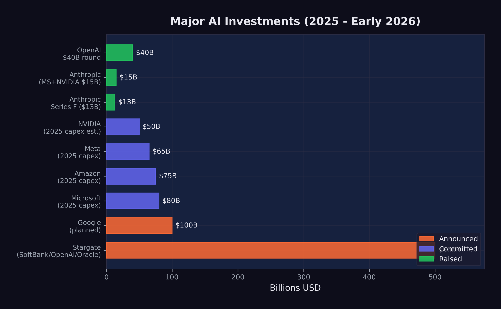

# The Investment Tsunami {#sec-investment-tsunami}

On January 21, 2025, Sam Altman and Masayoshi Son stood beside President Donald Trump at a White House podium and announced the Stargate Project --- a $500 billion AI infrastructure initiative that would build a network of data centers across the United States [@openai2025_stargate]. The number was so large that even within the AI industry, it prompted disbelief. Five hundred billion dollars. For data centers. In a single initiative.
<!-- PROOF: url=https://openai.com/index/announcing-the-stargate-project/ | accessed=2026-02-14 | key=openai2025_stargate -->

It was just the beginning. In 2025 alone, over $700 billion was committed to AI infrastructure and development --- more than the GDP of Switzerland, more than the annual defense budget of every NATO country except the United States, more than the combined market capitalization of most industries. By February 2026, the cumulative capital directed toward AI had reached a scale that defied easy comparison. What looked like an investment cycle turned out to be a geological event: a tsunami of money reshaping the terrain of technology, energy, real estate, and labor markets simultaneously.

To understand the magnitude, consider this: the entire venture capital industry deployed roughly $170 billion globally in 2023. The AI sector alone attracted multiples of that figure in a single year. Nobody doubted that AI was attracting capital. What remained unclear was whether the capital being deployed bore any relationship to the value being created --- or whether the world was witnessing the largest speculative bubble in the history of technology.

The answer, as of February 2026, was genuinely unclear. And that uncertainty was itself a defining feature of the moment.

## The Funding Rounds

The private funding rounds of 2024 and 2025 rewrote every record in venture capital history. The amounts involved were so large that they resembled sovereign wealth transactions more than traditional startup fundraising.

**OpenAI** set the pace. In late 2024, the company closed a $40 billion funding round at a $300 billion post-money valuation, making it the most valuable private company in history [@openai2024_funding]. The round included contributions from Microsoft, SoftBank, and a constellation of sovereign wealth funds and institutional investors. To put the valuation in perspective: $300 billion exceeded the market capitalization of Intel, IBM, and Adobe combined. OpenAI's revenue, while growing rapidly, was a fraction of what those mature businesses generated. The valuation was not a reflection of current economics. It was a bet on a future in which OpenAI's models would be embedded in virtually every information workflow on the planet.

**Anthropic** followed a trajectory that was, if anything, even more remarkable for a company barely three years old. The fundraising cadence accelerated through 2025 with the relentlessness of a model training run.

In March 2025, Anthropic raised $3.5 billion led by Lightspeed Venture Partners at a $61.5 billion valuation [@cnbc2025_anthropic_3b]. This was a substantial round by any standard, but it was merely the opening act. The company had previously raised nearly $9 billion, and the appetite for more was growing, not shrinking [@cnbc2025_anthropic_3b].

In September 2025, Anthropic closed its Series F: $13 billion at a $183 billion post-money valuation [@anthropic2025_seriesf]. The round was notable as much for a disclosure that accompanied it as for its size --- Anthropic's annualized revenue run rate had exceeded $5 billion. This was real money, not vaporware. The company was selling API access to Claude at a scale that placed it among the fastest-growing enterprise software businesses in history.

But the fundraising did not stop there. In November 2025, Microsoft committed up to $5 billion and NVIDIA committed up to $10 billion, pushing Anthropic's valuation to approximately $350 billion [@cnbc2025_anthropic_msnv]. In less than eight months, Anthropic had gone from a $61.5 billion valuation to $350 billion --- a nearly six-fold increase. No technology company had ever appreciated that quickly outside of a public market frenzy.

**Google** added fuel to the fire with an additional $1 billion investment in Anthropic in January 2025, bringing its total investment in the company to approximately $3 billion [@cnbc2025_anthropic_google]. The strategic logic was transparent: Google was simultaneously building its own frontier models (Gemini) and hedging its bets by maintaining a significant stake in its primary competitor. It was the corporate equivalent of betting on every horse in the race. If Anthropic's Claude eclipsed Gemini, Google would profit from its equity stake. If Gemini prevailed, the Anthropic investment was a modest insurance cost against a scenario that did not materialize. Either way, Google won.

The speed of these funding rounds was itself a signal. Traditional venture capital operates on timescales of months --- due diligence, term sheet negotiation, legal review. The AI funding rounds of 2025 were closing in weeks. Investors who hesitated found themselves shut out. The fear of missing the most transformative technology of the century was a more powerful motivator than the fear of overpaying.

The investor psychology deserved scrutiny. In private conversations at technology conferences, limited partners --- the pension funds, endowments, and sovereign wealth funds that provide capital to venture firms --- described a dynamic that was less about analysis and more about peer pressure. The California pension fund that didn't have AI exposure looked negligent to its board. The endowment that passed on an Anthropic allocation watched its peer group post outsized returns. The rational response to genuine uncertainty was diversified exposure. The actual response, in practice, was concentration: pouring more capital into the same handful of companies that every other institutional investor was also backing, creating a self-reinforcing cycle that looked increasingly like a consensus trade.

The cumulative picture was striking. Anthropic alone had raised over $40 billion in private funding by early 2026. OpenAI had raised a similar amount. These two companies, neither of which was publicly traded, had absorbed more capital than the entire biotechnology industry raised annually.

::: {.callout-note}
## The Valuation Context

To appreciate the scale: Anthropic's $350 billion valuation in November 2025 made it more valuable than 490 of the S&P 500 companies. It was worth more than Goldman Sachs, more than Caterpillar, more than most sovereign wealth funds' entire portfolios. And it was still a private company with fewer than 2,000 employees.
:::

## The Infrastructure Buildout

Jensen Huang made the case for the spending at Davos in January 2026: "Trillions of dollars of AI infrastructure needs to be built" [@huang2026_davos].
<!-- PROOF: url=https://finance.yahoo.com/news/nvidia-ceo-jensen-huang-trillions-of-dollars-of-ai-infrastructure-needs-to-be-built-144212721.html | accessed=2026-02-14 | key=huang2026_davos -->

If the private funding rounds were unprecedented, the infrastructure commitments were in a category of their own. The major technology companies were not just investing in AI research. They were building the physical infrastructure to deploy AI at planetary scale.

**The Stargate Project** was the most dramatic announcement. In January 2025, OpenAI unveiled a $500 billion AI infrastructure initiative backed by SoftBank, Oracle, and the UAE's MGX investment fund [@openai2025_stargate]. The project called for the construction of massive data centers across the United States, beginning in Texas, specifically designed for AI training and inference workloads. The $500 billion figure was a multi-year commitment, not a single expenditure, but even its first-year allocation dwarfed anything the technology industry had previously attempted. President Trump endorsed the project at a White House event, framing it as a matter of national competitiveness --- a signal that AI infrastructure had become industrial policy by another name.

**Microsoft** committed $80 billion to AI-capable data center construction in fiscal year 2025 alone, a figure that CEO Satya Nadella described as necessary to meet demand for Azure AI services. The company's capital expenditure had nearly doubled from the prior year, driven almost entirely by AI.

**Meta** announced $65 billion in AI infrastructure spending for 2025, a dramatic escalation from the $37 billion it had spent the prior year. Mark Zuckerberg framed the investment as essential to Meta's vision of AI-powered products across its family of applications, from content recommendation to the metaverse.

**Amazon** committed $75 billion, focused on expanding AWS capacity for AI workloads and supporting its investment in Anthropic. Amazon's approach was characteristically infrastructure-first: rather than building its own frontier models, it was building the cloud platform on which everyone else's models would run.

**Google** planned over $100 billion in AI-related capital expenditure across 2025 and 2026, spanning custom TPU chip development, data center construction, and the infrastructure for Gemini model training and deployment.

The total committed infrastructure spending across these five companies alone exceeded $820 billion. Add in spending from Oracle, NVIDIA, xAI, and dozens of smaller players, and the aggregate figure approached $1 trillion in committed or planned AI infrastructure investment.

The numbers were so large that even industry veterans struggled to contextualize them. A trillion dollars in committed AI infrastructure spending was more than the entire U.S. defense budget. It was more than the GDP of Switzerland, Norway, and Ireland combined. It was roughly equivalent to the total market capitalization of the entire global airline industry --- an industry that employed millions of people and moved billions of passengers.

To comprehend what this money was buying, consider the physical reality. Each new data center required hundreds of acres of land, access to high-voltage power lines, water cooling systems, and proximity to fiber optic trunk lines. The energy demands were staggering: a single frontier model training run could consume as much electricity as a small city over the course of months. The data center buildout amounted to a construction boom rivaling the interstate highway system, measured in concrete, copper, and kilowatt-hours.

## NVIDIA's Position

At the center of the infrastructure buildout sat a single company: NVIDIA. Every data center needed GPUs. Every training run needed chips. Every inference request needed hardware. And NVIDIA supplied the vast majority of it.

By January 2026, NVIDIA was forecasting $65 billion in quarterly revenue --- a number that would have been unimaginable for a semiconductor company just three years earlier [@nvidia2026_forecast]. The company's Blackwell and Rubin chip architectures had $500 billion in visible pipeline demand. Jensen Huang, NVIDIA's CEO, described the demand as "insatiable" at the World Economic Forum, a characterization that, for once, did not seem like corporate hyperbole [@huang2025].

NVIDIA's position was extraordinary by any measure. The company had evolved from a beneficiary of the AI boom into its central bottleneck --- the chokepoint through which nearly all AI spending had to pass. Every dollar committed by Microsoft, Meta, Amazon, Google, and OpenAI to AI infrastructure ultimately translated, in part, into a purchase order for NVIDIA chips. The company's market capitalization reflected this reality: by early 2026, NVIDIA was competing with Apple and Microsoft for the title of the world's most valuable company.

But NVIDIA's dominance also made it uniquely vulnerable to a single event.

On January 20, 2025, DeepSeek released DeepSeek-R1, an open-source reasoning model that matched the performance of OpenAI's o1 on multiple benchmarks [@deepseek2025_r1]. The model was trained for approximately $6 million --- a fraction of the cost of Western frontier models. It was released under an MIT license, making it freely available to anyone. And within days, it became the number-one app on the iOS App Store.

The market's reaction was immediate and historic. On January 27, 2025 --- the Monday after DeepSeek-R1's release --- NVIDIA's stock dropped 16.9%, erasing $589 billion in market capitalization in a single trading session. It was the largest single-day loss for any company in stock market history [@cnbc2025_nvidia_crash]. The carnage wasn't confined to NVIDIA. Broadcom fell over 17%. Micron dropped nearly 12%. AMD lost more than 6%. The Nasdaq 100 sank 3%, and the S&P 500 fell 1.5%. In the span of six hours, the market had repriced the entire AI hardware thesis.
<!-- PROOF: url=https://www.cnbc.com/2025/01/27/nvidia-sheds-almost-600-billion-in-market-cap-biggest-drop-ever.html | accessed=2026-02-13 | key=cnbc2025_nvidia_crash -->

The market's reasoning collapsed to a single question: if frontier-competitive models could be built for $6 million, then why did AI demand ever-increasing hardware investment? NVIDIA's revenue forecasts, traders concluded, were built on sand.

## The DeepSeek Paradox

The DeepSeek shock raised a question that, by February 2026, still had no definitive answer: if frontier models can be built for $6 million, why are companies spending hundreds of billions?

The question contained a paradox. DeepSeek-V3, the 671-billion-parameter mixture-of-experts model that preceded R1, was trained for approximately $6 million in compute costs [@deepseek2024_v3]. This figure was widely cited but also widely misunderstood. Critics offered two important caveats.

First, the $6 million figure likely understated the true cost. It captured the compute expense of the final training run but not the research and development costs that preceded it --- the failed experiments, the architectural explorations, the salary costs of the researchers who designed the system. DeepSeek, backed by the Chinese quantitative trading firm High-Flyer, had access to substantial resources that did not appear in the training cost figure. The $6 million was the cost of executing a recipe, not the cost of inventing it.

Second, and more fundamentally, training costs and deployment costs are different things. Building a frontier model is expensive. Running it at scale --- serving millions of users with low latency --- is far more expensive. The infrastructure buildout by Microsoft, Google, Amazon, and Meta was driven primarily by inference demand, not training demand. Even if every future model could be trained for $6 million, the data centers would still be needed to serve those models to billions of users.

This distinction was critical and often lost in the public debate. The AI infrastructure boom was not primarily about building smarter models. It was about deploying existing models at scale. A model that could resolve 79% of software engineering tasks, as documented in @sec-benchmark-revolution, was only as valuable as its availability. If a million developers wanted to use it simultaneously, the infrastructure to support that demand required exactly the kind of capital expenditure that the major technology companies were committing.

DeepSeek's efficiency achievement was real and significant. It demonstrated that the algorithmic innovations coming out of Chinese AI research could dramatically reduce training costs, and it challenged the assumption that only the deepest-pocketed Western labs could produce frontier models. But it did not invalidate the infrastructure thesis. If anything, it strengthened it: cheaper models meant broader adoption, broader adoption meant more inference demand, and more inference demand meant more data centers, more chips, and more power.

The paradox resolved into a more detailed picture. DeepSeek proved that training was becoming more efficient. The major technology companies were betting that deployment was becoming more ubiquitous. Both could be true simultaneously.

## Is This a Bubble?

The dot-com comparison was unavoidable. In 1999 and 2000, hundreds of billions of dollars flowed into internet companies on the promise that the web would transform every industry. That promise was correct --- the internet did transform every industry --- but the timing was wrong, the business models were premature, and many of the individual companies that attracted the most capital failed entirely. The aggregate thesis was right. The specific bets were often catastrophically wrong.

The AI investment cycle of 2024--2026 bore surface similarities to the dot-com era. Valuations were stratospheric relative to revenue. Companies were raising capital at a pace that assumed near-perfect execution over decades. Infrastructure was being built for a future that had not yet fully materialized. Investors were driven as much by fear of missing out as by rigorous analysis. These were the classic markers of speculative excess.

But there were important differences.

**Real revenue.** Anthropic's $5 billion run rate was actual money, already flowing from real customers for real services [@anthropic2025_seriesf]. OpenAI's revenue was even larger. Google and Microsoft were generating billions in additional cloud revenue directly attributable to AI services. The dot-com era was characterized by companies with minimal revenue and no clear path to profitability. The AI era, by contrast, featured companies with massive revenue and rapidly improving unit economics.

**Real capabilities.** The technology worked. AI models were resolving 79% of real-world software engineering tasks. They were writing production code at major corporations. They were accelerating scientific research. The dot-com era included companies like Pets.com, whose core product --- shipping fifty-pound bags of dog food --- was economically incoherent. No such fundamental incoherence characterized the leading AI companies. The products they sold did what their customers needed.

**Real deployment.** AI was already in production. GitHub Copilot had millions of active users. ChatGPT had hundreds of millions. Claude was embedded in enterprise workflows across thousands of companies. The infrastructure being built was serving existing demand, not speculative future demand.

These differences mattered. They did not eliminate the possibility of a correction --- some valuations were clearly pricing in decades of growth with minimal risk --- but they made the comparison to the dot-com bubble imprecise. A more apt comparison might be the railroad buildout of the nineteenth century. The railroads were real, the demand was real, the transformation was real, and the aggregate investment was justified. But many individual railroad companies failed, and the buildout was characterized by booms and busts even as the underlying technology proved transformative.

@fig-ai-investment-ch11 summarizes the major capital commitments across the industry.

{#fig-ai-investment-ch11}

The valuations, however, contained assumptions that deserved scrutiny. Anthropic at $350 billion implied a future in which the company captured a significant fraction of all AI-generated economic value. OpenAI at $300 billion implied something similar. Both could not be right to the same degree --- the market was, in effect, pricing in multiple simultaneous winners in a competition that might produce only one or two dominant players. Google, Microsoft, and Meta were also building frontier models with massive budgets. The total implied value across all AI companies exceeded the total addressable market by any reasonable estimate, which was a classic indicator of speculative excess.

AI would almost certainly justify hundreds of billions in investment, over time. What nobody could answer was whether it would justify this much investment this quickly --- and whether the specific companies receiving the capital would be the ones that captured the value. History suggested that even in transformative technology cycles, the investors who deployed capital earliest and most aggressively were often not the ones who earned the best returns.

The venture capitalist Marc Andreessen had a line that captured the investor's dilemma: "Software is eating the world." In 2025, the update was obvious: AI was eating software. But the history of technology investing suggested a subtler lesson: the companies that ultimately captured the value from AI might not yet exist. Google didn't exist when the internet was being built. Facebook didn't exist when social networking was beginning. The trillion-dollar AI infrastructure being constructed in 2025 and 2026 would be used by companies that hadn't been founded yet, for applications that hadn't been imagined yet, serving markets that didn't exist yet. The investors who understood this paradox --- that the best AI investment might be in a company that no one could currently invest in --- were the ones who kept their powder dry even as the rest of the market stampeded.

## Where the Money Goes

The abstract figures --- $500 billion for Stargate, $80 billion for Microsoft, $65 billion for Meta --- became concrete when traced to their physical destinations.

**Data centers** consumed the largest share. A hyperscale AI data center cost between $10 billion and $25 billion to build, depending on size and location. It required 18 to 36 months of construction time, hundreds of specialized workers, and supply chains for servers, networking equipment, cooling systems, and electrical infrastructure. By early 2026, there were more than 50 major AI data center projects under construction or in advanced planning across the United States, with additional facilities planned in Europe, the Middle East, and Southeast Asia.

**Chips** were the second largest category, and the supply chain behind them was a story of concentration that should have alarmed anyone thinking about systemic risk. NVIDIA's data center revenue alone was approaching $260 billion annually, and custom chip programs at Google (TPUs), Amazon (Trainium and Inferentia), and Microsoft (Maia) added tens of billions more. The semiconductor supply chain --- from TSMC's fabrication plants in Taiwan to advanced packaging facilities in Japan and the United States --- was running at maximum capacity, with lead times for frontier AI chips stretching to 12 months or more.

**Energy** was the fastest-growing cost category and the one that most directly connected the AI boom to the physical world. A single large AI data center consumed 100 to 300 megawatts of power --- enough to supply a city of 100,000 people. The aggregate power demand from planned AI data centers exceeded the total generating capacity of many small countries. Technology companies were signing long-term power purchase agreements, investing in nuclear energy projects, and in some cases purchasing entire power plants. Microsoft restarted the Three Mile Island nuclear facility. Amazon acquired a data center campus adjacent to a nuclear plant in Pennsylvania. Google signed the first corporate agreement for small modular nuclear reactors. The AI boom was, among other things, an energy boom --- one that complicated climate commitments and strained electrical grids.

**Talent** was the final major cost category, and the one most directly felt by humans. AI researcher compensation had reached extraordinary levels by 2025. Senior machine learning researchers at frontier labs commanded total compensation packages of $1 million to $5 million annually. Even mid-level engineers with relevant experience could command $500,000 or more. The talent market was so competitive that companies regularly paid signing bonuses exceeding $1 million, offered equity grants that assumed continued hypergrowth, and engaged in aggressive recruitment tactics that bordered on corporate espionage. As explored in @sec-human-cost, the paradox was stark: AI was simultaneously the most lucrative field for the workers building it and the greatest threat to workers in every other field.

## The Nuclear Bet

The energy demands of AI infrastructure were forcing technology companies into a business they'd never anticipated: power generation.

The scale was staggering. A single hyperscale AI data center consumed 100 to 300 megawatts of continuous power. The planned buildout would add over 10 gigawatts of demand to the U.S. grid by 2028 --- the equivalent of ten large nuclear power plants. But the grid wasn't growing fast enough to meet it. Natural gas plants took three to five years to build. Solar and wind farms required vast acreage and couldn't guarantee the 24/7 baseload power that data centers demanded.

So the technology companies went nuclear. In September 2024, Microsoft signed a twenty-year power purchase agreement to restart Unit 1 of the Three Mile Island nuclear plant in Pennsylvania --- the same facility whose Unit 2 had suffered a partial meltdown in 1979. The deal was worth an estimated $16 billion in revenue to Constellation Energy, and it signaled that the AI industry's appetite for clean, reliable power had overcome the stigma that had hung over nuclear energy for decades. Amazon acquired a data center campus adjacent to the Susquehanna nuclear plant, also in Pennsylvania, securing direct access to 960 megawatts of nuclear generation capacity. Google signed the first corporate agreement for small modular nuclear reactors, betting on a technology that didn't yet exist at commercial scale but that promised faster deployment and lower capital costs than traditional nuclear plants.

The irony was inescapable. The most advanced technology in human history was driving a revival of an energy source that the environmental movement had spent forty years trying to kill. AI companies that marketed themselves as agents of progress were buying electricity from reactors designed in the 1970s. The future, it turned out, ran on the past.

The environmental implications were uncomfortable. Every major technology company had committed to carbon neutrality or carbon negativity. Microsoft pledged to be carbon negative by 2030. Google committed to running on carbon-free energy 24/7 by the same date. But their AI infrastructure commitments were pulling in the opposite direction. A single large training run could consume as much electricity as 10,000 American households use in a year. The aggregate energy demand from planned AI data centers threatened to delay national climate goals by years. In Virginia --- the largest data center market in the world --- the local utility, Dominion Energy, was projecting that data center power demand would grow by 85% over five years, requiring the construction of new natural gas plants that directly contradicted the state's clean energy commitments.

The technology companies' answer was nuclear. But nuclear power plants take ten to fifteen years to build. Small modular reactors, the theoretical shortcut, had not yet produced a single commercial watt of electricity. The gap between AI's energy needs and clean energy's delivery timeline was the infrastructure version of the confirmation gap: the demand was here, the supply was not, and the interval between them would be filled by fossil fuels.

## The February Correction

On February 4, 2026, global software stocks plunged. The selloff, which had been building for weeks, accelerated sharply as investors processed the implications of Claude Opus 4.6 and GPT-5.3-Codex, both released the following day [@cnbc2026_softwarecrash]. By February 6, the combined losses across global equity markets exceeded $1 trillion [@fortune2026_selloff].

The proximate trigger was a Goldman Sachs research note, circulated the previous Friday, that modeled the impact of AI coding agents on the revenue of traditional software companies. The note estimated that AI-driven automation could reduce demand for enterprise software licenses by 15-30% over three years, as companies shifted from buying tools for human workers to deploying AI agents that didn't need tools. The note named names: Salesforce, ServiceNow, Atlassian, Workday, SAP. By Monday morning, the selling was underway.

But the nature of the selloff revealed something important: the crash hammered non-AI software stocks while AI companies held steady or gained.

The companies that suffered the worst losses were traditional enterprise software firms --- the SaaS companies that sold subscription software to businesses for functions like customer relationship management, human resources, project management, and data analytics. The market logic was straightforward: if AI could automate the tasks that these software tools facilitated, then the demand for the tools themselves would decline. Why pay $300 per seat per month for a project management tool when an AI agent could manage projects directly?

AI infrastructure companies, by contrast, held their ground or even gained. NVIDIA, despite the DeepSeek shock weeks earlier, recovered as investors concluded that inference demand would only grow. Cloud providers with significant AI revenue --- Microsoft Azure, Amazon Web Services, Google Cloud --- were buoyed by the same logic that sank traditional software: the shift from human-operated tools to AI-operated infrastructure favored the companies selling the infrastructure.

The February correction was not the market rejecting technology. It was the market repricing which technology mattered. Money did not leave the sector. It moved within it --- flowing from companies that sold software to humans toward companies that sold infrastructure to AI. The trillion-dollar selloff was not a judgment about whether AI worked. It was a judgment about what AI made obsolete.

This repricing had profound implications. It signaled that the market had internalized the capability gains documented in @sec-benchmark-revolution and was now translating them into sector-level economic forecasts. The SWE-bench scores, the METR time horizons, the recursive improvement loop --- data points that had been confined to technical discussions for months --- were now driving the allocation of trillions of dollars in global capital.

## The Question That Remains

By February 2026, more than $1 trillion had been committed to AI infrastructure and development. The capital was flowing. The chips were shipping. The data centers were rising from empty fields in Texas, Virginia, and Iowa. The models were getting better at a pace that made five-year forecasts look like exercises in fiction.

The money would be spent --- was already being spent. What remained uncertain was whether the returns would justify the investment, and on what timeline.

History offered an ambiguous guide. The railroad boom of the 1860s and 1870s justified its aggregate investment many times over, but it bankrupted the majority of the individual companies that participated. The internet boom of the 1990s and 2000s created trillions in value, but most of it accrued to companies --- Amazon, Google, Facebook --- that barely existed when the initial capital was deployed, not to the companies that received the earliest and largest investments.

The AI investment tsunami of 2024--2026 would likely follow a similar pattern. The aggregate bet --- that AI would transform every industry and create trillions in value --- was almost certainly correct. The specific bets --- that these particular companies, at these particular valuations, would capture that value --- were far less certain.

But the money was already in motion. Over $700 billion committed in a single year. Data centers consuming more electricity than small nations. A single chipmaker approaching $300 billion in annual revenue. Valuations that assumed not just success, but the kind of total industry transformation that happens once or twice in a century.

Either the investors were right, and the world was about to change more profoundly than at any point since the industrial revolution. Or the investors were wrong, and the hangover would be proportional to the party.

By February 2026, the evidence was piling up on the side of transformation. But the evidence for transformation and the evidence for prudent investment are not the same thing. The technology could be revolutionary and the investments could still be overpriced. That was the dot-com lesson. That was the railroad lesson. And it was the question that hung over the AI investment tsunami like a cloud that no one could quite see through.

The railroad analogy bears extending, because it captures something the dot-com comparison misses. The railroad boom wasn't just a financial event. It was a physical transformation --- iron rails laid across continents, stations built in towns that hadn't existed a decade earlier, time zones standardized because trains required synchronized schedules. The AI infrastructure boom was similarly physical: concrete poured for data centers in rural Texas, fiber optic cables laid across oceans, power plants restarted or constructed to feed computational demand that didn't exist five years earlier. The financial abstractions --- the valuations, the funding rounds, the stock prices --- sat atop a layer of physical reality that would persist regardless of what happened to any individual company's share price.

That physical reality was the strongest argument against the bubble thesis. Pets.com left nothing behind when it failed. The railroad companies left railroads. The AI infrastructure boom, whatever else happened, was leaving behind a global network of computational capacity that would serve the economy for decades. The infrastructure would be useful --- that much was beyond dispute. Whether the companies that built it would capture the value it created was another matter entirely.

::: {.callout-note title="Practitioner's Tool: Bubble Scorecard" icon=false}

Is it a bubble? The question demands specific metrics, not hand-waving.

| Indicator | Bubble Signal | Current Status (Feb 2026) |
|-----------|--------------|---------------------------|
| Revenue-to-investment ratio | <10% annual | ~15-20% (improving) |
| Company profitability | <10% of funded cos. profitable | ~15% (OpenAI, Anthropic growing) |
| Infrastructure utilization | Data centers <50% utilized | 85%+ (GPU shortage persists) |
| Customer retention | AI tool churn >30% annually | Unknown (too early) |
| Market concentration | Top 3 capture >80% of value | NVIDIA + cloud big 3 dominate |
| Alternative technology | Viable non-AI substitute emerges | None visible |

The honest answer: by the metrics that mattered in February 2026, this wasn't a bubble yet. GPU utilization was near capacity. Revenue was growing triple-digits at the leading companies. The infrastructure being built would be useful even if AI progress slowed, because inference demand was real and growing.

But "not a bubble yet" isn't the same as "not a bubble." The dot-com infrastructure --- fiber optic cables, data centers, internet exchanges --- was genuinely useful even after the crash. The problem wasn't the infrastructure. It was the valuations. Cisco's cables carried traffic for decades. Cisco's stock still hasn't recovered its 2000 peak.

Here's the falsification test: if by mid-2027, AI-generated revenue across the industry does not exceed $200 billion annually (roughly 25-30% of the $700B+ invested), the investment thesis was premature. If NVIDIA's data center revenue declines for two consecutive quarters before that date, the demand was peaking, not compounding. If either condition is met, the investment community was repeating the dot-com pattern: correctly identifying a transformative technology and massively overpaying for early exposure to it.
:::

The tsunami was here. What it would leave behind when the water receded --- that was the wager. But the money wasn't just reshaping industries. It was reshaping the balance of power between nations --- a story that plays out not in Silicon Valley board rooms, but in Taiwanese chip fabs, European regulatory offices, and Chinese research labs.

For the workers building the data centers, installing the chips, and writing the deployment code, the investment tsunami was tangible and immediate. For the investors writing the checks, it was a bet on a future that was arriving faster than anyone had modeled. And for the rest of the world --- the billions of people who would be affected by the technology these investments produced --- the tsunami was something they could feel approaching but could not yet see clearly.

By the time it arrived, it would be too late to prepare. That was the nature of tsunamis. And that was the nature of the capital flows reshaping the global economy in February 2026.

One number captured it all: in the twelve months ending February 2026, the technology industry committed more capital to AI than the United States spent on the Apollo program, the Manhattan Project, and the Human Genome Project combined --- adjusted for inflation. Those programs reshaped civilization. This one aimed to do the same, but at a pace and scale that made even those comparisons feel quaint. The money wasn't reshaping industries. It was reshaping the playing field between nations --- and the geopolitical chessboard that resulted was the most complex strategic contest since the Cold War.
