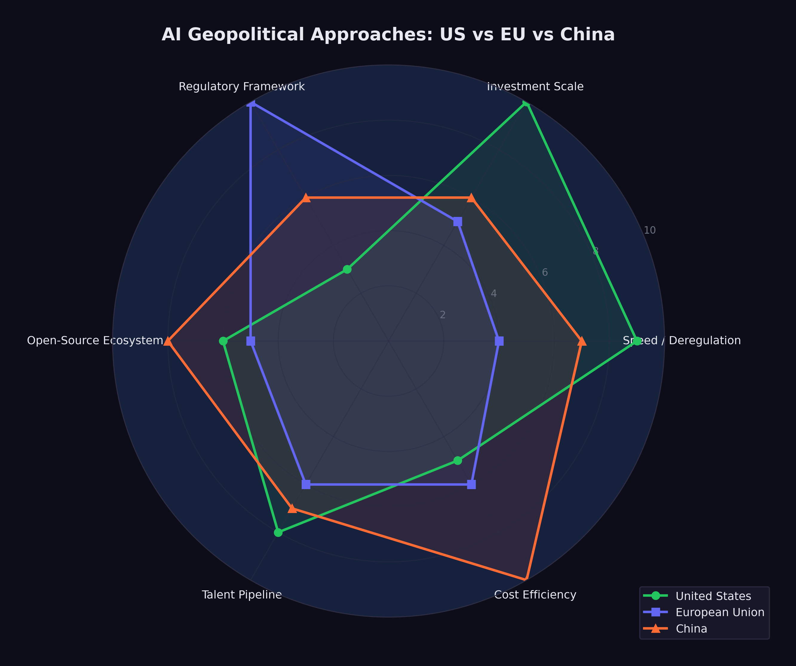

# The Geopolitical Chessboard {#sec-geopolitical-chessboard}

On December 2, 2023, Gina Raimondo walked onto the stage at the Reagan National Defense Forum in Simi Valley, California. The venue --- the Ronald Reagan Presidential Library, perched on a hilltop above the dry scrubland of Ventura County --- had been hosting defense policy conversations for a decade. The audience was the usual mix of generals, defense contractors, congressional staffers, and national security wonks. But the Commerce Secretary hadn't come to talk about missiles or aircraft carriers. She'd come to talk about chips.
<!-- PROOF: url=https://fortune.com/2023/12/02/ai-chip-export-controls-china-nvidia-raimondo/ | accessed=2026-02-14 | key=fortune2023_raimondo_chips -->

"We cannot let China get these chips. Period," Raimondo said. "We're a couple of years ahead of China. No way are we gonna let them catch up" [@fortune2023_raimondo_chips]. The bluntness was unusual for a cabinet secretary. So was the target. Raimondo called out NVIDIA by name --- the most valuable semiconductor company in the world, an American crown jewel --- for designing chips specifically to skirt export restrictions. "If you redesign a chip around a particular cut line that enables them to do AI, I'm going to control it the very next day," she warned [@fortune2023_raimondo_chips].

Then came the line that captured the absurdity of the moment. Her Bureau of Industry and Security, the agency tasked with policing the most consequential technology export controls since the Cold War, had a $200 million budget. "That's like the cost of a few fighter jets. Come on," Raimondo said [@fortune2023_raimondo_chips]. The United States was waging a technology war with the resources of a county sheriff's office.

Fourteen months later, Raimondo was gone --- replaced after the 2025 transition --- and the administration that succeeded her took a different view. Where she'd tried to control which chips crossed which borders, the new approach was simpler: move fast and don't regulate. But the underlying contest she'd articulated in Simi Valley had only intensified. The technology was better. The stakes were higher. And the three-way race she'd been trying to referee had spun beyond any single government's control.

Previous technological revolutions followed a similar pattern. The telegraph, the railroad, nuclear energy, the internet --- each was initially understood as an engineering achievement and only later recognized as a geopolitical force. The telegraph didn't just transmit messages faster. It made the British Empire possible in its modern form, enabling London to coordinate administration across continents in real time. The internet concentrated economic and cultural power in a handful of American companies whose platforms became the default infrastructure of global communication. AI was following the same trajectory: a technology that seemed, in its early stages, to be about benchmarks and model architectures was revealing itself as a contest over economic power, military advantage, and civilizational values.

By February 2026, three distinct approaches had crystallized, each reflecting the political culture of the civilization that produced it. The United States pursued speed. The European Union pursued regulation. China pursued efficiency. Each bet on a different theory of what AI was for and what risks it posed. And they were on a collision course.

The collision was tangible. In January 2025, when the United States tightened export controls on AI chips to China, China retaliated with restrictions on rare earth elements --- the minerals essential for manufacturing the very chips the U.S. was trying to hoard. When the EU AI Act began enforcing its GPAI provisions in August 2025, American companies faced compliance costs that their Chinese competitors didn't share. When DeepSeek released its models under open-source licenses, it undermined the business models of closed-model providers in both America and Europe while extending Chinese technical influence into regions that neither Western power had prioritized. Every move on the board provoked countermoves that the original players hadn't anticipated.

## The American Approach: Speed Wins

On January 20, 2025, within hours of taking the oath of office for his second term, President Donald Trump signed an executive order titled "Removing Barriers to American Leadership in Artificial Intelligence" [@whitehouse2025_ai]. The order revoked Executive Order 14110, the Biden administration's framework for AI oversight, which had established reporting requirements for frontier AI developers, created safety testing protocols, and directed federal agencies to assess AI-related risks.

Trump's order was a philosophical statement as much as a policy document. Where the Biden framework had treated AI as a technology that required careful governance, the Trump order treated it as an asset to be unleashed. The framing was explicitly competitive: the United States was in a race with China, regulation slowed the runners, and the way to win was to remove obstacles.

The practical implications were significant. Under Biden's Executive Order 14110, companies developing frontier AI models were required to report certain details about their training runs to the federal government, including the amount of compute used and the results of safety evaluations. The order also directed federal agencies to develop standards for AI testing and red-teaming. None of this had been fully implemented before Trump revoked it, but the revocation sent an unmistakable signal: the federal government would not be monitoring or constraining AI development.

The Stargate Project, announced the following day, made the connection between deregulation and investment explicit. The $500 billion infrastructure initiative was presented at a White House event with Trump standing alongside the CEOs of OpenAI, SoftBank, and Oracle [@openai2025_stargate]. The message was clear: massive AI investment required a permissive regulatory environment, and the administration was delivering one.

Gina Raimondo had framed the stakes a year earlier at the Reagan National Defense Forum: "We cannot let China get these chips. Period" [@fortune2023_raimondo_chips].
<!-- PROOF: url=https://fortune.com/2023/12/02/ai-chip-export-controls-china-nvidia-raimondo/ | accessed=2026-02-14 | key=fortune2023_raimondo_chips -->

Critics argued that this approach conflated speed with safety. The Biden framework had been modest by international standards --- far less restrictive than the EU AI Act, and less prescriptive than the regulatory approaches being developed in the UK, Canada, and Japan. Revoking even that modest framework left the United States with essentially no federal oversight of AI development, at a time when the technology's capabilities were advancing faster than at any previous point.

Supporters countered that the market was moving too fast for bureaucratic oversight to be meaningful. By the time a federal agency could evaluate a frontier model, three newer models would have already been released. Regulation, in this view, was structurally incompatible with the pace of AI development. The best oversight, they argued, came from market competition: companies that deployed unsafe or unreliable AI would lose customers to competitors who did better.

The debate also had a temporal dimension. Regulation, by its nature, assumed that there was time to regulate --- that the pace of change was slow enough for legislative and administrative processes to keep up. The AI development timeline was challenging that assumption. By the time a regulatory framework could be designed, debated, passed, and implemented, the technology it sought to govern might have advanced by several generations. Biden's Executive Order 14110, signed in October 2023, was already outdated by the time Trump revoked it in January 2025 --- not because its goals were wrong, but because the models it sought to govern had been superseded by vastly more capable successors.

By February 2026, events had overtaken the debate. The models kept getting better, the investments kept flowing, and the question of whether the American approach was wise was increasingly academic. It was the approach. What it would produce remained to be seen.

## The European Approach: Regulation as Strategy

The European Union took a fundamentally different path. The EU AI Act, signed into law in 2024, represented the most thorough regulatory framework for artificial intelligence anywhere in the world [@eu_ai_act]. Its implementation was staged over several years, with each phase adding new requirements:

::: {.callout-note}
## EU AI Act Implementation Timeline

- **February 2, 2025:** Prohibited AI practices take effect. Systems that use subliminal manipulation, exploit vulnerabilities, conduct social scoring, or perform real-time biometric identification in public spaces are banned outright.
- **August 2, 2025:** Rules for General-Purpose AI (GPAI) models take effect. Developers of frontier models must conduct model evaluations, assess and mitigate systemic risks, report serious incidents, and ensure adequate cybersecurity protections [@ec2025_gpai_guidelines].
- **August 2, 2026:** Obligations for high-risk AI systems begin, along with EU-level fines for GPAI providers of up to 15 million euros or 3% of global turnover [@ec2025_gpai_guidelines]. AI used in critical infrastructure, education, employment, law enforcement, and migration must meet transparency, accuracy, and human oversight requirements.
- **August 2, 2027:** Full enforcement for all remaining provisions.
:::

The EU's approach reflected a specific philosophical commitment: that AI's benefits should not come at the cost of fundamental rights, and that the market, left unregulated, would not protect those rights on its own. The Act categorized AI systems by risk level --- minimal, limited, high, and unacceptable --- and applied proportionate requirements to each category. Prohibited practices, the highest-risk category, were banned entirely. High-risk systems were permitted but subjected to extensive oversight.

The tension in the European approach was real and widely acknowledged. The EU's technology sector was already smaller and less well-capitalized than its American and Chinese counterparts. The AI Act's compliance requirements --- model evaluations, risk assessments, transparency documentation, incident reporting --- imposed costs that fell disproportionately on European companies, which were smaller and had fewer resources to absorb regulatory overhead. Every dollar (or euro) spent on compliance was a dollar not spent on research or deployment.

The counterargument was that trust was a competitive advantage. If European AI products were more transparent, more accountable, and more aligned with democratic values, they might earn the trust of users, governments, and enterprises that were wary of less regulated alternatives. In regulated industries like healthcare, finance, and public services, European AI companies argued they would have an edge precisely because their products had been subjected to rigorous oversight.

By February 2026, the evidence was mixed. No major European AI company had achieved frontier model capability. The leading European AI startups --- Mistral in France, Aleph Alpha in Germany --- were competitive but not at the level of OpenAI, Anthropic, or Google DeepMind. European companies were heavy users of American AI infrastructure, raising questions about digital sovereignty. But the regulatory framework itself was being studied and emulated globally: Canada, Brazil, India, and several Southeast Asian nations were developing AI governance frameworks that drew explicitly on the EU model.

The European bet was a long-term one. It would not pay off in a quarter or even a year. But if AI's transformative impact was as profound as its creators predicted, the question of who governed it might ultimately matter more than who built it first.

There was also a subtler dimension to the European approach. The AI Act functioned as a statement of values --- a declaration that human dignity, democratic governance, and fundamental rights took precedence over technological capability. In a world where the most powerful AI systems were being built by private companies answerable primarily to their investors, the EU was asserting that public governance had a legitimate role in shaping how those systems were deployed. Whether this assertion would prove effective or merely symbolic was, as of February 2026, the central question of European technology policy.

## The Chinese Challenge: Efficiency as Strategy

If the American approach was characterized by speed and the European approach by regulation, the Chinese approach was characterized by efficiency --- and it stunned the world.

DeepSeek, a research lab backed by the Chinese quantitative trading firm High-Flyer, demonstrated in late 2024 and early 2025 that the assumed relationship between capital expenditure and AI capability was not a law of nature.

DeepSeek-V3, released in December 2024, was a 671-billion-parameter mixture-of-experts model with 37 billion active parameters per forward pass. It was trained for approximately $6 million in compute costs --- a figure that bordered on the absurd when compared to the hundreds of millions spent on Western frontier models [@deepseek2024_v3]. Despite this radical cost efficiency, the model was competitive with GPT-4 on multiple benchmarks. It demonstrated that architectural innovation, algorithmic efficiency, and clever engineering could substitute for brute-force compute at a ratio that no Western lab had anticipated.

DeepSeek-R1, released on January 20, 2025, went further [@deepseek2025_r1]. It was an open-source reasoning model, released under an MIT license --- the most permissive open-source license available. It rivaled OpenAI's o1 on reasoning benchmarks, it was freely downloadable by anyone in the world, and within days of release it became the number-one application on the iOS App Store. A Chinese AI lab had produced a frontier-competitive reasoning model for a fraction of Western costs, released it for free, and won a consumer popularity contest against every American tech product.

The geopolitical implications were immediate and far-reaching.

First, DeepSeek challenged the assumption that AI dominance required the kind of massive capital expenditure being undertaken by American companies. If $6 million could buy frontier performance, then the $500 billion Stargate Project looked less like a strategic investment and more like an expensive insurance policy against a risk that might not materialize.

Second, DeepSeek demonstrated that export controls were not sufficient to contain Chinese AI capability. The United States had imposed increasingly stringent restrictions on the export of advanced semiconductors and chipmaking equipment to China, with the explicit goal of constraining Chinese AI development. A Bruegel analysis concluded that US hegemony in AI was "no longer guaranteed" and that the export controls appeared ineffective at containing Chinese AI capability [@bruegel2025_deepseek_geopolitics]. DeepSeek's achievement suggested that Chinese researchers had found ways to achieve frontier performance with less advanced hardware, rendering the export controls less effective than their architects had intended.

Third, the open-source release under an MIT license was itself a geopolitical act. By making R1 freely available, DeepSeek ensured that its architecture and approach would be studied, replicated, and improved upon by researchers worldwide. It was an assertion of Chinese technical leadership delivered in the most credible format possible: open code that anyone could verify.

The Chinese government's role in DeepSeek's success was ambiguous. DeepSeek was not a state-owned enterprise; it was a private research lab. But the line between private and state-sponsored enterprise in China was never as clear as in Western markets, and the strategic alignment between DeepSeek's open-source approach and China's broader interest in undermining American AI dominance was difficult to ignore.

Beyond DeepSeek, China's broader AI ecosystem was developing with a momentum that Western observers frequently underestimated. Huawei and SMIC were making tangible progress on domestic chip development: TechInsights confirmed that Huawei's Kirin 9030 processor was manufactured on SMIC's N+3 process --- China's most advanced domestic node --- though it remained substantially less capable than TSMC's equivalent [@techinsights2025_kirin9030_smic]. Bloomberg reported that Huawei planned to double production of its Ascend 910C AI accelerator to approximately 600,000 units in 2025, targeting 1.6 million dies across its Ascend line by 2026, despite a 7nm yield rate of only 40% [@bloomberg2025_huawei_smic]. Alibaba, Baidu, Tencent, and ByteDance all maintained active AI research programs. Chinese universities were producing more AI research papers than American universities, though the quality distribution remained debated. The Chinese government's "New Generation AI Development Plan," originally published in 2017, had set ambitious targets for AI leadership by 2030 --- including a core AI industry valued at one trillion yuan and a position as the world's primary AI innovation center [@digichina2017_ngaidp] --- targets that, in light of DeepSeek's achievements, looked increasingly plausible.

The efficiency thesis extended beyond model training. Chinese technology companies had developed deployment and scaling capabilities that, in certain consumer-facing applications, exceeded those of their Western counterparts. The speed with which DeepSeek-R1 reached the top of the iOS charts demonstrated not just technical competence but consumer product sophistication --- a combination that few Western observers had anticipated from a Chinese research lab.

## The Hardware Chokepoint

Beneath the software competition lay a hardware reality that shaped every nation's AI strategy: the semiconductor supply chain was the most geopolitically significant industrial network on earth.

NVIDIA dominated the market for AI training and inference chips, holding an estimated 80% or more of the data center GPU market. Its chips were manufactured by TSMC in Taiwan --- which held 71% of global semiconductor foundry revenue and over 90% of advanced chip manufacturing below 7 nanometers [@trendforce2025_tsmc_market_share] --- using extreme ultraviolet lithography machines made by ASML in the Netherlands. This supply chain --- American design, Taiwanese fabrication, Dutch equipment --- was concentrated to a degree that made it simultaneously extraordinarily efficient and extraordinarily fragile.

The United States had used this concentration as a geopolitical weapon. Export controls imposed in 2022 and tightened in 2023 and again in December 2024 --- when BIS added controls on 24 types of semiconductor manufacturing equipment and placed 140 entities on the Entity List [@bis2024_export_controls] --- restricted the sale of advanced AI chips and chipmaking equipment to China [@sutter2025_crs_export_controls]. The goal was explicit: to deny China the hardware needed to train frontier AI models and thereby maintain American technological superiority. But the controls were imperfect: a Congressional Research Service report documented that Chinese companies had imported over $26 billion in semiconductor equipment in just the first seven months of 2024, stockpiling before restrictions tightened further [@sutter2025_crs_export_controls], and enforcement gaps persisted --- in late 2025, authorities uncovered a smuggling ring that had attempted to export at least $160 million in NVIDIA H100 and H200 GPUs to China [@cnbc2025_nvidia_smuggling].

DeepSeek's efficiency achievements called this strategy into question. A CSIS analysis found that while US and partner manufacturing capacity for advanced AI processor dies was approximately 35 to 38 times that of China's, the controls had not prevented Chinese labs from producing competitive AI models [@shivakumar2025_csis_export_limits]. Chinese chipmakers found ways to circumvent the restrictions through at least four documented pathways [@shrivastava2025_china_semiconductor_conundrum], and SMIC exploited a loophole by relying on older DUV immersion lithography tools rather than the restricted EUV systems [@nie2025_cnas_export_loophole]. The controls imposed costs --- Chinese models took longer to train, and Chinese companies had to develop workarounds for hardware limitations --- but they did not achieve their stated objective of preventing China from competing at the frontier.

Meanwhile, the concentration of semiconductor manufacturing in Taiwan created a vulnerability that transcended the US-China competition. A disruption to TSMC's fabrication capacity --- whether from natural disaster, military conflict, or economic coercion --- would immediately cripple AI development globally. Both the United States and China recognized this vulnerability: the CHIPS Act in the United States and various domestic semiconductor initiatives in China were attempts to reduce dependence on Taiwanese manufacturing. A GAO review found that the Commerce Department had awarded $30.9 billion across 40 CHIPS Act projects to 19 companies, with one leading-edge fab in Arizona certified as complete in June 2025, though only 24 of 161 project milestones had been completed [@gao2026_chips_act]. Globally, SEMI projected eighteen new semiconductor fabs beginning construction in 2025, with the Americas and Japan each leading with four projects [@semi2025_eighteen_fabs]. But as of early 2026, TSMC remained irreplaceable for the most advanced chip production, and the geopolitical risk associated with that concentration was growing, not shrinking.

## Open Source as Geopolitical Tool

The open-source movement in AI was often discussed in purely technical terms --- model architectures, licensing terms, benchmark comparisons. But by 2026, open-source AI had become a geopolitical tool of the first order.

Meta's Llama 3.1, released in July 2024 with 405 billion parameters under an open license, was the first model to demonstrate that open-source could be competitive with proprietary frontier systems [@meta2024_llama31]. DeepSeek-R1 reinforced this lesson with its MIT-licensed release.

The geopolitical significance of open-source AI was straightforward: open models could not be controlled by any single nation or company. Once released, they propagated globally. Researchers in India, Brazil, Nigeria, and Indonesia could download, fine-tune, and deploy models that would otherwise be accessible only through American API providers at American prices under American terms of service.

This dynamic created an unusual alignment of interests. Meta, an American corporation, released open-source models in part to commoditize the inference layer and maintain its competitive position against closed-model providers. DeepSeek, a Chinese lab, released open-source models in part to demonstrate Chinese technical leadership and undermine the influence of American AI companies. Both achieved their goals, and the net effect was to democratize access to frontier AI capabilities in a way that no government --- American, European, or Chinese --- could fully control.

For developing nations, open-source AI represented something close to a geopolitical equalizer. Countries that could not afford to fund frontier model development from scratch could nonetheless access frontier-competitive models for free. An Observer Research Foundation analysis documented that DeepSeek had gained significant market share in developing nations --- including 56% in Belarus, 49% in Cuba, and 43% in Russia --- functioning as a "geopolitical instrument" extending Chinese technological influence into regions where Western platforms had limited reach [@batra2025_deepseek_moment]. The implications for education, healthcare, agriculture, and governance in the Global South were potentially immense, though as of February 2026, the infrastructure to deploy these models at scale remained concentrated in wealthier nations.

## The California Experiment

While the federal government retreated from AI oversight, the state of California moved in the opposite direction. California's AI safety law, passed in late 2025, imposed requirements on companies developing frontier AI models, including pre-deployment safety testing, incident reporting, and transparency obligations.

The law was immediately tested. When OpenAI released GPT-5.3-Codex on February 5, 2026, AI safety watchdogs filed claims that the release had violated certain provisions of the California statute [@openai2026_calaw]. OpenAI disputed the allegations, arguing that it had complied with the law's requirements and that the claims were based on a misreading of the statute's definitions.

The incident highlighted the challenge of regulating global technology at a sub-national level. California was home to most of the world's leading AI companies, giving it significant regulatory power. But AI models, once released, were available globally --- to users in Texas, Tokyo, and Tallinn. A California law could impose compliance costs on companies headquartered in the state, but it could not meaningfully constrain what users in other jurisdictions did with the resulting products.

The federal-state tension was a distinctly American phenomenon. In the EU, regulation operated at the supranational level, creating a unified framework for all member states. In China, the central government directed AI policy nationally. Only in the United States did the regulatory environment feature a patchwork of state laws overlaid on a federal vacuum --- a structure that created compliance complexity for companies while arguably providing less effective governance than either a unified federal framework or no framework at all.

Other states were watching California closely. New York, Illinois, and Colorado had all introduced AI-related legislation, and the possibility of fifty different state-level AI regulatory frameworks was becoming a real concern for industry. Some companies argued that the California law, whatever its merits, would effectively become the de facto national standard --- not because it was legally binding outside California, but because companies headquartered there would find it simpler to comply with the strictest standard nationwide rather than maintain different practices for different jurisdictions. This "California effect," well-documented in environmental and privacy regulation, was beginning to manifest in AI governance.

The federal vacuum created a second-order problem: regulatory arbitrage. AI companies headquartered in California faced the state's compliance requirements. Their competitors headquartered in Texas, Florida, or Delaware faced none. In theory, this could have driven companies out of California. In practice, it didn't --- the talent pool, the venture capital ecosystem, and the proximity to Stanford and Berkeley were too valuable. But it created a two-tier system in which some of the world's most powerful technology was subject to meaningful oversight while other equally powerful technology operated in a regulatory vacuum, all within the borders of a single country. No other major technology power had this problem. The EU's framework applied uniformly. China's applied nationally. Only America had turned AI governance into a zip code lottery.

## The Davos Debate

The geopolitical dimension of AI was dramatized most vividly at the World Economic Forum in Davos in January 2026, where two of the most powerful figures in AI sat across from each other and offered competing visions of the future.

Dario Amodei, CEO of Anthropic, was characteristically direct. In an interview with The Economist, he predicted that AI models would do "most, maybe all" of what software engineers currently do within six to twelve months [@amodei2026_davos]. He described a "Moore's Law for intelligence" in which models became "more and more cognitively capable every few months." He acknowledged uncertainty about the timeline for full automation of physical tasks like chip manufacturing, but on the core question of white-collar work, he was unequivocal: the displacement was imminent.

Demis Hassabis, CEO of Google DeepMind and a 2025 Nobel laureate in Chemistry for his work on AlphaFold, offered a more measured assessment [@businessworld2026_davos]. He assigned a 50% probability to the emergence of transformative AGI by 2030 --- a notable statement from someone whose own research had produced one of AI's most celebrated achievements. But Hassabis's caution was notable. He emphasized the distinction between narrow AI capabilities (where progress was undeniable) and general intelligence (where progress was real but the timeline was uncertain). He also stressed the importance of safety research proceeding in tandem with capability development.

The debate between Amodei and Hassabis was more than a disagreement about timelines. It was a microcosm of the broader geopolitical tension. Amodei represented the philosophy that speed was essential --- that the transformative potential of AI was so great that the priority should be deployment. Hassabis represented the philosophy that caution was essential --- that the same transformative potential that made AI valuable also made it dangerous, and that the priority should be responsible development.

Both were speaking from positions of power. Anthropic, valued at $350 billion, was one of the most heavily funded private companies in history. Google DeepMind, backed by one of the world's largest corporations, had the resources to sustain long-term research programs that no startup could match. The debate was not between an optimist and a pessimist. It was between two different theories of how to manage a technology that both men believed would reshape civilization.

::: {.callout-important}
## The Davos Divide

The Amodei-Hassabis debate at Davos crystallized a divide that ran through every aspect of AI geopolitics. On one side: the conviction that AI's benefits were so immense that delay was the greatest risk. On the other: the conviction that AI's risks were so serious that haste was the greatest danger. Both positions were held by serious people with deep expertise. Both were supported by evidence. And both could not be simultaneously correct.
:::

What went unsaid at Davos was as revealing as what was said. Neither Amodei nor Hassabis addressed the workforce implications in detail --- Amodei's "six to twelve months" prediction hung in the air, but neither man discussed what happened to the millions of software engineers, analysts, writers, and knowledge workers whose jobs were within the capability envelope of models their companies were building. The audience --- hedge fund managers, government ministers, corporate executives --- didn't press the point. They were there to understand the opportunity, not to reckon with the displacement.

Jensen Huang, NVIDIA's CEO, provided the infrastructure counterpoint. In his own Davos appearance, he described demand for AI chips as "insatiable" --- a word that carried a very specific meaning coming from the CEO of the company selling the picks and shovels [@huang2025]. Huang's position was unique: he profited regardless of which approach won. American speed required NVIDIA chips. Chinese efficiency challenged NVIDIA's pricing but expanded the total market. European regulation slowed nothing about the hardware buildout. For NVIDIA, the geopolitical chessboard was a board on which every move was a buying opportunity.

The spectacle of competing CEOs debating the future of intelligence in front of world leaders at a Swiss mountain resort had an air of unreality to it. The decisions being made in Davos conference rooms would affect billions of people who were not in attendance and had no voice in the proceedings. The gap between the AI elite and the general public --- a gap in knowledge, in agency, and in exposure to the consequences --- was a geopolitical fact as significant as any trade agreement or arms treaty.

## Three Scenarios

By February 2026, the geopolitical chessboard was set. The pieces were in motion. And the game could unfold along any of several paths.

@fig-geopolitical-approaches maps the three approaches against key dimensions of AI strategy.

{#fig-geopolitical-approaches}

**Scenario One: American Dominance Through Speed.** In this scenario, the United States' deregulatory approach pays off. American companies, freed from compliance burdens, continue to lead in model capability. The Stanford AI Index documented that US private AI investment reached $109.1 billion in 2024 --- nearly twelve times China's $9.3 billion --- with total global corporate AI investment reaching $252.3 billion [@stanfordhai2025_ai_investment]. The Stargate Project and associated infrastructure investments create an unassailable advantage in deployment scale. China's efficiency gains hit diminishing returns as models become larger and more complex. The EU falls further behind technologically, becoming a consumer rather than a producer of AI. American companies set global standards by default, because their products are the most capable and most widely deployed.

**Scenario Two: European Leadership Through Trust.** In this scenario, the EU's regulatory framework becomes the global standard. As AI systems are deployed in critical infrastructure --- healthcare, finance, transportation, government services --- trust becomes the binding constraint on adoption. The Tony Blair Institute's analysis of AI sovereignty argued that no state could dominate every layer of the AI stack, and that sovereignty was best secured through strategic diversification rather than autarky [@tbi2026_sovereignty_ai]. European AI products, built to the highest regulatory standards, are preferred by risk-averse enterprises, governments, and consumers. The compliance costs borne by European companies become a competitive advantage, as buyers worldwide gravitate toward providers that can demonstrate transparency, accountability, and alignment with democratic values.

**Scenario Three: Chinese Leapfrog Through Efficiency.** In this scenario, Chinese AI labs continue to achieve frontier performance at a fraction of Western costs. DeepSeek and its successors demonstrate that algorithmic innovation can substitute for hardware at scale, rendering American export controls and infrastructure advantages less relevant. As one strategic analysis argued, semiconductor advantage compounds over time while countermeasures like China's rare-earth restrictions tend to burn out [@camba2026_burn_choke] --- but this logic cuts both ways if Chinese labs find architectural workarounds that reduce their dependence on advanced hardware entirely. Open-source releases from Chinese labs become the default starting point for AI development globally, shifting the center of gravity of the AI ecosystem toward China. Western dominance in AI is not overturned by force but outmaneuvered by efficiency.

None of these scenarios was inevitable. All were plausible. A Federal Reserve analysis of AI competition across advanced economies found that cumulative US private AI investment from 2013 to 2024 exceeded $470 billion, compared with roughly $50 billion across the entire EU --- a disparity that highlighted the scale advantage but also the narrowness of the American lead in terms of infrastructure and talent pipelines [@haag2025_fed_ai_competition]. The most likely outcome was some combination of all three: American strength in certain domains, European leadership in others, Chinese competitiveness across the board, and a global order shaped by the interaction of speed, regulation, and efficiency in ways that no single actor could fully predict or control.

Each scenario had its champions and its skeptics. The American speed camp pointed to the sheer scale of investment --- over $700 billion committed in a single year, as documented in @sec-investment-tsunami --- and argued that capital advantage was self-reinforcing. The European regulation camp pointed to the growing backlash against unregulated AI in consumer markets and the increasing demand for trustworthy AI in regulated industries. The Chinese efficiency camp pointed to DeepSeek and argued that algorithmic ingenuity could neutralize capital advantages.

## The Case for Multipolarity {#sec-multipolarity}

There's a fourth scenario that the conventional framing misses entirely: nobody wins, and that turns out to be fine.

DeepSeek proved something the export control advocates hadn't expected: that blocking hardware access doesn't block AI capability. A Chinese lab, working with older chips and a fraction of Western budgets, produced models competitive with the frontier. If algorithmic innovation can substitute for hardware, then export controls are a speed bump, not a wall. The Bruegel analysis put it directly: U.S. hegemony in AI was "no longer guaranteed," and export controls appeared "ineffective at containing Chinese AI capability" [@bruegel2025_deepseek_geopolitics].
<!-- PROOF: url=https://www.bruegel.org/first-glance/geopolitics-artificial-intelligence-after-deepseek | accessed=2026-02-14 | key=bruegel2025_deepseek_geopolitics -->

The multipolarity argument: AI proliferation, like nuclear proliferation, may be unstoppable. Multiple countries and companies will have frontier-level AI capability by 2027-2028, regardless of what any single government does. In this scenario, the relevant question isn't "who leads?" but "what rules apply?" And the EU's much-mocked regulatory approach might turn out to be the most forward-looking of the three --- not because it produces the best models, but because it produces the governance frameworks that the rest of the world eventually adopts.

The falsification tests for the geopolitical chapter:

1. **American dominance.** If by 2028, all top-10 models on major benchmarks are from U.S. companies, speed won.
2. **European influence.** If by 2028, more than half of Fortune Global 500 companies adopt EU AI Act-style compliance frameworks regardless of legal requirement, regulation won.
3. **Chinese parity.** If by 2028, Chinese open-source models are the default fine-tuning base for AI development in 50+ countries, efficiency won.
4. **Multipolarity.** If none of the above, the chessboard is more complex than any single narrative allows.

::: {.callout-note title="Practitioner's Tool: Geopolitical Scorecard" icon=false}

| Strategy | Strength | Vulnerability | Key Metric to Watch |
|----------|----------|---------------|---------------------|
| US Speed | $700B+ investment, talent pool | Regulatory backlash, concentration risk | NVIDIA revenue growth rate |
| EU Regulation | Trust framework, democratic values | Talent drain, slow deployment | AI company formations in EU |
| Chinese Efficiency | Low-cost innovation, state coordination | Hardware ceiling, data quality | DeepSeek benchmark progression |
| Multipolarity | Resilience, redundancy | Coordination failure, arms race | Cross-border AI collaborations |

The chessboard was set. The players were moving. And the stakes --- economic, military, cultural, existential --- were higher than in any technological competition since the nuclear age [@camba2026_burn_choke; @tbi2026_sovereignty_ai]. The difference was that nuclear weapons were controlled by governments. AI was controlled by companies. And the geopolitical implications of that distinction were only beginning to be understood.
:::

The Taiwan question was the board's most dangerous square. TSMC fabricated over 90% of the world's most advanced chips. Every frontier AI model --- American, Chinese, or European --- depended on wafers produced in Taiwanese fabs. A Chinese military action against Taiwan wouldn't just disrupt the semiconductor supply chain. It would shut down AI development globally for years. The American CHIPS Act and Chinese domestic fab initiatives were both attempts to reduce this dependency, but neither would achieve meaningful independence before 2028 at the earliest. Until then, the AI future ran through a single island in the western Pacific, and the geopolitical chessboard's most consequential move was one that no AI company could predict, prevent, or prepare for.

The science acceleration examined in the next chapter adds one more dimension: AI isn't just reshaping economics and geopolitics. It's reshaping how we understand the physical world itself.
