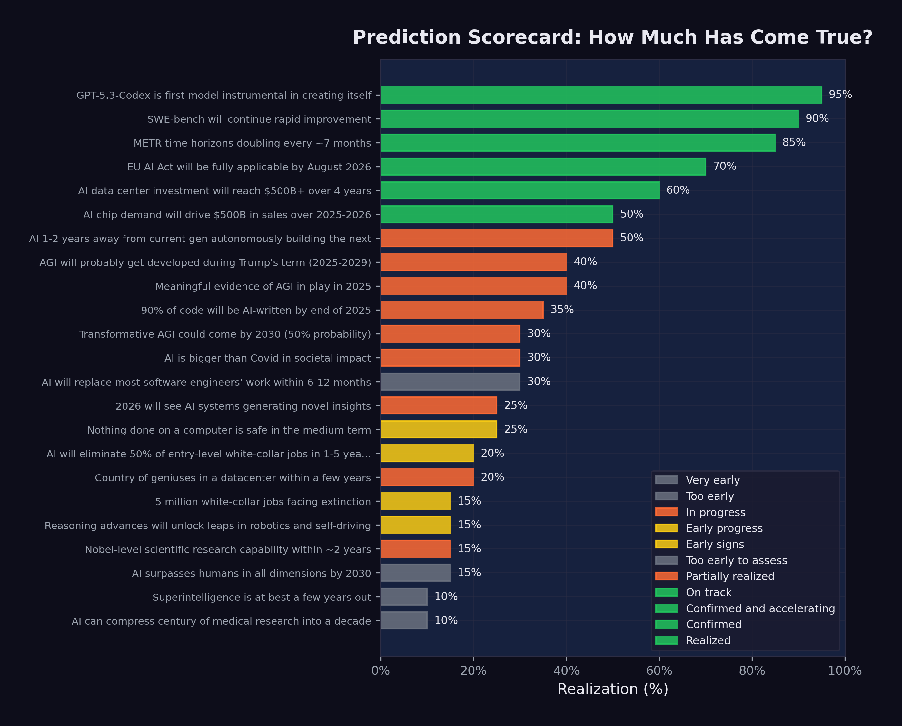

# What Now? {#sec-what-now}

On the evening of February 9, 2026, Matt Shumer watched the counter climb. He was at his desk in New York --- the same desk where he ran OthersideAI, the same screen where he'd spent hours working with Claude to shape the essay he'd just posted. Twenty million views. Then thirty. Then fifty. His phone kept buzzing: reporters from Fortune, messages from strangers, a thread on Reddit dissecting every paragraph, engineers he'd never met telling him he'd put into words what they'd been afraid to say out loud.
<!-- PROOF: url=https://fortune.com/2026/02/11/something-big-is-happening-ai-february-2020-moment-matt-shumer/ | accessed=2026-02-14 | key=shumer2026 -->

The Syracuse grad who'd launched a VR startup in high school, who'd made Forbes 30 Under 30 with an AI writing tool, had just produced the most-read essay on artificial intelligence in years. And the irony --- the one he kept returning to in interviews --- was that Claude had helped write it. "It did help a lot," he told Fortune, "and I think that's kind of the point" [@shumer2026]. The essay about AI disruption was itself AI-disrupted. The medium was the message, and the message was: the future is already here. It just hasn't knocked on your door yet. It's about to.

Shumer hadn't planned to write a manifesto. He'd planned to write a long email to friends and family --- the kind you send when you see something coming and nobody around you seems to notice. His comparison was to February 2020: the weeks before lockdown, when the virus was already spreading but most Americans still thought it was someone else's problem. "We are currently in the 'this seems overblown' phase," he wrote, "of something much, much bigger than Covid" [@shumer2026]. The line was designed to provoke, and it did. But fifty million views suggested it had also landed.

Now, five days later, the world looked different. Claude Opus 4.6 and GPT-5.3-Codex had launched. A trillion-dollar stock selloff had hammered non-AI software companies. Policy debates that had been abstract were suddenly concrete. And the question that Shumer's essay posed --- what do you do when the change is already underway? --- had moved from his Substack to the front page.

This final chapter takes stock. It presents the full scorecard: all twenty-three predictions tracked in this book, with their current status. It analyzes the patterns that emerge --- what came true, what didn't, and what the gaps reveal. And it asks the question that the title insists upon: if something big has already happened, what do we do now?

## The Scorecard

@fig-prediction-scorecard shows the complete prediction scorecard as of February 12, 2026.

{#fig-prediction-scorecard}

The full data is summarized in @tbl-full-scorecard, organized by realization percentage from highest to lowest.

| # | Prediction | Source | Realization |
|--:|:-----------|:-------|:------------|
| 1 | GPT-5.3-Codex is first self-improving model | OpenAI | 95% |
| 2 | SWE-bench will continue rapid improvement | Consensus | 90% |
| 3 | METR time horizons doubling every ~7 months | METR | 85% |
| 4 | EU AI Act on schedule | EU | 70% |
| 5 | AI data center investment reaches $500B+ | Stargate | 60% |
| 6 | AI chip demand drives $500B+ sales | Huang | 50% |
| 7 | AI building next-gen AI in 1--2 years | Amodei | 50% |
| 8 | AGI probably during Trump's term | Altman | 40% |
| 9 | Meaningful AGI evidence in 2025 | Hassabis | 40% |
| 10 | 90% of code AI-written by end 2025 | Amodei | 35% |
| 11 | AI is bigger than Covid | Shumer | 30% |
| 12 | Transformative AGI by 2030 (50%) | Hassabis | 30% |
| 13 | Most SWE work replaced in 6--12 months | Amodei | 30% |
| 14 | Nothing on computers safe medium-term | Shumer | 25% |
| 15 | Novel AI insights in 2026 | Altman | 25% |
| 16 | 50% entry-level job elimination | Amodei | 20% |
| 17 | Country of geniuses in datacenter | Amodei | 20% |
| 18 | Nobel-level research in ~2 years | Amodei | 15% |
| 19 | Reasoning unlocks robotics/self-driving | Huang | 15% |
| 20 | AI surpasses humans all dimensions by 2030 | Altman | 15% |
| 21 | 5 million white-collar jobs face extinction | Microsoft | 15% |
| 22 | Superintelligence in a few years | Hassabis | 10% |
| 23 | Compress century of medicine to decade | Shumer | 10% |

: Predictions ranked by realization percentage as of February 12, 2026. Some closely related predictions have been consolidated for readability; the full dataset contains all individually tracked predictions. {#tbl-full-scorecard}

## What Came True

The predictions with the highest realization scores share a common feature: they are about measurable technical capabilities, not societal outcomes.

**GPT-5.3-Codex's self-improvement (95%).** The single most realized prediction. OpenAI confirmed that the model contributed to its own training, deployment, and evaluation. The recursive improvement loop is no longer theoretical --- it is a product feature [@openai2026_codex].

**SWE-bench progression (90%).** The prediction that AI coding benchmarks would continue to improve rapidly was confirmed beyond what most forecasters expected. From 2.7% to 79.2% in less than two years, with multiple organizations contributing to the improvement curve [@epoch2025_swebench].

**METR time horizon doubling (85%).** METR's measurement of autonomous task duration followed an exponential curve with remarkable consistency, doubling approximately every seven months. The data was strong, the methodology was transparent, and the trend showed no sign of flattening [@metr2025_timehorizons].

**EU AI Act implementation (70%).** Among the most predictable items on the scorecard: a regulatory timeline set by legislation was proceeding largely on schedule. Prohibited practices were enforced in February 2025, GPAI governance obligations kicked in by August 2025, and high-risk system requirements were on track for August 2026 [@eu_ai_act].

**Infrastructure investment (60%).** The prediction that AI data center investment would reach $500 billion was tracking solidly. The Stargate Project alone committed approximately $400 billion, and Microsoft, Meta, Amazon, and Google collectively pledged hundreds of billions more [@openai2025_stargate].

The pattern is clear. Technical predictions --- about benchmarks, timelines, and infrastructure --- were the most accurately forecasted. These predictions were grounded in measurable trends with clear momentum. They did not require assumptions about human behavior, institutional response, or societal change.

## What Is Still Pending

The predictions in the middle range --- 20% to 40% realization --- are the most interesting. They are not wrong, but they are not yet right. They represent the gap between capability and consequence.

**Job displacement (20--35%).** Amodei predicted 50% entry-level displacement in 1--5 years. Microsoft Research identified 5 million vulnerable jobs. Shumer said nothing on computers is safe. By February 2026, the early signs were visible: nearly 290,000 tech layoffs, 55,000 AI-cited cuts, rising unemployment. But the full-scale displacement these predictions described had not yet materialized. The capability existed; the organizational and economic restructuring to deploy that capability was still underway.

**AGI timelines (30--40%).** Both Altman and Hassabis predicted forms of AGI arriving within years, not decades. Current models demonstrated remarkable breadth, but whether they constituted "AGI" depended entirely on definition. If AGI meant "better than most humans at most cognitive tasks," the gap was narrowing rapidly. If it meant "genuine understanding and reasoning comparable to the best human minds across all domains," the gap remained substantial.

**Recursive improvement (50%).** GPT-5.3-Codex's self-contribution was confirmed, but full autonomous AI-building-AI remained ahead. The loop was running, but humans remained essential at the highest levels of decision-making.

::: {.callout-note}
## The Definition Problem

Several predictions --- particularly those about AGI and superintelligence --- resist clean assessment because the terms themselves are poorly defined. When Altman says "AGI during Trump's term," what exactly triggers that claim? When Hassabis says "transformative AGI by 2030," what does "transformative" mean? The AI community has not converged on definitions, which means that the same system could simultaneously satisfy some definitions of AGI and fail others. This ambiguity is not accidental; it serves the interests of organizations that benefit from both claiming progress and deferring accountability.
:::

## What Has Not Happened

Several predictions remained at 10--15% realization, representing claims that were either too early or too ambitious:

**Superintelligence (10%).** Hassabis's prediction that superintelligence was "at best a few years out" showed no concrete evidence of realization. Current systems excelled in narrow domains but lacked the autonomous scientific creativity and open-ended problem-solving that the concept implies.

**Medical research compression (10%).** Shumer's prediction about compressing a century of medical research into a decade reflected genuine enthusiasm about AI's potential in biomedical science, but the fundamental bottleneck --- clinical trials, regulatory approval, and the irreducible pace of biological experimentation --- remained firmly in place.

**Robotics and self-driving (15%).** Huang's prediction about reasoning advances unlocking robotics was one of the slowest to realize. While progress was real, the physical world proved more resistant to AI disruption than the digital one. Software can be improved instantly and deployed globally. Robots need to work in specific, unpredictable environments. The gap between digital and physical AI capability was widening, not narrowing.

## The Case for Caution

This book has documented an accelerating trajectory. But intellectual honesty requires acknowledging the counterarguments --- the reasons why the most dramatic predictions might not materialize on schedule, or at all.

**Benchmark saturation.** Every benchmark has a ceiling, and as scores approach that ceiling, improvement becomes harder. SWE-bench Verified, at 79.2%, is remarkable --- but the remaining 20.8% may represent qualitatively harder problems: ambiguous specifications, complex system-level interactions, tasks requiring deep domain expertise that no training dataset can fully capture. The history of AI is littered with benchmarks that were "solved" on paper while the underlying capability they were meant to measure remained elusive. It is possible that AI coding capability, as measured by SWE-bench, will plateau before it reaches human parity on the full spectrum of software engineering work.

**The reliability gap.** Benchmarks measure what a model *can* do under ideal conditions. Production deployment measures what a model *consistently* does under variable conditions. Simon Willison, even while documenting the StrongDM software factory's achievements, identified "the most consequential question in software development right now: how can you prove that software you are producing works if both the implementation and the tests are being written for you by coding agents?" [@willison2026_softwarefactory]. Until this question has a satisfying answer, the gap between benchmark performance and production reliability will constrain adoption.

**Organizational inertia.** Technology does not deploy itself. It is deployed by organizations with legacy systems, existing contracts, regulatory obligations, change-averse cultures, and employees who resist being automated out of their jobs. The history of technology adoption is one of decades-long transitions, not overnight revolutions. Electricity took forty years to reach 80% adoption in American factories after its invention. The internet took twenty years to reshape retail. Even if AI capability is advancing exponentially, organizational deployment may follow a slower, more traditional adoption curve.

**The demo-to-deployment gap.** Impressive demonstrations are not the same as reliable production systems. A model that can solve 79% of SWE-bench tasks in a controlled evaluation environment may struggle with the messy realities of production codebases: legacy systems with poor documentation, interdependent services with undocumented failure modes, regulatory requirements that no benchmark captures. The gap between what works in a demo and what works in deployment is real, and closing it requires engineering effort that scales with the complexity of the deployment environment.

These counterarguments do not invalidate the thesis of this book. They complicate it. The trajectory is real. The acceleration is real. But the path from capability to consequence is not automatic, and the timeline may be longer than the most aggressive predictions suggest.

## Dan Shapiro's Five Levels

One of the most useful frameworks for understanding where we are --- and where we are not --- was published by Dan Shapiro, CEO of Glowforge, in January 2026. Shapiro proposed five levels of AI-assisted software development, using an analogy to autonomous driving [@shapiro2026_fivelevels].

**Level 0: Spicy Autocomplete.** "Whether it's vi or Visual Studio, not a character hits the disk without your approval. You might use AI as a search engine on steroids or occasionally hit tab to accept a suggestion, but the code is unmistakably yours" [@shapiro2026_fivelevels].

**Level 1: The Coding Intern.** "You're writing the important stuff, but you offload specific, discrete tasks to your AI intern" [@shapiro2026_fivelevels].

**Level 2: The Junior Developer.** "You've got a junior buddy to hand off all your boring stuff to. This is where 90% of 'AI-native' developers are living right now" [@shapiro2026_fivelevels].

**Level 3: The Developer.** "You're not a senior developer anymore; that's your AI's job. You are... a manager. You are the human in the loop" [@shapiro2026_fivelevels].

**Level 4: The Engineering Team.** "More of an engineering manager or product/program/project manager. You collaborate on specs and plans, the agents do the work" [@shapiro2026_fivelevels].

**Level 5: The Dark Software Factory.** "It's not really a car any more...your software process isn't really a software process any more. It's a black box that turns specs into software" [@shapiro2026_fivelevels]. At this level, "nobody reviews AI-produced code, ever. They don't even look at it" [@shapiro2026_fivelevels].

The framework is valuable because it reveals the gap between what is possible and what is practiced. The models released during the November Cluster and afterward --- Claude Opus 4.5, GPT-5.2, Gemini 3 Deep Think --- are capable of supporting Level 3 and Level 4 work. As documented in @sec-recursive-loop, the frontier AI labs are themselves operating at Level 4 or higher: Claude writing Claude, GPT-5.3-Codex contributing to its own creation. The StrongDM software factory, with its three-person team and "$1,000 per day per engineer" token budget, is arguably operating at Level 5 [@strongdm2026_factory].

But 90% of AI-native developers --- the ones who are already enthusiastic adopters of AI tools --- are at Level 2 [@shapiro2026_fivelevels]. They are using AI as a junior developer: handing off boring tasks, accepting suggestions, but maintaining control over the overall workflow. The majority of the software industry, the non-AI-native majority, is at Level 0 or Level 1.

This is the deployment gap in concrete terms. The technology supports Level 4 and 5 operation. The industry is mostly at Level 1 and 2. The predictions tracked in this book describe a Level 3-to-5 world. When the industry catches up to the technology, the predictions will be realized. The question is how fast the catch-up happens.

## The Gap Between Perception and Reality

One of Shumer's most important observations was that the gap between public perception and AI reality was widening. Most people, he argued, were still thinking of AI as a tool --- like a faster calculator or a better search engine. They had not internalized the possibility that AI was becoming a worker, a colleague, and potentially a replacement.

The data supports this. Despite 79% SWE-bench scores, most software companies were still hiring human engineers. Despite 55,000 AI-cited layoffs, AI was not yet the dominant factor in most layoff decisions. Despite five-hour autonomous time horizons, most organizations were still deploying AI as an assistant, not an agent.

This gap is both reassuring and alarming. Reassuring, because it means the transition is happening gradually, giving workers and institutions time to adapt. Alarming, because it means that when organizational adoption catches up to technical capability, the impact could arrive suddenly. The capability is already here. The deployment is lagging. When the lag closes, the disruption will accelerate.

## For Individuals: Adapt or Be Adapted

The most common question from individuals confronting the data in this book is: "What should I do?"

The honest answer is that no one knows with certainty. But the data suggests several principles:

**Learn to work with AI, not against it.** The workers most at risk are those who perform tasks that AI can do independently. The workers most valuable are those who can direct AI, evaluate its output, and handle the tasks it cannot. The shift from executor to orchestrator is the defining career transition of this period.

**Invest in judgment, not routine.** AI is excellent at routine tasks and poor at novel judgment calls. The skills that remain uniquely human --- at least for now --- are the ones that involve ambiguity, ethics, stakeholder management, and creative problem-solving in unstructured domains.

**Expect continuous change.** The pace of AI improvement means that the skills that are safe today may not be safe in two years. Career planning must become more adaptive, with continuous learning replacing the traditional model of front-loaded education followed by decades of stable practice.

**Build financial resilience.** The workers most vulnerable to AI displacement are those with the least financial cushion. Savings, diverse income streams, and reduced fixed obligations provide the flexibility to manage transitions.

**Understand the levels.** Dan Shapiro's five-level framework is not just an analytical tool; it is a personal diagnostic. If you are operating at Level 0 or 1 --- using AI as a search engine or an occasional autocomplete --- you are underutilizing the technology and leaving productivity on the table. If you are at Level 2 --- delegating routine tasks to AI --- you are in the mainstream but not ahead of it. The workers who will thrive in the coming years are those who move to Level 3 and beyond: becoming managers and orchestrators of AI systems rather than hands-on executors [@shapiro2026_fivelevels]. This transition requires not just technical skill but a fundamental shift in identity --- from "I write code" to "I direct systems that write code."

**Cultivate the uniquely human.** Daniela Amodei's message deserves repetition: "The things that make us human will become much more important instead of much less important" [@damodei2026_generalists]. Communication, empathy, curiosity, ethical reasoning, the ability to work through ambiguity and build trust --- these are not soft skills to be listed on a resume. They are the hard skills of the AI era. The *Science* study's finding that experienced developers benefit from AI while inexperienced ones do not suggests that the real differentiator is not technical knowledge per se but the judgment and context that come with deep experience [@daniotti2026_aicoding]. Invest in becoming the kind of person whose judgment AI cannot replace, rather than the kind of person whose output AI can replicate.

## For Companies: Embrace or Be Disrupted

The February 2026 software stock crash delivered a clear message to corporate leaders: the market believes AI will disrupt existing business models. Companies that ignore this signal do so at their own risk.

**Adopt AI aggressively but thoughtfully.** The data shows that AI can already handle a significant fraction of software engineering, customer service, and analytical work. Companies that deploy AI effectively will operate with smaller teams, lower costs, and faster iteration cycles. Companies that do not will find themselves at a growing competitive disadvantage.

**Restructure, do not just lay off.** Cutting headcount without changing workflows produces short-term savings and long-term dysfunction. Effective AI adoption requires rethinking how work is organized: which tasks are delegated to AI, which remain with humans, and how the human-AI interface is managed.

**Invest in your people.** The companies that handle the transition best will be those that invest in retraining their existing workforce rather than simply replacing them. This is not just ethical; it is practical. Experienced workers with domain knowledge and organizational context are more valuable as AI orchestrators than new hires without that background.

## For Societies: Policy, Safety, Equity

The collective implications of the predictions tracked in this book demand a societal response that goes beyond individual career advice or corporate strategy.

**Labor market policy needs updating.** Current unemployment insurance, job training programs, and social safety nets were designed for an economy in which technological displacement happened gradually and in specific sectors. AI-driven displacement may be faster and broader than anything these systems were designed to handle.

**Safety research deserves serious investment.** The recursive improvement loop documented in @sec-recursive-loop is the most consequential technical dynamic in AI development. Ensuring that this loop produces beneficial outcomes --- rather than systems that pursue misaligned objectives --- is arguably the most important engineering challenge of the century.

**Equity must be a priority.** The benefits of AI are accruing primarily to the organizations that build and deploy it, and to the investors who fund them. The costs are being borne primarily by the workers who are displaced. Without deliberate policy intervention, AI risks widening the gap between those who own the technology and those who are replaced by it.

**International coordination is essential.** AI development is a global phenomenon, but regulation is national. The EU AI Act, the U.S. deregulatory approach, and China's AI governance framework represent three different philosophies. Mark Zuckerberg has argued for a fourth path: "Open source is necessary for a positive AI future" [@zuckerberg2024_opensource]. Without some degree of international coordination --- whether through regulation, open-source norms, or both --- regulatory arbitrage will undermine the effectiveness of any single jurisdiction's approach.
<!-- PROOF: url=https://about.fb.com/news/2024/07/open-source-ai-is-the-path-forward/ | accessed=2026-02-14 | key=zuckerberg2024_opensource -->

**Education requires fundamental reimagining.** The current education system was designed to produce workers with stable skill sets that would serve them for decades. The data in this book suggests that model --- front-loaded education followed by decades of stable practice --- is already obsolete. If AI capability doubles every seven months, as METR time horizons suggest, then the skills taught in a four-year degree program may be partially automated by the time the student graduates. Education must shift from knowledge transmission to capability building: teaching students how to learn, how to direct AI systems, how to exercise judgment in ambiguous situations, and how to do the things that AI cannot. Daniela Amodei's emphasis on humanities, communication, and emotional intelligence is not just a hiring preference; it is an educational philosophy for the AI age [@damodei2026_generalists].

**The UBI question deserves serious debate.** Universal basic income --- a guaranteed minimum payment to all citizens regardless of employment status --- has been discussed for decades but has never gained mainstream political traction. AI-driven displacement may change that calculus. If a significant fraction of the workforce faces structural unemployment --- not temporary layoffs but permanent displacement from roles that no longer exist --- then the social safety net must evolve to accommodate a world in which many people cannot find traditional employment. The revenue to fund such programs could plausibly come from the extraordinary productivity gains that AI generates, but the political will to redistribute those gains does not yet exist.

**International labor mobility will become critical.** The *Science* study documented significant variation in AI adoption across countries [@daniotti2026_aicoding]. Countries with lower AI adoption may see delayed displacement but also delayed productivity gains. Countries with higher adoption may generate more wealth but displace more workers. The result could be new patterns of labor migration: workers moving from AI-saturated markets where their skills are automated to less-saturated markets where they are still valued, or conversely, workers moving to AI hubs where the demand for AI orchestrators creates new opportunities. International labor agreements, visa policies, and social safety nets will need to adapt to these flows.

## The Living Thesis: The November Revolution {#sec-living-thesis}

This book has argued that something big already happened. But when, exactly?

The popular narrative places the inflection point in February 2026 --- the week when Shumer's essay went viral, when GPT-5.3-Codex and Claude Opus 4.6 were released, when the stock market crashed, when the world seemed to wake up to AI's implications. That narrative is compelling, but this book's evidence points to a different answer.

The real inflection was the November Cluster documented in @sec-november-cluster: twenty-four days between November 17 and December 11, 2025, during which five frontier model releases from four organizations crossed a threshold of practical capability. Grok 4.1 topped the leaderboards. Gemini 3 solved Olympiad-level problems. Claude Opus 4.5 worked autonomously for nearly five hours. GPT-5.2 offered three variants for every use case. The models that made February 2026 possible were not the February models. They were the November models.

This pattern --- capability preceding recognition by two to three months --- is itself one of the most important findings in this book. The technology advanced in November. The world noticed in February. The lag was not accidental. It was structural. Organizations need time to deploy new models. Researchers need time to run evaluations. Journalists need time to report findings. Public discourse needs time to process implications. The result is a persistent gap between what AI can do and what the world knows AI can do.

The implication is unsettling: there may be capabilities that exist right now, in February 2026, that the world will not recognize until April or May. The models released this week are being evaluated, deployed, and tested in ways that will produce revelations months from now. The recursive loop documented in @sec-recursive-loop is already using these models to build the next generation. By the time the public processes the implications of Claude Opus 4.6 and GPT-5.3-Codex, the next generation may already be in development --- built, in part, by the very models whose implications have not yet been absorbed.

This is the living thesis of this book. It is not a static claim about a single moment. It is a dynamic observation about the relationship between capability and recognition, between what has happened and what we know has happened. The gap is real, it is persistent, and it is growing. Understanding it is essential to navigating what comes next.

::: {.callout-note title="Practitioner's Tool: What Would Change My Mind" icon=false}

A book committed to evidence must specify, in advance, what evidence would prove it wrong. Here are the conditions under which the central thesis of this book --- that a transformative AI inflection occurred in November 2025, that its consequences are already propagating through the economy, and that the pace of change will accelerate --- would be falsified.

**1. Benchmark stagnation.** If SWE-bench Verified scores plateau below 90% through the end of 2027, it suggests the current scaling paradigm has hit diminishing returns. The exponential curve documented in @sec-benchmark-revolution would have been a logistic curve in disguise --- dramatic growth followed by saturation. This wouldn't mean AI is useless, but it would mean the "revolutionary" framing of this book overstated the pace.

**2. The recursive loop stalls.** If, by mid-2027, no major AI lab reports that its newest model contributed meaningfully to the development of its successor, the recursive improvement thesis was wrong. The GPT-5.3-Codex self-improvement claim would have been a one-time artifact rather than the beginning of a compounding cycle.

**3. Job creation exceeds displacement.** If, by end of 2028, the net number of technology sector jobs is higher than in February 2026 --- meaning new AI-related roles have more than offset the positions eliminated --- then the displacement narrative was wrong. The historical pattern of creative destruction would have held.

**4. The Confirmation Gap closes without consequence.** If the three-month lag between capability (November 2025) and recognition (February 2026) proves to be a one-time artifact of a specific set of circumstances, rather than a repeating pattern, then the "Confirmation Gap" framework proposed in @sec-confirmation-gap is not a useful analytical tool.

**5. Safety concerns materialize.** If, by 2027, a frontier AI model deployed with insufficient testing causes measurable, attributable harm --- a production system failure, a security breach, a financial loss --- that is directly traceable to the competitive pressure of the November 2025 release sprint, then the safety skeptics were right and this book underweighted the risks.

**6. Investment returns fail.** If, by mid-2028, the aggregate revenue generated by AI applications hasn't reached 25-30% of the cumulative capital invested since 2024, the investment thesis was a bubble. The technology might still be transformative on a longer timeline, but the dot-com pattern would have repeated: right thesis, wrong valuation, painful correction.

We'll know. The predictions in this book are specific and time-bound. They will be tracked, updated, and scored. If we're wrong, the scorecard will show it. That's the point of a living document.

These falsification conditions are not a hedge. They are the mechanism that distinguishes this book from the thousands of pages of AI commentary that offer predictions without accountability. Every claim in this book is an invitation to be proven wrong. The benchmarks are public. The timelines are specific. The economic data will be available. By 2028, either the predictions held or they didn't, and no amount of retrospective reinterpretation will change the scorecard. That kind of accountability is uncomfortable. It's also necessary. The AI discourse has too many prophets and too few accountants.
:::

## Something Big Already Happened

The confirmation gap runs through every chapter of this book. In the benchmark data, there was a gap between what the models could score and what organizations understood about those scores. In the investment data, there was a gap between the capital deployed and the returns yet to materialize. In the geopolitical analysis, there was a gap between export control ambitions and actual containment outcomes. In the science acceleration, there was a gap between computational capability and physical reality. Each gap was a different expression of the same underlying dynamic: the speed of technological change outpacing the speed of human comprehension.

The title of this book is a past-tense statement, and that is deliberate. The tendency in AI discourse is to talk about what *will* happen: AGI will arrive, superintelligence will emerge, jobs will be lost, society will be transformed. The future tense creates a comfortable distance. It suggests we still have time to prepare.

The data in this book challenges that comfort. Consider what has already happened, not what might happen:

- An AI model contributed to its own creation. That is not a prediction; it is a fact.
- AI systems can resolve 79% of real-world software engineering tasks. That is not a forecast; it is a measurement.
- AI can work autonomously for nearly five hours. That is not speculation; it is data.
- Over 288,000 tech workers have been laid off, with 55,000 cuts directly attributed to AI. Those are not hypothetical numbers; they are people.
- A trillion dollars in market value was wiped out in a single day on the basis of AI capability assessments. That is not a scenario; it is a headline.
- Top engineers at both frontier AI labs report writing zero code by hand. That is not a forecast; it is a testimony.
- A peer-reviewed study in *Science* found that 29% of U.S. Python functions are AI-generated, and the technology widens skill-based disparities rather than narrowing them. That is not speculation; it is peer-reviewed data.

Something big is not merely happening. Something big has already happened. We are living in the aftermath of predictions that came true faster than anyone expected, and in the anticipation of predictions that are on track to come true faster still.

The November Revolution was the inflection. February was the recognition. What comes next is the consequence.

Matt Shumer's essay asked the public to wake up. This book asks a harder question: now that we are awake, what do we do?

## This Is a Living Document

Unlike a traditional book, *Something Big Already Happened* is designed to be updated as new predictions come true and new evidence emerges. The scorecard will be revised. New predictions will be added. Chapters will be expanded as developments warrant.

The rate of change documented in these pages --- benchmark scores doubling, time horizons growing exponentially, models releasing monthly --- means that some of what is written here will be outdated within months. That is the point. The speed of obsolescence is itself evidence of the thesis.

If you are reading this in mid-2026, check the updated scorecard. Predictions that were at 20% realization in February may be at 50% or higher. The METR time horizon, currently at approximately five hours, may have doubled to ten. The SWE-bench frontier may have pushed past 85%. New models will have been released --- models built, in part, by the models documented in this book. The recursive loop will have tightened further.

If you are reading in 2027, some of the "too early to assess" predictions may have definitive verdicts. Amodei's six-to-twelve-month prediction for software engineering displacement will have reached its deadline. Hassabis's 50% probability of transformative AGI by 2030 will be closer to resolution. The five million white-collar jobs that Microsoft Research identified as vulnerable will have either been displaced, transformed, or proven more resilient than expected. The story is still being written, and the pace of the writing is accelerating.

::: {.callout-tip}
## How to Stay Updated

This book is produced by the S.H. Ash as an open-source project. Data, methodology, and source files are publicly available. To receive updates, watch the project repository. To suggest corrections or additions, open an issue. The prediction scorecard is updated quarterly.
:::

## A Final Word on Uncertainty

It would be dishonest to end this book with false certainty. The data documented in these pages is real, the trends are measurable, and the trajectory is clear. But the future remains, as it always has, uncertain.

The history of technology prediction is a history of overconfidence in the short term and underestimation in the long term. Nuclear power was going to make electricity "too cheap to meter." Self-driving cars were supposed to be ubiquitous by 2020. The metaverse was going to replace physical offices. None of these predictions were unreasonable at the time they were made. All of them were wrong, or at least dramatically premature.

AI may follow the same pattern. The benchmarks may plateau. The recursive loop may encounter diminishing returns. Organizational adoption may prove slower than the technology's capability suggests. The counterarguments outlined in "The Case for Caution" are genuine, not rhetorical.

The honest assessment is that this book was written at a moment of maximum uncertainty. The technical capability is clear --- the benchmarks, the time horizons, the recursive improvements are all measured and documented. What's not clear is how that capability translates into societal change. Will organizations restructure quickly or slowly? Will labor markets adjust through gradual reskilling or sudden displacement? Will the regulatory response be adaptive or paralyzing? Will the safety challenges be manageable or catastrophic? These are questions that data alone cannot answer. They depend on human choices --- choices made by executives, policymakers, educators, and individuals --- that have not yet been made.

What this book can say with confidence is that the choices are imminent. The Confirmation Gap documented throughout these chapters means that the window between "something is happening" and "something has already happened" is shorter than most institutions assume. The organizations, governments, and individuals who wait for certainty before acting will find that certainty arrives too late to be useful. The ones who act on probability --- who begin restructuring, reskilling, and adapting now, while the evidence is strong but not yet overwhelming --- will be the ones best positioned for whatever comes next.

But there is a difference between this wave and previous technology predictions. Nuclear power, self-driving cars, and the metaverse all faced fundamental technical barriers that proved harder to overcome than anticipated. AI's barriers are different. The models are already working. The benchmarks are already being achieved. The recursive loop is already running. The question is not whether the technology works --- it demonstrably does --- but how fast and how broadly its consequences will unfold.

The honest conclusion is this: the direction is clear. The pace is uncertain. And the choices we make in the next few years --- as individuals, as companies, as societies --- will determine whether the consequences of this technological revolution are managed wisely or endured chaotically.

We have the data. We have the trajectory. We have the warnings. What we do with them is up to us.

---

*Something big already happened. What happens next depends on what we do with what we now know.*
